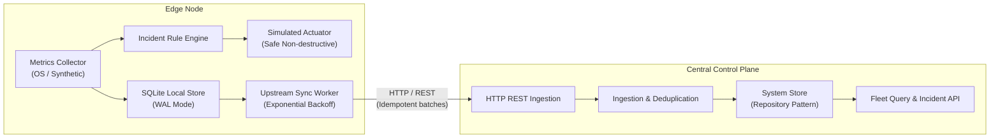
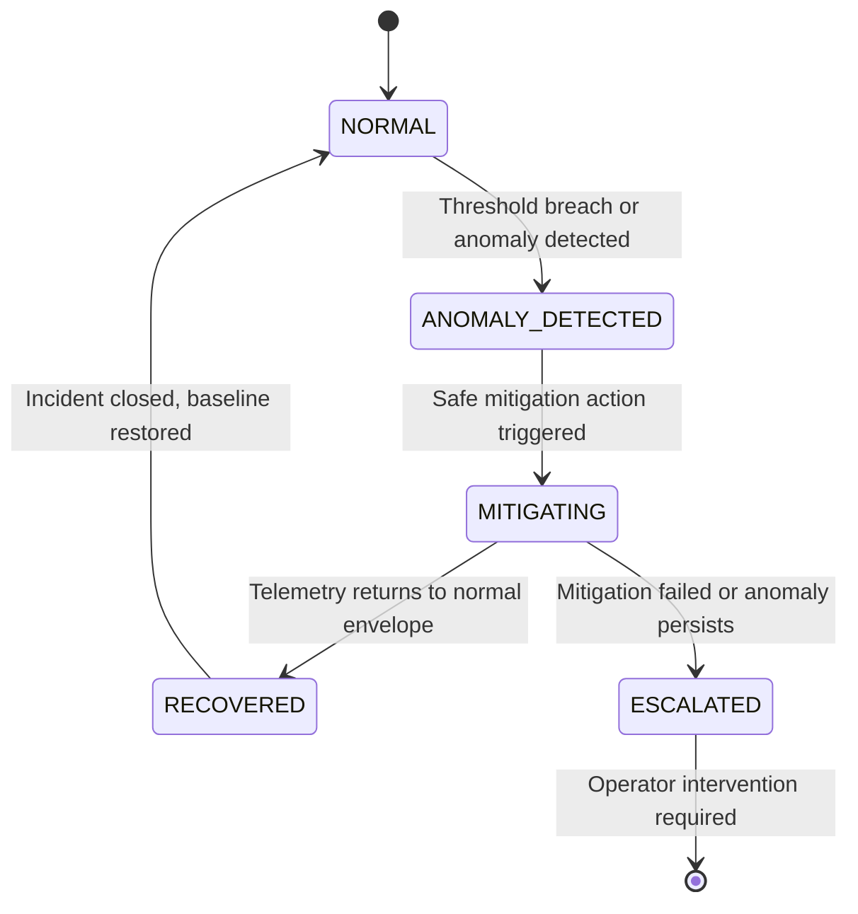
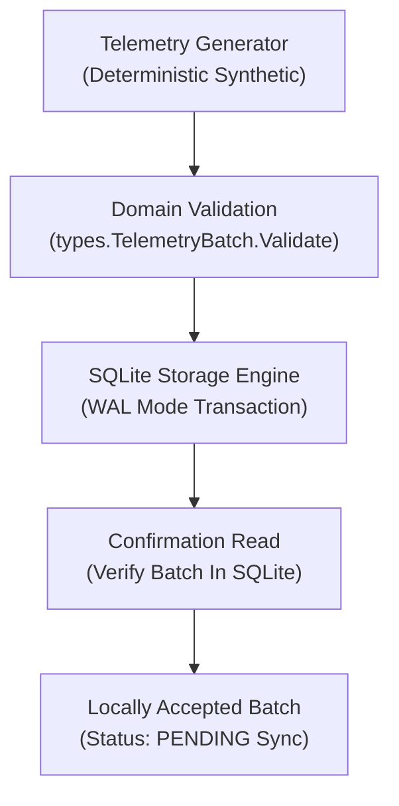

# AegisEdge Architectural Overview

## 1. System Vision
AegisEdge provides autonomous incident detection and mitigation on edge computing nodes while streaming consolidated telemetry and incident reports to a centralized control plane.

---

## 2. Component Responsibilities

### `edge/agent`
* **Collector**: Periodically gathers host metrics (CPU, memory, disk, network, synthetic metrics).
* **Local Storage**: Persists metrics and incident records into a local SQLite database using Write-Ahead Logging (WAL).
* **Incident Engine**: Evaluates metrics against threshold rules to detect anomalies in real time.
* **Actuator**: Executes mitigation actions locally. In Phase 1, **all actions are safely simulated** (recording the intended action, timestamp, and target without executing destructive shell commands or killing host processes).
* **Sync Worker**: Periodically queries un-synced batches from SQLite and sends them upstream over HTTP, respecting backoff and idempotency semantics.

### `services/control-plane`
* **API Server**: Exposes endpoints for device registration, telemetry ingestion, and incident logging.
* **Storage Layer**: Implements a clean repository interface (`Store`) enabling seamless transition between SQLite (for simple local dev) and PostgreSQL (for production).
* **Fleet State**: Tracks node heartbeats, liveness, and open incidents across the entire fleet.

### `shared/types`
* Contains canonical Go structs and JSON serialization logic shared between the edge agent and control plane.
* Prevents schema drift and ensures strict contract validation at compile time.

---

## 3. Safety and Non-Destructive Operation (Phase 1)
To ensure safety on developer workstations:
* No arbitrary shell commands are executed.
* No host processes are killed.
* No system services or network firewalls are modified.
* All mitigations in Phase 1 use the `SimulatedActuator` interface, which records simulated remediation operations into the audit trail for verification.

---

## 4. Deterministic Incident Lifecycle State Machine

The edge incident engine transitions through explicit, deterministic states:

* **`NORMAL`**: Baseline healthy operating state. Continuous metric collection.
* **`ANOMALY_DETECTED`**: Telemetry condition exceeded threshold for $N$ consecutive evaluation windows.
* **`MITIGATING`**: Autonomous mitigation policy is executing (safe simulated action in Phase 1).
* **`RECOVERED`**: Metrics returned to within safe limits following mitigation.
* **`ESCALATED`**: Mitigation unsuccessful or severity escalated, requiring central operator review.

---

## 5. Edge Local Durable Persistence Pipeline (Phase 2)

The edge agent enforces local data durability before considering any telemetry batch accepted:

### Core Durability Invariants:
1. **Local Persistence Precedes Ingestion**: Batches are committed to local SQLite WAL storage *before* any remote synchronization is attempted.
2. **Autonomous Offline Survivability**: The edge node does not require the control plane to start, run, or persist telemetry. If the control plane is offline, unreachable, or non-existent, the edge continues collecting and buffering data locally.
3. **Write-Ahead Logging (WAL)**:
   * Provides concurrent reads while writes are occurring without blocking.
   * Atomic commits ensure that abrupt edge power loss or crashes cannot corrupt the database file.
   * `PRAGMA synchronous=NORMAL` balances high write throughput with durability across application restarts.
4. **Per-Node Sequence Continuity**: On startup, the agent queries `MAX(sequence_number)` from the local database, ensuring monotonic sequence numbers across application restarts without collisions or resets.
5. **Idempotency Guarantee**: `batch_id` serves as a unique primary key. Duplicate batch insertions are detected and rejected (`ErrDuplicateBatch`), preventing duplicate records.
6. **Realistic Buffer Limits (No False Zero-Data-Loss Claims)**: Physical disk capacity on edge hardware is finite. Telemetry batches are persisted with status `PENDING` to await upstream sync. While the pipeline guarantees durable local writes, it explicitly does **not** claim mathematically guaranteed zero data loss under indefinite network partitions.
