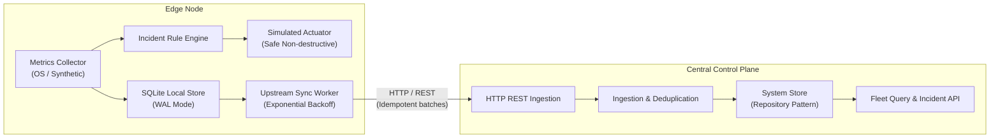
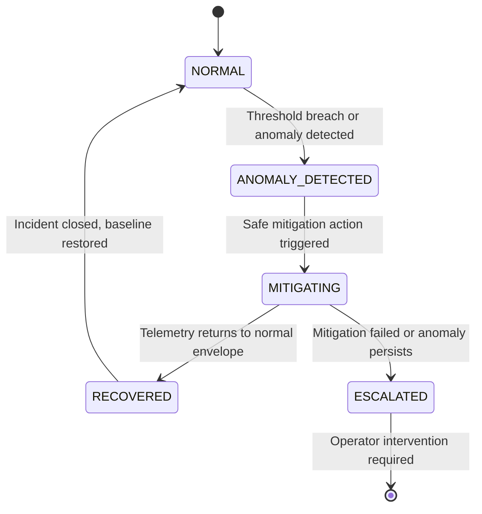
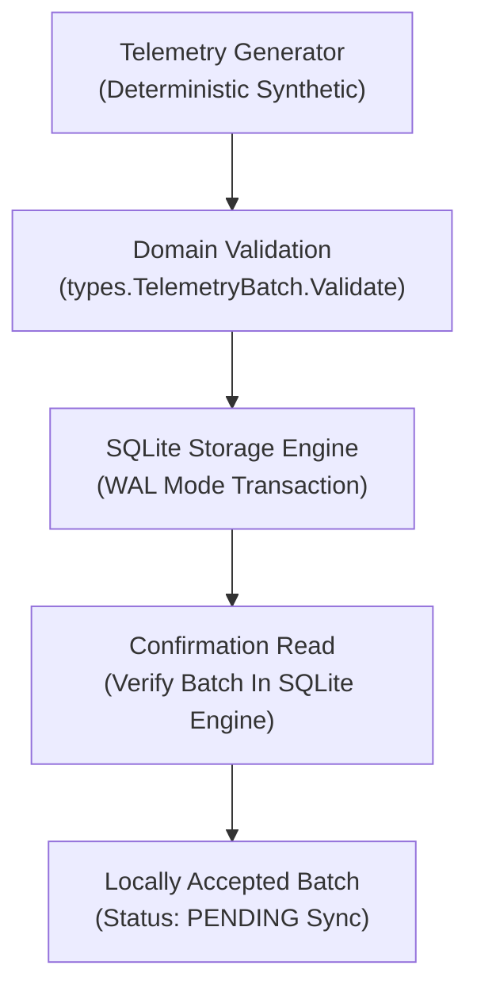
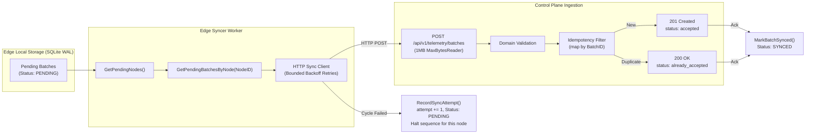

# AegisEdge Architectural Overview

## 1. System Vision
AegisEdge provides autonomous incident detection and mitigation on edge computing nodes while streaming consolidated telemetry and incident reports to a centralized control plane.

---

## 2. Component Responsibilities

### `edge/agent`
* **Collector**: Periodically gathers host metrics (CPU, memory, disk, network, synthetic metrics).
* **Local Storage**: Persists metrics and incident records into a local SQLite database using Write-Ahead Logging (WAL).
* **Incident Engine**: Evaluates metrics against threshold rules to detect anomalies in real time.
* **Actuator**: Executes mitigation actions locally. In Phase 1, **all actions are safely simulated** (recording the intended action, timestamp, and target without executing destructive shell commands or killing host processes).
* **Sync Worker**: Periodically queries un-synced batches from SQLite and sends them upstream over HTTP, respecting backoff and idempotency semantics.

### `services/control-plane`
* **API Server**: Exposes endpoints for device registration, telemetry ingestion, and incident logging.
* **Storage Layer**: Implements a clean repository interface (`Store`) enabling seamless transition between SQLite (for simple local dev) and PostgreSQL (for production).
* **Fleet State**: Tracks node heartbeats, liveness, and open incidents across the entire fleet.

### `shared/types`
* Contains canonical Go structs and JSON serialization logic shared between the edge agent and control plane.
* Prevents schema drift and ensures strict contract validation at compile time.

---

## 3. Safety and Non-Destructive Operation (Phase 1)
To ensure safety on developer workstations:
* No arbitrary shell commands are executed.
* No host processes are killed.
* No system services or network firewalls are modified.
* All mitigations in Phase 1 use the `SimulatedActuator` interface, which records simulated remediation operations into the audit trail for verification.

---

## 4. Deterministic Incident Lifecycle State Machine

The edge incident engine transitions through explicit, deterministic states:

* **`NORMAL`**: Baseline healthy operating state. Continuous metric collection.
* **`ANOMALY_DETECTED`**: Telemetry condition exceeded threshold for $N$ consecutive evaluation windows.
* **`MITIGATING`**: Autonomous mitigation policy is executing (safe simulated action in Phase 1).
* **`RECOVERED`**: Metrics returned to within safe limits following mitigation.
* **`ESCALATED`**: Mitigation unsuccessful or severity escalated, requiring central operator review.

---

## 5. Edge Local Durable Persistence Pipeline (Phase 2)

The edge agent enforces local persistence before considering any telemetry batch accepted, establishing the system's first durable buffering boundary:

### Core Durability Invariants:
1. **Local Persistence Precedes Ingestion**: Batches are committed to local SQLite WAL storage *before* any remote synchronization is attempted.
2. **Autonomous Offline Survivability**: The edge node does not require the control plane to start, run, or persist telemetry. If the control plane is offline, unreachable, or non-existent, the edge continues collecting and buffering data locally.
3. **Write-Ahead Logging (WAL) & Synchronous Tuning**:
   * Provides non-blocking concurrent reads while transactional writes are occurring.
   * Configured with `PRAGMA synchronous=NORMAL;` to balance write throughput and flash longevity with crash recovery.
   * A successful transaction commit means SQLite has accepted the batch according to its configured durability semantics. While `NORMAL` mode protects against database corruption across application crashes and clean reboots, transactions committed since the most recent checkpoint could be lost during an abrupt, catastrophic hardware power outage. The exact guarantees of physical persistence depend on SQLite configuration and underlying OS/filesystem write caching.
4. **Verification Read-Back**: An immediate read-back verifies that the batch was correctly written and is queryable in the local database engine before marking it accepted. It does **not** claim or prove physical persistence to non-volatile storage media.
5. **Per-Node Sequence Continuity**: On startup, the agent queries `MAX(sequence_number)` from the local database, ensuring monotonic sequence numbers across application restarts without collisions or resets.
6. **Idempotency Guarantee**: `batch_id` serves as a unique primary key. Duplicate batch insertions are detected and rejected (`ErrDuplicateBatch`), preventing duplicate records.
7. **Realistic Buffer Limits (No False Zero-Data-Loss Claims)**: Physical disk capacity on edge hardware is finite. Telemetry batches are persisted with status `PENDING` to await upstream sync. AegisEdge explicitly does **not** claim mathematically guaranteed zero data loss under indefinite network partitions.

---

## 6. Edge-to-Control-Plane Synchronization Pipeline (Phase 3)

Phase 3 introduces edge-to-control-plane synchronization over HTTP to prove the distributed recovery flow:

### Core Synchronization Invariants:
1. **At-Least-Once Delivery + Idempotent Processing**: The system guarantees at-least-once delivery; exactly-once delivery is NOT claimed. Duplicates are handled idempotently via `BatchID`.
2. **Per-Node Sequence Ordering `(NodeID, SequenceNumber)`**: Sequence numbers are strictly per-node. Ordering is enforced per-node, never globally across different edge nodes.
3. **Failure Isolation Between Nodes**: If Node A sequence $N$ fails, subsequent batches for Node A are halted for that sync cycle to prevent out-of-order delivery, but Node B continues synchronizing independently.
4. **Retry Attempt Semantics**: The persisted `attempt` counter represents logical synchronization cycles and is incremented once per failed cycle, not per transient internal HTTP retry.
5. **Idempotent Duplicate Acceptance**: If the control plane returns HTTP 200 `already_accepted`, the edge marks the local batch as `SYNCED`.
6. **Timestamp Semantics**:
   * `collected_at`: Immutable edge timestamp when telemetry was captured.
   * `sent_at`: Recorded on the edge when transmission was attempted.
   * `ingested_at`: Appended by the control plane upon acceptance.
7. **Phase 3 Control Plane In-Memory Limitation**: Accepted batches survive for the lifetime of the control plane process. Process restarts reset the accepted set. Because the edge maintains records in SQLite until acknowledged, a control plane restart triggers safe re-synchronization without edge data loss. Durable control-plane storage will be introduced in later phases.
