# AegisEdge Architectural Overview

## 1. System Vision
AegisEdge provides autonomous incident detection and mitigation on edge computing nodes while streaming consolidated telemetry and incident reports to a centralized control plane.

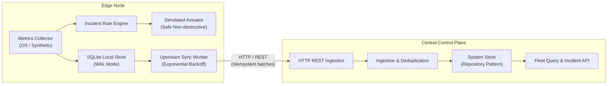
```mermaid
flowchart LR
    subgraph EdgeDevice ["Edge Node"]
        Collector["Metrics Collector\n(OS / Synthetic)"] --> Buffer["SQLite Local Store\n(WAL Mode)"]
        Collector --> RuleEngine["Incident Rule Engine"]
        RuleEngine --> Actuator["Simulated Actuator\n(Safe Non-destructive)"]
        Buffer --> SyncWorker["Upstream Sync Worker\n(Exponential Backoff)"]
    end

    subgraph CentralServer ["Central Control Plane"]
        APIServer["HTTP REST Ingestion"] --> IngestionHandler["Ingestion & Deduplication"]
        IngestionHandler --> StateStore["System Store\n(Repository Pattern)"]
        StateStore --> QueryAPI["Fleet Query & Incident API"]
    end

    SyncWorker -- "HTTP / REST\n(Idempotent batches)" --> APIServer
```

---

## 2. Component Responsibilities

### `edge/agent`
* **Collector**: Periodically gathers host metrics (CPU, memory, disk, network, synthetic metrics).
* **Local Storage**: Persists metrics and incident records into a local SQLite database using Write-Ahead Logging (WAL).
* **Incident Engine**: Evaluates metrics against threshold rules to detect anomalies in real time.
* **Actuator**: Executes mitigation actions locally. In Phase 1, **all actions are safely simulated** (recording the intended action, timestamp, and target without executing destructive shell commands or killing host processes).
* **Sync Worker**: Periodically queries un-synced batches from SQLite and sends them upstream over HTTP, respecting backoff and idempotency semantics.

### `services/control-plane`
* **API Server**: Exposes endpoints for device registration, telemetry ingestion, and incident logging.
* **Storage Layer**: Implements a clean repository interface (`Store`) enabling seamless transition between SQLite (for simple local dev) and PostgreSQL (for production).
* **Fleet State**: Tracks node heartbeats, liveness, and open incidents across the entire fleet.

### `shared/types`
* Contains canonical Go structs and JSON serialization logic shared between the edge agent and control plane.
* Prevents schema drift and ensures strict contract validation at compile time.

---

## 3. Safety and Non-Destructive Operation (Phase 1)
To ensure safety on developer workstations:
* No arbitrary shell commands are executed.
* No host processes are killed.
* No system services or network firewalls are modified.
* All mitigations in Phase 1 use the `SimulatedActuator` interface, which records simulated remediation operations into the audit trail for verification.

---

## 4. Deterministic Incident Lifecycle State Machine

The edge incident engine transitions through explicit, deterministic states:

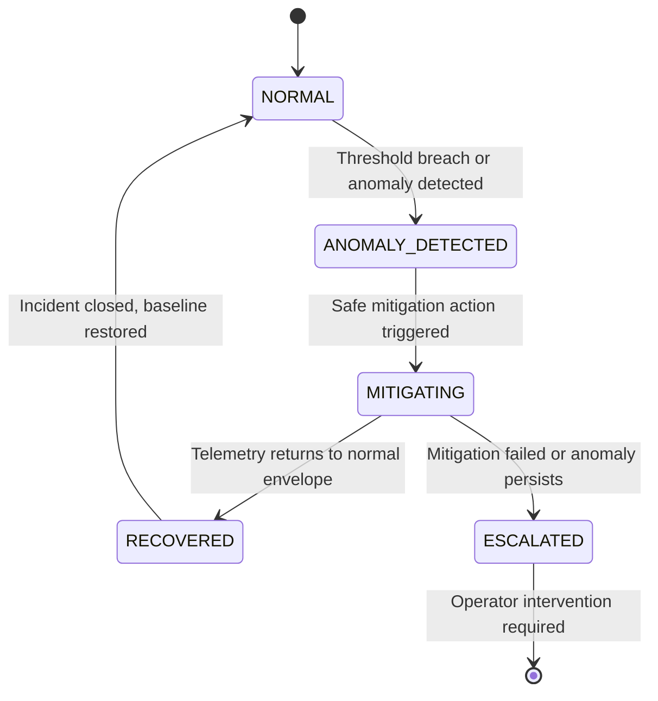
```mermaid
stateDiagram-v2
    [*] --> NORMAL
    NORMAL --> ANOMALY_DETECTED : Threshold breach or anomaly detected
    ANOMALY_DETECTED --> MITIGATING : Safe mitigation action triggered
    MITIGATING --> RECOVERED : Telemetry returns to normal envelope
    MITIGATING --> ESCALATED : Mitigation failed or anomaly persists
    RECOVERED --> NORMAL : Incident closed, baseline restored
    ESCALATED --> [*] : Operator intervention required
```

* **`NORMAL`**: Baseline healthy operating state. Continuous metric collection.
* **`ANOMALY_DETECTED`**: Telemetry condition exceeded threshold for $N$ consecutive evaluation windows.
* **`MITIGATING`**: Autonomous mitigation policy is executing (safe simulated action in Phase 1).
* **`RECOVERED`**: Metrics returned to within safe limits following mitigation.
* **`ESCALATED`**: Mitigation unsuccessful or severity escalated, requiring central operator review.

---

## 5. Edge Local Durable Persistence Pipeline (Phase 2)

The edge agent enforces local persistence before considering any telemetry batch accepted, establishing the system's first durable buffering boundary:

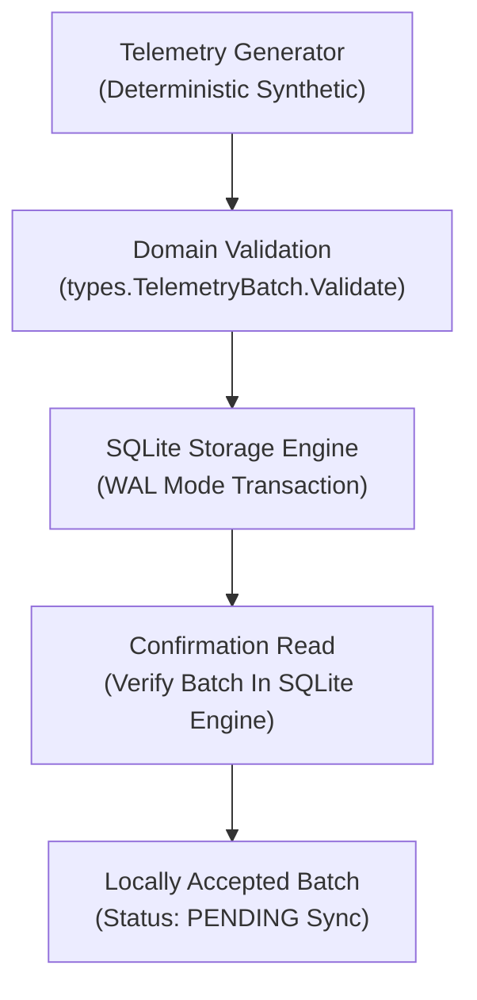
```mermaid
flowchart TD
    TG["Telemetry Generator\n(Deterministic Synthetic)"] --> VAL["Domain Validation\n(types.TelemetryBatch.Validate)"]
    VAL --> WAL["SQLite Storage Engine\n(WAL Mode Transaction)"]
    WAL --> CONF["Confirmation Read\n(Verify Batch In SQLite Engine)"]
    CONF --> PEND["Locally Accepted Batch\n(Status: PENDING Sync)"]
```

### Core Durability Invariants:
1. **Local Persistence Precedes Ingestion**: Batches are committed to local SQLite WAL storage *before* any remote synchronization is attempted.
2. **Autonomous Offline Survivability**: The edge node does not require the control plane to start, run, or persist telemetry. If the control plane is offline, unreachable, or non-existent, the edge continues collecting and buffering data locally.
3. **Write-Ahead Logging (WAL) & Synchronous Tuning**:
   * Provides non-blocking concurrent reads while transactional writes are occurring.
   * Configured with `PRAGMA synchronous=NORMAL;` to balance write throughput and flash longevity with crash recovery.
   * A successful transaction commit means SQLite has accepted the batch according to its configured durability semantics. While `NORMAL` mode protects against database corruption across application crashes and clean reboots, transactions committed since the most recent checkpoint could be lost during an abrupt, catastrophic hardware power outage. The exact guarantees of physical persistence depend on SQLite configuration and underlying OS/filesystem write caching.
4. **Verification Read-Back**: An immediate read-back verifies that the batch was correctly written and is queryable in the local database engine before marking it accepted. It does **not** claim or prove physical persistence to non-volatile storage media.
5. **Per-Node Sequence Continuity**: On startup, the agent queries `MAX(sequence_number)` from the local database, ensuring monotonic sequence numbers across application restarts without collisions or resets.
6. **Idempotency Guarantee**: `batch_id` serves as a unique primary key. Duplicate batch insertions are detected and rejected (`ErrDuplicateBatch`), preventing duplicate records.
7. **Realistic Buffer Limits (No False Zero-Data-Loss Claims)**: Physical disk capacity on edge hardware is finite. Telemetry batches are persisted with status `PENDING` to await upstream sync. AegisEdge explicitly does **not** claim mathematically guaranteed zero data loss under indefinite network partitions.

---

## 6. Edge-to-Control-Plane Synchronization Pipeline (Phase 3)

Phase 3 introduces edge-to-control-plane synchronization over HTTP to prove the distributed recovery flow:

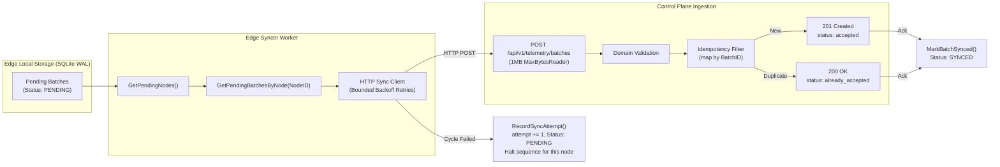
```mermaid
flowchart LR
    subgraph EdgeStore ["Edge Local Storage (SQLite WAL)"]
        PB["Pending Batches\n(Status: PENDING)"]
    end

    subgraph SyncerWorker ["Edge Syncer Worker"]
        PN["GetPendingNodes()"] --> PBNode["GetPendingBatchesByNode(NodeID)"]
        PBNode --> Client["HTTP Sync Client\n(Bounded Backoff Retries)"]
    end

    subgraph ControlPlane ["Control Plane Ingestion"]
        EP["POST /api/v1/telemetry/batches\n(1MB MaxBytesReader)"] --> VAL["Domain Validation"]
        VAL --> IDEM["Idempotency Filter\n(map by BatchID)"]
        IDEM -- "New" --> RES1["201 Created\nstatus: accepted"]
        IDEM -- "Duplicate" --> RES2["200 OK\nstatus: already_accepted"]
    end

    PB --> PN
    Client -- "HTTP POST" --> EP
    RES1 -- "Ack" --> Mark["MarkBatchSynced()\nStatus: SYNCED"]
    RES2 -- "Ack" --> Mark
    Client -- "Cycle Failed" --> Attempt["RecordSyncAttempt()\nattempt += 1, Status: PENDING\nHalt sequence for this node"]
```

### Core Synchronization Invariants:
1. **At-Least-Once Delivery + Idempotent Processing**: The system guarantees at-least-once delivery; exactly-once delivery is NOT claimed. Duplicates are handled idempotently via `BatchID`.
2. **Per-Node Sequence Ordering `(NodeID, SequenceNumber)`**: Sequence numbers are strictly per-node. Ordering is enforced per-node, never globally across different edge nodes.
3. **Failure Isolation Between Nodes**: If Node A sequence $N$ fails, subsequent batches for Node A are halted for that sync cycle to prevent out-of-order delivery, but Node B continues synchronizing independently.
4. **Retry Attempt Semantics**: The persisted `attempt` counter represents logical synchronization cycles and is incremented once per failed cycle, not per transient internal HTTP retry.
5. **Idempotent Duplicate Acceptance**: If the control plane returns HTTP 200 `already_accepted`, the edge marks the local batch as `SYNCED`.
6. **Timestamp Semantics**:
   * `collected_at`: Immutable edge timestamp when telemetry was captured.
   * `sent_at`: Recorded on the edge when transmission was attempted.
   * `ingested_at`: Appended by the control plane upon acceptance.
7. **Phase 3 Control Plane In-Memory Limitation**: Accepted batches survive for the lifetime of the control plane process. Process restarts reset the accepted set. Because the edge maintains records in SQLite until acknowledged, a control plane restart triggers safe re-synchronization without edge data loss. Durable control-plane storage will be introduced in later phases.

---

## 7. Event-Driven Messaging Architecture & Ingestion Pipeline (Phase 4 Design)

Phase 4 introduces an event-driven architecture using NATS to decouple edge devices from control-plane hostnames and enable multi-consumer telemetry streaming.

### Component Role Distinctions
To maintain architectural clarity throughout the platform, the messaging tiers are strictly distinguished:
* **NATS**: The underlying publish/subscribe messaging system responsible for subject-based routing, cluster topology, and connection multiplexing.
* **JetStream**: The durable streaming and persistence subsystem built into NATS, responsible for message storage, stream persistence, consumer offset tracking, deduplication windows (`Nats-Msg-Id`), and delivery acknowledgments (`Ack`/`Nak`/`Term`).
* **Consumer**: The application processing component (running within the control plane or auxiliary ingestor services) responsible for fetching messages from JetStream, validating envelopes and domain objects, enforcing application-level idempotency, executing business logic, and signaling message completion.

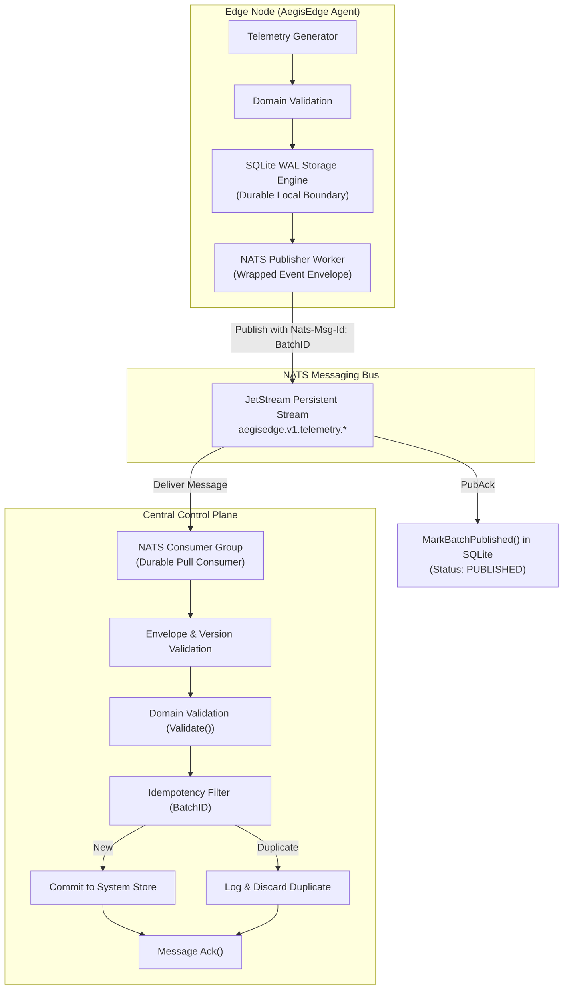
```mermaid
flowchart TD
    subgraph EdgeAgent ["Edge Node (AegisEdge Agent)"]
        TG["Telemetry Generator"] --> VAL["Domain Validation"]
        VAL --> WAL["SQLite WAL Storage Engine\n(Durable Local Boundary)"]
        WAL --> NP["NATS Publisher Worker\n(Wrapped Event Envelope)"]
    end

    subgraph Broker ["NATS Messaging Bus"]
        JS["JetStream Persistent Stream\naegisedge.v1.telemetry.*"]
    end

    subgraph ControlPlane ["Central Control Plane"]
        NC["NATS Consumer Group\n(Durable Pull Consumer)"] --> ENV["Envelope & Version Validation"]
        ENV --> DOM["Domain Validation (Validate())"]
        DOM --> IDEM["Idempotency Filter (BatchID)"]
        IDEM -- "New" --> COMMIT["Commit to System Store"]
        IDEM -- "Duplicate" --> NOOP["Log & Discard Duplicate"]
        COMMIT --> ACK["Message Ack()"]
        NOOP --> ACK
    end

    NP -- "Publish with Nats-Msg-Id: BatchID" --> JS
    JS -- "PubAck" --> ACKWAL["MarkBatchPublished() in SQLite\n(Status: PUBLISHED)"]
    JS -- "Deliver Message" --> NC
```

### Core Architecture Invariants (Phase 4):
1. **Persist Locally First, Publish Second**: SQLite remains the primary durability boundary for the edge node. NATS is an asynchronous distributed transport, not a replacement for local persistence. If NATS is unreachable or partitioned, batches remain safely stored in SQLite WAL according to configured SQLite durability semantics (`synchronous=NORMAL`), subject to local storage capacity limits and documented power loss guarantees.
2. **Canonical Event Envelope**: All NATS messages wrap payloads in a standardized metadata envelope (`event_id`, `event_type`, `schema_version`, `source_node_id`, `sequence_number`, `occurred_at`, `published_at`, `correlation_id`, `payload`).
3. **Event Identity & Deduplication**: For telemetry events, `event_id` is set identical to `batch_id`. NATS JetStream headers populate `Nats-Msg-Id: <batch_id>` for broker-side deduplication, while the control plane consumer enforces application-level idempotency by `batch_id`.
4. **Subject Hierarchy**: Formatted as `aegisedge.v1.<domain>.<node_id>` (e.g., `aegisedge.v1.telemetry.edge-node-01`). Supports per-node partitioning, subject authorization, and wildcard subscriptions (`aegisedge.v1.telemetry.*`).
5. **Delivery Semantics (At-Least-Once + Idempotent Processing)**: AegisEdge does not claim exactly-once delivery and instead uses at-least-once delivery with idempotent processing because retries, reconnects, and network or node failures can cause duplicate delivery.
6. **Per-Node Sequence Ordering**: Causality is strictly maintained per-node as `(NodeID, SequenceNumber)`. No global sequence synchronization across nodes is assumed or imposed. Node A failure isolates Node A sequence progression without blocking Node B.
7. **Transport Coexistence & Role Differentiation (No Automatic Fallback)**: The edge syncer adopts a pluggable `BatchPublisher` transport interface. At runtime, exactly one transport is active per sync worker cycle, avoiding split-brain database race conditions. Automatic runtime fallback from NATS to HTTP is **NOT implemented or implied**; when NATS connectivity is lost, telemetry remains safely buffered in local SQLite WAL according to configured durability semantics until NATS connectivity is restored. HTTP remains strictly a secondary, control-plane, and development/testing transport (for diagnostics `/healthz`, query APIs, initial device enrollment handshake, and lightweight local unit testing without an external NATS broker daemon), while NATS serves as the primary distributed streaming pipeline.

---

## 8. Resilience, Redelivery, and Recovery Architecture (Phase 4.4)

Phase 4.4 (formally defined in [ADR-0008](docs/decisions/ADR-0008-nats-resilience-and-recovery.md)) establishes the comprehensive failure, recovery, and redelivery design for the event pipeline:

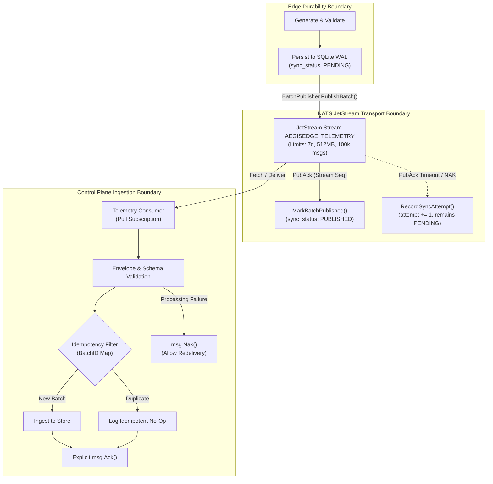
```mermaid
flowchart TD
    subgraph EdgeBoundary ["Edge Durability Boundary"]
        EB_COL["Generate & Validate"] --> EB_SQL["Persist to SQLite WAL\n(sync_status: PENDING)"]
    end

    subgraph TransportBoundary ["NATS JetStream Transport Boundary"]
        EB_SQL -- "BatchPublisher.PublishBatch()" --> TB_JS["JetStream Stream AEGISEDGE_TELEMETRY\n(Limits: 7d, 512MB, 100k msgs)"]
        TB_JS -- "PubAck (Stream Seq)" --> EB_ACK["MarkBatchPublished()\n(sync_status: PUBLISHED)"]
        TB_JS -. "PubAck Timeout / NAK" .-> EB_FAIL["RecordSyncAttempt()\n(attempt += 1, remains PENDING)"]
    end

    subgraph ConsumerBoundary ["Control Plane Ingestion Boundary"]
        TB_JS -- "Fetch / Deliver" --> CB_CONS["Telemetry Consumer\n(Pull Subscription)"]
        CB_CONS --> CB_VAL["Envelope & Schema Validation"]
        CB_VAL --> CB_IDEM{"Idempotency Filter\n(BatchID Map)"}
        CB_IDEM -- "New Batch" --> CB_STORE["Ingest to Store"]
        CB_IDEM -- "Duplicate" --> CB_LOG["Log Idempotent No-Op"]
        CB_STORE --> CB_ACK["Explicit msg.Ack()"]
        CB_LOG --> CB_ACK
        CB_VAL -- "Processing Failure" --> CB_NAK["msg.Nak()\n(Allow Redelivery)"]
    end
```

### Core Resilience Principles:
1. **Clear Boundary Separation**:
   * **Local Durability**: Governed by SQLite WAL commits (`synchronous=NORMAL`). Survives agent restarts and clean reboots.
   * **Broker Buffering**: Governed by JetStream file-backed stream retention (`limits`, 7-day age, 512 MB bytes, 100,000 messages).
   * **Consumer Idempotency**: Governed by `BatchID` equality. Prevents duplicate state mutation on redeliveries.
2. **The Two-Phase Publish Window**: If JetStream returns a `PubAck` but the local `MarkBatchPublished()` call fails (e.g. disk full), the edge preserves `PENDING` and republishes on the next cycle. The identical `BatchID`/`EventID` allows JetStream deduplication (within its 24-hour window) and the consumer's idempotency filter to suppress duplicate state mutation.
3. **Consumer ACK Discipline**: Messages are acknowledged **only after** successful application ingestion or when recognized as an idempotent duplicate. Processing failures trigger `Nak()`, enabling broker-managed redelivery.
4. **Per-Node Sequence Isolation**: Sequence progression is strictly bounded by `(NodeID, SequenceNumber)`. A transient failure on Node A sequence $N$ halts subsequent batches for Node A to prevent sequence gaps, while Node B continues synchronizing without interruption.

---

## 9. Edge Anomaly Detection Architecture (Phase 5.1 Design)

Phase 5.1 (formally defined in [ADR-0009](docs/decisions/ADR-0009-edge-anomaly-detection.md)) establishes the comprehensive architecture and design for edge-local anomaly detection and autonomous incident lifecycle evaluation.

> [!IMPORTANT]
> **Phase 5.1 Scope Boundary**: This phase is **ARCHITECTURE AND DESIGN ONLY**.
> No detector implementation code, no ML models, no Python runtimes or ML dependencies (`TensorFlow`, `PyTorch`, `scikit-learn`, `NumPy`, `pandas`), no SQLite schema changes, and no autonomous remediation actions are introduced in this phase.

### 9.1 The Decoupled Edge Intelligence Pipeline

The anomaly detection subsystem enforces strict decoupling across four primary stages:

$$\text{Telemetry} \longrightarrow \text{Local Anomaly Detection} \longrightarrow \text{Incident Engine} \longrightarrow \text{Safe Response}$$

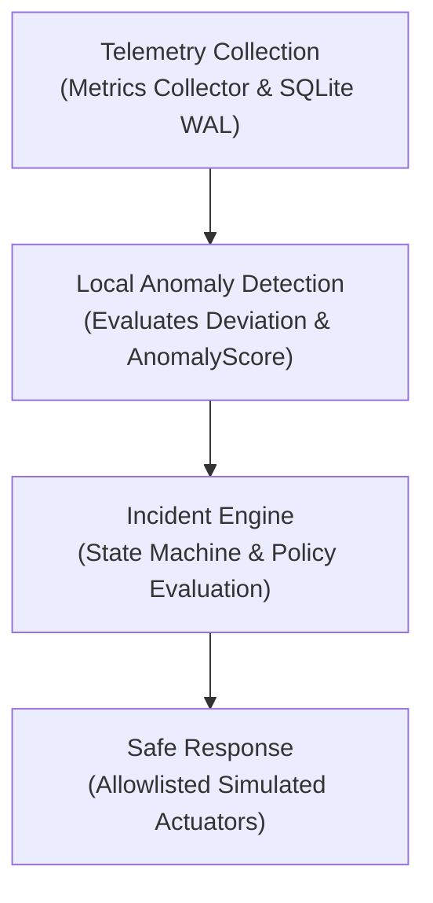
```mermaid
flowchart TD
    TEL["Telemetry Collection\n(Metrics Collector & SQLite WAL)"] --> DET["Local Anomaly Detection\n(Evaluates Deviation & AnomalyScore)"]
    DET --> INC["Incident Engine\n(State Machine & Policy Evaluation)"]
    INC --> SAFE["Safe Response\n(Allowlisted Simulated Actuators)"]
```

### 9.2 Layered Detection Strategy & Roadmap

AegisEdge adopts a three-tier layered intelligence strategy unified behind a single `AnomalyDetector` conceptual interface:

1. **Layer 1: Deterministic Threshold Rules (IMPLEMENTED — Phase 5.2/5.3)**: Static bounds checking ($O(1)$ evaluation) for hard resource saturation (`cpu > 90%`, `disk > 95%`, `memory > 92%`). Zero ML dependencies, fully deterministic, instant evaluation.
2. **Layer 2: Rolling Statistical Anomaly Detection (IMPLEMENTED — Phase 5.4)**: Sliding-window statistical tracking (population standard deviation, rolling z-score drift $|Z| \ge 3.0$). Detects progressive resource leaks, sudden spikes, and trend shifts without hardcoded static limits.
3. **Layer 3: Pure-Go Multivariate ML Inference & Offline Training (IMPLEMENTED — Phase 5.5B/5.5C; Distribution & Rollback DESIGNED — Phase 5.5D)**: Pure-Go Isolation Forest traversal engine (`MLDetector` in `edge/agent/detector/ml.go`) evaluating 4D telemetry vectors in real time, accompanied by an offline training CLI (`aegisedge-train` in `services/control-plane/cmd/aegisedge-train/`). Model distribution, staging, atomic activation, and autonomous rollback are designed in Phase 5.5D ([ADR-0009 §31](../decisions/ADR-0009-edge-anomaly-detection.md#31-phase-55d--ml-model-distribution--deployment-architecture)).

### 9.3 False-Positive Suppression Pipeline (Design Specification)

To prevent transient system spikes (cron jobs, GC pauses, network reconnects) from generating alert storms:

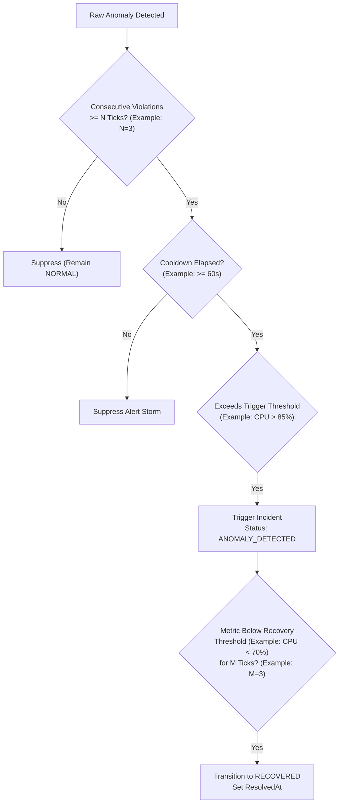
```mermaid
flowchart TD
    RAW["Raw Anomaly Detected"] --> CONSEC{"Consecutive Violations\n>= N Ticks? (Example: N=3)"}
    CONSEC -- "No" --> SUPP1["Suppress (Remain NORMAL)"]
    CONSEC -- "Yes" --> COOLDOWN{"Cooldown Elapsed?\n(Example: >= 60s)"}
    COOLDOWN -- "No" --> SUPP2["Suppress Alert Storm"]
    COOLDOWN -- "Yes" --> HYST{"Exceeds Trigger Threshold\n(Example: CPU > 85%)"}
    HYST -- "Yes" --> FIRE["Trigger Incident\nStatus: ANOMALY_DETECTED"]
    FIRE --> RECOV{"Metric Below Recovery\nThreshold (Example: CPU < 70%)\nfor M Ticks? (Example: M=3)"}
    RECOV -- "Yes" --> RESOLVE["Transition to RECOVERED\nSet ResolvedAt"]
```

> [!NOTE]
> The suppression parameters below are **initial design examples — not empirically validated production thresholds**. They do not guarantee the elimination of false positives under real physical workloads.

* **Consecutive Violations ($N$)**: An anomaly must persist for $N$ consecutive ticks (design example: 3) before an incident is created.
* **Hysteresis**: Distinct trigger ($\theta_{\text{trigger}} = 85\%$) and recovery ($\theta_{\text{recover}} = 70\%$) thresholds mitigate flapping.
* **Recovery Persistence ($M$)**: Normalization must persist for $M$ consecutive ticks (design example: 3) before transitioning to `RECOVERED`.
* **Cooldown Window**: An enforced cooldown interval (design example: 60s) prevents immediate re-triggering of the same rule.

### 9.4 Core Architectural Invariants:
1. **Detection $\neq$ Mitigation**: The detection subsystem is an observer only. It produces detection results and incident events and never executes shell commands, kills processes, or alters system configurations.
2. **Network-Independent Local Detection**: The detection engine is architecturally designed to operate without NATS, HTTP, cloud, or control-plane availability, subject to local compute, memory, storage, and process availability.
3. **Safety Boundary: Detection Performs No Host Mutation**: An architectural constraint requiring zero OS command executions, zero process terminations, and zero network modifications.
4. **Durability Option A (Future Design)**: Incidents will be persisted in a dedicated SQLite table (`edge_incidents`) physically separate from high-frequency telemetry. Durable incident persistence does not currently exist; schema migrations are deferred to a future incident phase.
5. **Stable Identity & Causality**: Incidents will generate immutable UUIDv4 identifiers upon creation; they do not reuse telemetry `BatchID` values or telemetry `SequenceNumber` counters.

---

## 10. Local Anomaly Detection Pipeline Integration (Phase 5.3)

Phase 5.3 integrates the deterministic anomaly detector ([ADR-0009](../decisions/ADR-0009-edge-anomaly-detection.md)) into the edge agent's collection and persistence pipeline.

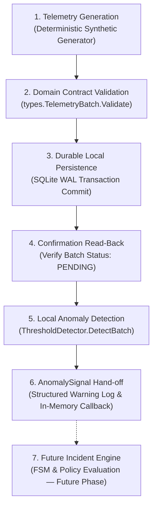
```mermaid
flowchart TD
    GEN["1. Telemetry Generation\n(Deterministic Synthetic Generator)"] --> VAL["2. Domain Contract Validation\n(types.TelemetryBatch.Validate)"]
    VAL --> WAL["3. Durable Local Persistence\n(SQLite WAL Transaction Commit)"]
    WAL --> CONF["4. Confirmation Read-Back\n(Verify Batch Status: PENDING)"]
    CONF --> DET["5. Local Anomaly Detection\n(ThresholdDetector.DetectBatch)"]
    DET --> SIG["6. AnomalySignal Hand-off\n(Structured Warning Log & In-Memory Callback)"]
    SIG -.-> INC["7. Future Incident Engine\n(FSM & Policy Evaluation — Future Phase)"]
```

### Core Pipeline Invariants:

1. **PERSIST FIRST. DETECT SECOND**:
   Local persistence precedes anomaly detection. Telemetry batches are committed to SQLite WAL and confirmed *before* the detector evaluates the batch.
2. **Strict Error Isolation**:
   * A detector failure or error **never** prevents successful telemetry persistence.
   * A detector error **never** marks the telemetry batch as failed or causes it to be discarded.
   * Telemetry remains durably accepted and buffered for upstream synchronization regardless of detector outcomes.
3. **Persistence Failure Semantics**:
   * If SQLite persistence fails, telemetry is **not** accepted.
   * The detector is **never executed** on batches that fail local persistence. The detector cannot become an alternative buffering or durability fallback.
4. **Independent Upstream Synchronization**:
   * Synchronization workers (HTTP client or NATS publisher) pull persisted `PENDING` batches asynchronously from SQLite.
   * Synchronization is completely decoupled from detection results; anomalous batches are synchronized identically to nominal batches.
5. **Local & Process-Local Lifecycle**:
   * Anomaly detection is offline with zero cloud, NATS, or HTTP dependencies.
   * The detector is instantiated once per agent process lifetime, maintaining in-memory hysteresis state partitioned by `NodeID:MetricName`.
   * Detector state is process-local; upon agent restart, the detector initializes fresh following cold-start semantics without altering SQLite WAL telemetry persistence.
6. **Anomaly $\neq$ Incident**:
   * The detector produces mathematical observation signals (`AnomalySignal` with normalized `AnomalyScore` $\in [0.0, 1.0]$).
   * Anomaly signals are logged locally using structured fields (`anomaly_id`, `node_id`, `metric_name`, `observed_value`, `expected_value`, `anomaly_score`, `detection_method`, `detector_version`, `correlation_id`) and handed off to downstream listeners via the `AnomalyHandler` interface.

---

## 11. Local Incident Engine & State Management (Phase 5.4)

Phase 5.4 introduces the **Local Incident Engine** ([ADR-0010](../decisions/ADR-0010-incident-engine.md)), converting discrete `AnomalySignal` domain observations into formal `types.Incident` entities governed by the canonical Incident FSM.

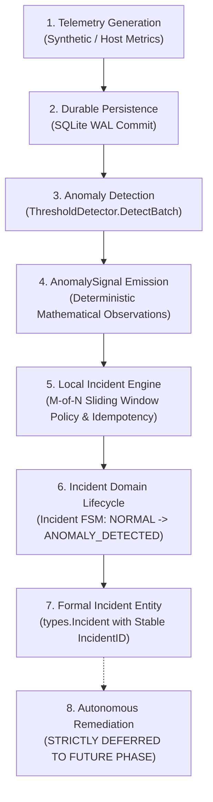
```mermaid
flowchart TD
    TEL["1. Telemetry Generation\n(Synthetic / Host Metrics)"] --> PERS["2. Durable Persistence\n(SQLite WAL Commit)"]
    PERS --> DET["3. Anomaly Detection\n(ThresholdDetector.DetectBatch)"]
    DET --> SIG["4. AnomalySignal Emission\n(Deterministic Mathematical Observations)"]
    SIG --> INC_ENG["5. Local Incident Engine\n(M-of-N Sliding Window Policy & Idempotency)"]
    INC_ENG --> INC_FSM["6. Incident Domain Lifecycle\n(Incident FSM: NORMAL -> ANOMALY_DETECTED)"]
    INC_FSM --> INC_OBJ["7. Formal Incident Entity\n(types.Incident with Stable IncidentID)"]
    INC_OBJ -.-> REM["8. Autonomous Remediation\n(STRICTLY DEFERRED TO FUTURE PHASE)"]
```

### Core Architecture & Operating Invariants:

1. **Pipeline Ordering & Durability Invariant**:
   The Incident Engine is strictly downstream of durable SQLite WAL persistence and anomaly detection:
   $$\text{Telemetry} \longrightarrow \text{Persistence} \longrightarrow \text{Anomaly Detection} \longrightarrow \text{Incident Engine} \longrightarrow \text{Incident}$$
   Local persistence always precedes detection and incident correlation.
2. **Correlation Policy ($M$-of-$N$ Sliding Window)**:
   * Transient, isolated spikes are suppressed to avoid alert fatigue.
   * By default, at least $M=2$ qualifying anomaly observations within a sliding window of $N=3$ observations (temporal horizon: 5 minutes) are required before an incident is opened.
3. **Partitioned Stream Isolation**:
   * Correlation state is strictly partitioned by composite key: `NodeID:MetricName`.
   * Cross-node and cross-metric state bleed is strictly prohibited; separate nodes and separate metrics maintain completely independent sliding observation windows.
4. **Stable Incident Identity**:
   * When an incident is triggered, an immutable `IncidentID` (UUIDv4) is assigned.
   * Persistent breaches during an active incident episode update the existing incident (`UpdatedAt`, `TriggerValue`, latest evidence) and preserve the identical `IncidentID`.
   * Re-breaches following recovery create a new, distinct incident with a new `IncidentID`.
5. **Idempotency & Replay Safety**:
   * Incoming signals are tracked by `AnomalyID`.
   * Duplicate deliveries of an already-processed `AnomalyID` are treated as no-ops and never increment the $M$-of-$N$ counter.
6. **Deterministic Severity Mapping**:
   * Normalized `AnomalyScore` $[0.0, 1.0]$ maps deterministically to `IncidentSeverity`:
     * Score $\ge 0.85 \implies$ `CRITICAL`
     * Score $\ge 0.60 \implies$ `HIGH`
     * Score $\ge 0.30 \implies$ `MEDIUM`
     * Score $< 0.30 \implies$ `LOW`
7. **Strict Error Isolation**:
   * Incident Engine failure or handler errors never invalidate or roll back persisted telemetry.
   * Telemetry batches remain safely committed to SQLite WAL with `PENDING` status, and background synchronization continues uninterrupted.
8. **Evolution to Durable State**:
   * In Phase 5.4, correlation state and active incidents resided in process-local memory (`LocalEngine`).
   * Phase 5.5 upgrades this to durable SQLite persistence while preserving the same domain FSM and correlation policies.
   * **Autonomous Remediation remains strictly a future phase**: no process kills, service restarts, network modifications, or shell commands are executed.

---

## 12. Durable Incident Persistence & Restart Recovery (Phase 5.5)

Phase 5.5 introduces **Durable Incident Persistence** ([ADR-0011](../decisions/ADR-0011-durable-incident-persistence.md)), backing the Local Incident Engine with dedicated SQLite tables (`incident_records` and `incident_observations`) under WAL mode.

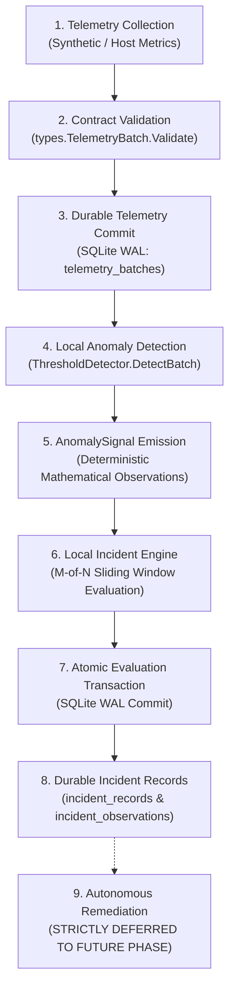
```mermaid
flowchart TD
    TEL["1. Telemetry Collection\n(Synthetic / Host Metrics)"] --> VAL["2. Contract Validation\n(types.TelemetryBatch.Validate)"]
    VAL --> WAL_TEL["3. Durable Telemetry Commit\n(SQLite WAL: telemetry_batches)"]
    WAL_TEL --> DET["4. Local Anomaly Detection\n(ThresholdDetector.DetectBatch)"]
    DET --> SIG["5. AnomalySignal Emission\n(Deterministic Mathematical Observations)"]
    SIG --> INC_ENG["6. Local Incident Engine\n(M-of-N Sliding Window Evaluation)"]
    INC_ENG --> TX["7. Atomic Evaluation Transaction\n(SQLite WAL Commit)"]
    TX --> WAL_INC["8. Durable Incident Records\n(incident_records & incident_observations)"]
    WAL_INC -.-> REM["9. Autonomous Remediation\n(STRICTLY DEFERRED TO FUTURE PHASE)"]
```

### Core Architecture & Operating Invariants:

1. **Clear Separation of Durability Concerns**:
   AegisEdge establishes explicit, decoupled durability boundaries:
   * **Telemetry Durability**: Raw time-series samples are persisted locally to `telemetry_batches` (SQLite WAL) before detection or synchronization.
   * **Incident Durability**: Derived anomaly observations and active incident lifecycles are persisted locally to `incident_records` and `incident_observations` (SQLite WAL) using atomic transactions.
   * **NATS Transport Durability**: In-transit messages are buffered in JetStream file-backed streams with 24-hour message deduplication (`Nats-Msg-Id`).
   * *Local incident persistence is strictly edge-local; central cloud incident replication is deferred to future transport phases.*
2. **SQLite as the Single Source of Truth**:
   * Process memory serves as a thread-safe working cache and reconstructed state.
   * SQLite WAL storage is the authoritative durable source of truth.
   * All incident lifecycle state updates and anomaly observation records are committed transactionally.
3. **Restart Recovery & State Reconstruction**:
   * Upon agent startup, `RecoverFromStore(ctx)` loads all active incidents (`ANOMALY_DETECTED`, `MITIGATING`, `ESCALATED`) and bounded recent observations within the sliding window horizon (`WindowDuration`, default: 5 minutes).
   * Unfinished $M$-of-$N$ correlation progress (e.g. 1 of 2 observations) survives agent restart and resumes evaluation seamlessly upon arrival of the next observation.
4. **Durable Idempotency**:
   * `anomaly_id` is the primary key in `incident_observations`.
   * Replayed or duplicate anomaly signals are rejected idempotently by SQLite index lookups and primary key constraints; duplicates never increment the $M$-of-$N$ counter or create duplicate incidents across restarts.
5. **Atomic Incident Evaluation Boundary**:
   * Observation insertion, idempotency verification, and incident creation/updates occur within a single SQLite transaction:
     $$\text{BEGIN} \longrightarrow \text{Idempotency Check} \longrightarrow \text{Persist Observation} \longrightarrow \text{Create/Update Incident} \longrightarrow \text{COMMIT}$$
   * If any step fails, the transaction rolls back cleanly, preventing partial or orphaned state.
6. **Strict Error & Failure Isolation**:
   $$\textbf{PERSIST TELEMETRY FIRST} \longrightarrow \textbf{DETECT SECOND} \longrightarrow \textbf{PERSIST INCIDENT THIRD}$$
   * An error or failure in incident persistence never rolls back or marks already-persisted telemetry batches as failed.
   * Background telemetry synchronization via HTTP or NATS JetStream proceeds independently.
7. **Consistency Boundaries & Non-Claims**:
   * Mitigation records, incidents, and telemetry are persisted through SQLite transactions using the project's configured WAL durability boundary. This provides the application's local durable persistence boundary under SQLite's configured semantics, but does not guarantee survival of every sudden-power-loss, storage-device, or hardware failure scenario.
   * Incident state survives application/process restart and SQLite crash-recovery scenarios covered by the configured WAL durability semantics (`synchronous=NORMAL`).
   * Physical power-loss durability depends on SQLite synchronous settings, filesystem behavior, storage hardware, and OS/device caches.
   * AegisEdge maintains strict explicit non-claims: no zero-data-loss claim, no arbitrary physical power-loss guarantee, no hardware failure guarantee, no distributed exactly-once delivery/execution, and no distributed transaction guarantee.

---

## 13. Safe Autonomous Response & Remediation Architecture (Phases 6.8 & 6.9 — Orchestration & Audit Trail)

Phase 6.1 established the architecture and safety model ([ADR-0012](../decisions/ADR-0012-autonomous-incident-response.md)). Phase 6.2 implemented the policy engine and safety validator, Phase 6.3 implemented the simulated action executor and dry-run pipeline, Phase 6.4 implemented durable mitigation persistence (Migration v4) and startup recovery, Phase 6.5 implemented the operator approval domain and durable approval persistence, Phase 6.6 implemented automated telemetry verification, Phase 6.7 implemented bounded escalation and circuit breaking, Phase 6.8 implements the controlled incident response orchestrator connecting these components into a bounded, deterministic, fail-closed remediation workflow, and Phase 6.9 implements the durable, structured, queryable audit trail.

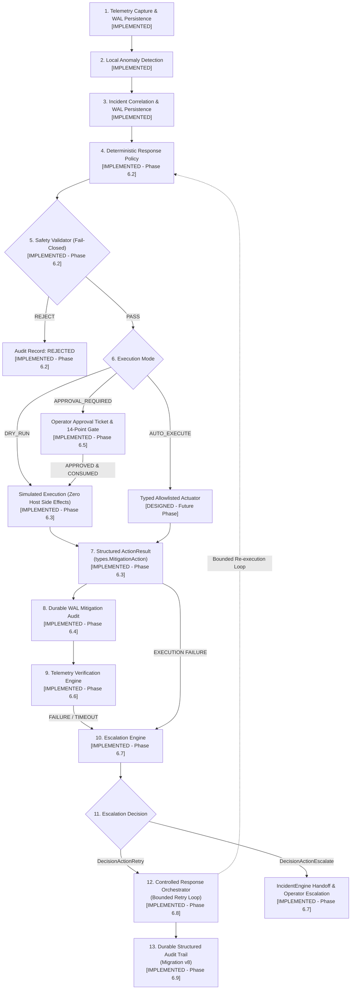
```mermaid
flowchart TD
    TEL["1. Telemetry Capture & WAL Persistence\n[IMPLEMENTED]"] --> DET["2. Local Anomaly Detection\n[IMPLEMENTED]"]
    DET --> INC["3. Incident Correlation & WAL Persistence\n[IMPLEMENTED]"]
    INC --> POL["4. Deterministic Response Policy\n[IMPLEMENTED - Phase 6.2]"]
    POL --> VAL{"5. Safety Validator (Fail-Closed)\n[IMPLEMENTED - Phase 6.2]"}

    VAL -- "REJECT" --> AUD_REJ["Audit Record: REJECTED\n[IMPLEMENTED - Phase 6.2]"]
    VAL -- "PASS" --> MODE{"6. Execution Mode"}

    MODE -- "DRY_RUN" --> SIM["Simulated Execution (Zero Host Side Effects)\n[IMPLEMENTED - Phase 6.3]"]
    MODE -- "AUTO_EXECUTE" --> EXEC["Typed Allowlisted Actuator\n[DESIGNED - Future Phase]"]
    MODE -- "APPROVAL_REQUIRED" --> QUEUE["Operator Approval Ticket & 14-Point Gate\n[IMPLEMENTED - Phase 6.5]"]

    QUEUE -- "APPROVED & CONSUMED" --> SIM
    SIM --> RES["7. Structured ActionResult\n(types.MitigationAction)\n[IMPLEMENTED - Phase 6.3]"]
    EXEC --> RES

    RES --> AUD["8. Durable WAL Mitigation Audit\n[IMPLEMENTED - Phase 6.4]"]
    AUD --> VER["9. Telemetry Verification Engine\n[IMPLEMENTED - Phase 6.6]"]

    VER -- "FAILURE / TIMEOUT" --> ESC["10. Escalation Engine\n[IMPLEMENTED - Phase 6.7]"]
    RES -- "EXECUTION FAILURE" --> ESC

    ESC --> DEC{"11. Escalation Decision"}
    DEC -- "DecisionActionRetry" --> ORCH["12. Controlled Response Orchestrator\n(Bounded Retry Loop)\n[IMPLEMENTED - Phase 6.8]"]
    DEC -- "DecisionActionEscalate" --> HANDOFF["IncidentEngine Handoff & Operator Escalation\n[IMPLEMENTED - Phase 6.7]"]

    ORCH -. "Bounded Re-execution Loop" .-> POL
    ORCH --> AUDIT_TRAIL["13. Durable Structured Audit Trail\n(Migration v8)\n[IMPLEMENTED - Phase 6.9]"]
```

### Explicit State of Implementation:
| Pipeline Stage | Implementation Status | Implementation Phase |
| :--- | :---: | :--- |
| **Telemetry Ingestion & SQLite WAL** | **CURRENTLY IMPLEMENTED** | Phase 1–2 |
| **Upstream HTTP / NATS JetStream Sync** | **CURRENTLY IMPLEMENTED** | Phase 3–4 |
| **Deterministic Threshold Anomaly Detection** | **CURRENTLY IMPLEMENTED** | Phase 5.1–5.3 |
| **Rolling Statistical Anomaly Detection** | **CURRENTLY IMPLEMENTED** | Phase 5.4 |
| **Local Incident Correlation ($M$-of-$N$)** | **CURRENTLY IMPLEMENTED** | Phase 5.4 |
| **Pure-Go Isolation Forest Inference Engine** | **CURRENTLY IMPLEMENTED** | Phase 5.5B |
| **Offline Model Training Tooling CLI** | **CURRENTLY IMPLEMENTED** | Phase 5.5C |
| **ML Model Shared Contracts & Validation** | **CURRENTLY IMPLEMENTED** | Phase 5.6A |
| **Edge Local Model Store & Candidate Staging** | **CURRENTLY IMPLEMENTED** | Phase 5.6B |
| **Edge ML Model Activation & Runtime Switching** | **CURRENTLY IMPLEMENTED** | Phase 5.6C |
| **Edge ML Model Rollback & Recovery** | **CURRENTLY IMPLEMENTED** | Phase 5.6D |
| **Autonomous Incident Response Architecture** | *DESIGNED / DOCUMENTED* | Phase 6.1 (ADR-0012 Design Only) |
| **ML Model Distribution Transport & Registry** | *DESIGNED (Future Implementation)* | Phase 5.5D Design Only |
| **Deterministic Response Policy Engine** | **CURRENTLY IMPLEMENTED** | Phase 6.2 (`edge/agent/response/policy.go`) |
| **Fail-Closed Safety Validator** | **CURRENTLY IMPLEMENTED** | Phase 6.2 (`edge/agent/response/validator.go`) |
| **Simulated Action Executor & Dry-Run Mode** | **CURRENTLY IMPLEMENTED** | Phase 6.3 (`edge/agent/response/executor.go`) |
| **Durable Mitigation Persistence (Migration v4)** | **CURRENTLY IMPLEMENTED** | Phase 6.4 (`edge/agent/storage/sqlite.go`) |
| **Operator Approval & Controlled Actuation Boundary** | **CURRENTLY IMPLEMENTED** | Phase 6.5 (`edge/agent/response/approval.go`, `edge/agent/storage/sqlite.go`) |
| **Automated Telemetry Verification Engine (Migration v6)** | **CURRENTLY IMPLEMENTED** | Phase 6.6 (`edge/agent/verification/engine.go`, `edge/agent/storage/sqlite.go`) |
| **Deterministic Incident Escalation & Circuit Breaker (Migration v7)** | **CURRENTLY IMPLEMENTED** | Phase 6.7 (`edge/agent/escalation/engine.go`, `edge/agent/storage/sqlite.go`) |
| **Controlled Incident Response Orchestrator** | **CURRENTLY IMPLEMENTED** | Phase 6.8 (`edge/agent/orchestrator/orchestrator.go`) |
| **Incident Response Audit Trail & Observability (Migration v8)** | **CURRENTLY IMPLEMENTED** | Phase 6.9 (`edge/agent/audit/`, `edge/agent/storage/sqlite.go`) |
| **Metrics & Operational Observability (Prometheus /metrics)** | **CURRENTLY IMPLEMENTED** | Phase 6.10 (`edge/agent/metrics/`) |
| **Real Host Actuation Execution** | *DESIGNED (Future Implementation)* | Future Phase |
| **External Operator Notification Infrastructure** | *DESIGNED (Future Implementation)* | Future Phase |

### Core Safety Invariant:
$$\textbf{INCIDENT [IMPLEMENTED]} \longrightarrow \textbf{RESPONSE POLICY [IMPLEMENTED]} \longrightarrow \textbf{SAFETY VALIDATION [IMPLEMENTED]} \longrightarrow \textbf{DRY-RUN / SIMULATION [IMPLEMENTED]} \longrightarrow \textbf{DURABLE PERSISTENCE [IMPLEMENTED]} \longrightarrow \textbf{OPERATOR APPROVAL [IMPLEMENTED]} \longrightarrow \textbf{SIMULATED EXECUTION [IMPLEMENTED]} \longrightarrow \textbf{TELEMETRY VERIFICATION [IMPLEMENTED]} \longrightarrow \textbf{ESCALATION ENGINE EVALUATION [IMPLEMENTED]} \longrightarrow \textbf{ORCHESTRATION / BOUNDED RETRY LOOP [IMPLEMENTED]} \longrightarrow \textbf{DURABLE AUDIT TRAIL [IMPLEMENTED]} \longrightarrow \textbf{OPERATIONAL METRICS [IMPLEMENTED]} \longrightarrow \textbf{HEALTH & READINESS [IMPLEMENTED]} \longrightarrow \textbf{GRACEFUL SHUTDOWN & LIFECYCLE [IMPLEMENTED]} \longrightarrow \textbf{PERSISTENT RUNTIME RECOVERY [IMPLEMENTED]} \longrightarrow \textbf{CONTROL-PLANE COORDINATION [IMPLEMENTED]} \longrightarrow \textbf{SECURE COMMUNICATION [IMPLEMENTED]}$$

1. **Zero Arbitrary Execution**: The system must **NEVER** execute arbitrary shell commands (`/bin/sh`, `powershell.exe`) or AI-generated raw command strings.
2. **Typed Allowlisted Actions Only**: Only compile-time typed actions (`SIMULATED_THROTTLE`, `SIMULATED_RESTART`, `SIMULATED_ISOLATE`, `SIMULATED_ALERT`) can be executed.
3. **Fail-Closed Safety Validation**: If target, parameters, cooldowns, or limits cannot be verified, the action is rejected immediately.
4. **Idempotency & Identity Hierarchy**:
   $$\textbf{AnomalyID} \longrightarrow \textbf{IncidentID} \longrightarrow \textbf{DecisionID} \longrightarrow \textbf{ActionID} \longrightarrow \textbf{EscalationID} \longrightarrow \textbf{EventID}$$
   Actions are deduplicated by `ActionID`; duplicate invocations across retries or restarts produce zero duplicate mutations. Escalations are deduplicated by deterministic `EscalationID`. Audit events are deduplicated by deterministic `EventID`.
5. **Ambiguous State Safety**: If an action times out or the process crashes during execution, execution cancellation is requested where supported. If execution state cannot be confirmed, the action enters `UNKNOWN_RECONCILIATION_REQUIRED` (an action execution state, not an `IncidentStatus`). In Phase 6.8 orchestration, an un-reconciled execution triggers fail-closed evaluation via the escalation engine; in Phase 6.4, `RecoverInFlightMitigations` transitions the persisted mitigation record to `UNKNOWN_RECONCILIATION_REQUIRED` without mutating the incident FSM. The system **never blindly retries** an ambiguous execution. Future actuator-specific reconciliation will determine whether the action executed successfully.
6. **Strict Pipeline Isolation**: A failure in response policy, safety validation, or actuation can never roll back or corrupt committed telemetry batches or incident records. Upstream synchronization proceeds unaffected.
7. **Offline Autonomy**: All response evaluation, validation, and simulated actuation execute entirely locally without cloud, internet, control plane, or external dependencies.
8. **Verification Requirement & Non-Claims (Phase 6.6)**: Actuator completion (exit code 0 or simulated success) does not prove that an incident is resolved ("Execution success does not equal recovery"). Subsequent telemetry conditions must be observed post-execution to confirm recovery via $N$ consecutive healthy samples within an observation timeout window. Recovery confirmation means that the configured recovery condition was satisfied by subsequent telemetry; it does not prove that the mitigation caused the recovery.
9. **Strict AI / ML Segregation**: Machine learning produces mathematical observations (anomaly score, signal, evidence) but has zero direct execution authority over host commands, action types, or filesystem operations.
10. **Operator Approval & Decision Binding (Phase 6.5)**: Actions requiring approval enforce an 8-field deterministic SHA-256 fingerprint binding `DecisionID`, `IncidentID`, `ActionID`, `NodeID`, `ActionType`, `Target`, `PolicyVersion`, and canonical parameters. Approval state transitions (`PENDING -> APPROVED -> CONSUMED`) are persisted to SQLite WAL (`approval_records`). Approvals are single-use tokens; real host mutation remains prohibited, and operator identity is unauthenticated application metadata without cryptographic signatures, non-repudiation, or tamper-proof audit logging.
12. **Incident Escalation & Circuit Breaker (Phase 6.7)**: Bounded automatic remediation loops enforce the critical invariant: "NO UNBOUNDED AUTONOMOUS REMEDIATION LOOP." Phase 6.7 bounds the retry decisions produced by the escalation policy and prevents the escalation engine from authorizing retries beyond the configured budget. The Phase 6.7 circuit breaker is scoped to the node/incident pair `(NodeID, IncidentID)`. Configured with default `MaxAutomaticRetries = 3`: Phase 6.7 permits at most three retry decisions after the initial failed attempt, bounding total mitigation executions to at most 4 if the orchestration layer honors all retry decisions. Configured with `RetryCooldown = 5m`, sliding `FailureWindow = 30m`, and fail-closed `CircuitBreakerFailureThreshold = 3`. Deterministic failure classifications (`MITIGATION_FAILED`, `VERIFICATION_TIMED_OUT`, `VERIFICATION_REJECTED`, `UNKNOWN_RECONCILIATION_REQUIRED`, `COOLDOWN_ACTIVE`, `RETRY_BUDGET_EXHAUSTED`, `CIRCUIT_BREAKER_OPEN`). Fail-closed circuit breaker enforces strictly `CLOSED -> OPEN -> explicit operator reset -> CLOSED`. SHA-256 deterministic escalation identity over `IncidentID | NodeID | ActionID | FailureClassification | PolicyVersion | Attempt`. SQLite WAL persistence via Migration v7 (`escalation_records` and `circuit_breaker_states`). Restart recovery preserves circuit `OPEN` state and cooldown across agent reboots. Handoff to `IncidentEngine.TransitionActiveIncident(..., types.StatusEscalated, now)` preserves the canonical Incident FSM without direct struct mutation.
13. **Controlled Incident Response Orchestration (Phase 6.8)**: The orchestration layer (`edge/agent/orchestrator`) connects detection, incident correlation, response policy, safety validation, simulated mitigation, verification, and escalation into a bounded, deterministic, fail-closed simulated incident-response workflow. The orchestrator never independently initiates retries without `EscalationEngine` returning `DecisionActionRetry`. The bounded retry budget permits at most `MaxAutomaticRetries = 3` after the initial failure (bounding total mitigation executions to at most 4, backed by hard defense-in-depth ceiling `MaxExecutionCeiling = 4`; the hard ceiling of 4 agrees with the configured maximum of 3 automatic retries and cannot authorize an additional execution beyond the escalation policy). Concurrency is strictly serialized per `IncidentID` via in-flight leader-follower tracking with wait groups. Actuation remains compile-time restricted to `SIMULATED_*` actions; execution of arbitrary shell commands or real host modifications is strictly prevented. Durable persistence precedes simulated actuation: the orchestrator requires the mitigation record to be successfully persisted before invoking the executor. Uses durable SQLite mitigation and verification records to detect previously recorded logical attempts across supported restart-recovery paths and suppress duplicate orchestration where persisted state is available.
14. **Incident Response Audit Trail & Observability (Phase 6.9)**: The audit subsystem (`edge/agent/audit`) provides a durable, structured, queryable audit trail for the complete incident-response lifecycle. Enforces 25 discrete allowlisted `EventType` constants across policy evaluation, approval gates, safety validation, mitigation execution, verification, escalation, retry authorization, and orchestration completion. Stored in SQLite WAL via Migration v8 (`audit_events` table and 5 query indexes). SHA-256 deterministic event identity `ComputeEventID(nodeID, incidentID, eventType, attempt, discriminator)` guarantees identical hash on re-emission while preventing collisions across retry attempts. Fail-closed metadata sanitation rejects credentials and scripts, bounding payloads to 8192 bytes and 32 key-value pairs. All query APIs enforce default (100) and hard maximum (1000) limits. Reconstructs complete end-to-end incident timelines by `IncidentID`, `CorrelationID`, or `NodeID`. Operational distinction: audit recording is fail-safe and non-fatal to operational mitigation actions; operator identity is unauthenticated local metadata without cryptographic non-repudiation or tamper-proof chains.
15. **Metrics & Operational Observability (Phase 6.10)**: The metrics subsystem (`edge/agent/metrics`) provides a local, Prometheus-compatible operational metrics layer for monitoring the complete incident-response lifecycle. Enforces bounded label cardinality (no IDs, targets, errors, or timestamps; fail-closed sanitization to "unknown"). Exposes 27 metric families via pure-Go Prometheus-compatible text format (`text/plain; version=0.0.4; charset=utf-8`) at local read-only HTTP endpoint `127.0.0.1:9091/metrics`. Metric updates are process-lifetime in-memory operations that do not intentionally alter business decisions or block operational response logic.
16. **Edge Agent Health & Readiness Model (Phase 6.11)**: The health subsystem (`edge/agent/health`) provides an explicit, bounded health and readiness model distinguishing process liveness (`GET /healthz`) from subsystem readiness (`GET /readyz`). Enforces 4 explicit lifecycle states (`INITIALIZING`, `READY`, `DEGRADED`, `SHUTTING_DOWN`) and a fixed allowlist of subsystem checks (`config`, `storage`, `telemetry`, `incident_engine`, `response_engine`, `metrics`). Readiness evaluates to true iff in `READY` state with all required checks reporting `OK`. Optional subsystems (such as disabled metrics) do not fail readiness. Read-only endpoints reject mutation methods with `405 Method Not Allowed` (`Allow: GET, HEAD`). Diagnostic messages are filtered fail-closed to prevent secret, path, or SQL disclosure. Thread-safe in-memory tracking ensures that probe handlers do not perform application-level disk or network I/O during HTTP probe evaluation. Health checks are strict observers and have zero authority over business decisions or actuation.
17. **Controlled Graceful Shutdown & Runtime Lifecycle Coordinator (Phase 6.12)**: The lifecycle subsystem (`edge/agent/lifecycle`) provides deterministic, bounded, concurrency-safe graceful shutdown and runtime lifecycle management. Governs 4 bounded states (`STARTING`, `RUNNING`, `SHUTTING_DOWN`, `STOPPED`) and validates strictly permitted state movements fail-closed. Executes registered shutdown hooks in deterministic numerical order (`health` order 10 $\rightarrow$ `coordination` order 30 $\rightarrow$ `metrics_server` order 40 $\rightarrow$ `nats_publisher` order 45 $\rightarrow$ `storage` order 50). Hooks execute outside the coordinator mutex lock, preventing lock inversion deadlocks. First invocation initiates shutdown and cancels the root context (`Context()`); concurrent or subsequent callers await completion and receive the identical cached result. Hard bounded by a configurable timeout (`DefaultShutdownTimeout = 10s`, `AEGISEDGE_SHUTDOWN_TIMEOUT` / `-shutdown-timeout`). Integrates operational Prometheus metrics (`aegisedge_shutdowns_total`, `aegisedge_shutdown_duration_seconds`, `aegisedge_shutdown_timeouts_total`). Process-local scope: does not execute distributed cluster shutdown, invoke shell commands, or make unachievable promises of zero data loss under abrupt power loss.
18. **Persistent Runtime State & Safe Restart Recovery (Phase 6.13)**: The recovery subsystem (`edge/agent/recovery`) introduces a persistent runtime recovery model governing safe restart reconciliation ([ADR-0015](../decisions/ADR-0015-persistent-runtime-state-and-safe-restart-recovery.md)). Enforces the core safety invariant: **RESTART MUST NEVER BY ITSELF AUTHORIZE ACTION EXECUTION**. Bounded recovery state model (`RECOVERY_NOT_REQUIRED`, `RECOVERY_LOADING`, `RECOVERY_RECONCILING`, `RECOVERY_BLOCKED`, `RECOVERY_COMPLETE`, `RECOVERY_FAILED`). SQLite WAL persistence via Migration v9 introduces `runtime_checkpoints` table with indexes (`idx_runtime_checkpoints_node`, `idx_runtime_checkpoints_created`). Reconciles in-flight mitigations (`EXECUTING -> UNKNOWN_RECONCILIATION_REQUIRED`); any ambiguous unconfirmed execution enters `RECOVERY_BLOCKED`, blocks readiness (`503`), and requires manual operator intervention. Reconciles `PENDING` mitigations to `SKIPPED` with reason `interrupted by agent restart prior to execution` and error code `RESTART_ABORTED`. Safely expires past-deadline verifications to `TIMED_OUT`. Registers required check `health.CheckRecovery` with health tracker. Records 7 structured audit event types (`recovery_started`, `recovery_state_loaded`, `recovery_reconciliation_required`, `recovery_reconciliation_completed`, `recovery_blocked`, `recovery_failed`, `recovery_completed`). Exposes 5 Prometheus metrics (`aegisedge_recovery_total`, `aegisedge_recovery_duration_seconds`, `aegisedge_recovery_reconciliation_required_total`, `aegisedge_recovery_blocked_total`, `aegisedge_recovery_failed_total`). Strictly prohibits arbitrary shell execution, real host mutations, or approval bypasses.
19. **Edge ↔ Control-Plane Coordination (Phase 6.14)**: The coordination subsystem (`edge/agent/coordination`) introduces a bounded, offline-first coordination layer ([ADR-0016](../decisions/ADR-0016-edge-control-plane-coordination.md)). Core invariant: **EDGE OPERATES AUTONOMOUSLY OFFLINE $\longrightarrow$ CONTROL PLANE AVAILABLE $\longrightarrow$ EDGE REGISTERS / HEARTBEATS $\longrightarrow$ COORDINATION WHEN AVAILABLE $\longrightarrow$ EDGE REMAINS SAFE AND AUTONOMOUS IF LOST**. Persists immutable node identity via Migration v10 (`node_identity` table) with cryptographic random generation fallback and bounded security validation. Manages bounded connection states (`DISCONNECTED`, `CONNECTING`, `CONNECTED`, `DEGRADED`, `STOPPING`). Implements periodic liveness heartbeats with monotonic sequence numbers and exponential reconnect backoff (1s doubling up to 30s). Registers optional health check `health.CheckControlPlane` (`required = false`); connection loss marks check degraded but preserves agent readiness (`200 OK`). Automatic edge re-registration upon receiving 404 from control plane. Durably logs 8 dedicated audit event types (`CONTROL_PLANE_*`) under `system-coordination`. Exposes 6 cardinality-safe Prometheus metrics (`aegisedge_control_plane_*`). Graceful teardown registered at order 30 in lifecycle coordinator. Strictly prohibits remote command execution, shell invocation, or distributed consensus dependencies.
20. **Secure Edge–Control-Plane Communication (Phase 6.15)**: The security layer (`shared/types`, `services/control-plane/server`, `edge/agent/coordination`) provides authenticated, anti-replay, and authorized edge-to-control-plane communication ([ADR-0017](../decisions/ADR-0017-secure-edge-control-plane-communication.md)). Core invariant: **EDGE OPERATES AUTONOMOUSLY OFFLINE $\longrightarrow$ PERSISTS LOCALLY $\longrightarrow$ AUTHENTICATES WHEN AVAILABLE $\longrightarrow$ COORDINATES SECURELY $\longrightarrow$ REMAINS SAFE IF CP IS UNAVAILABLE**. Implements HMAC-SHA256 request signing using Go standard library (`crypto/hmac`, `crypto/sha256`, `crypto/subtle`, `crypto/rand`). Cryptographically binds HTTP verb, request target (path + raw query), node ID, timestamp, nonce, and hex-encoded body SHA-256 digest into a canonical string. Mitigates side channels using constant-time signature comparison (`subtle.ConstantTimeCompare`). Supports per-node credential isolation (`NodeSecrets` and dynamic `SecretResolver`) as well as fallback fleet secrets. Hardens against DoS and memory exhaustion by executing signature verification strictly prior to nonce caching, ensuring invalid requests cannot consume replay cache capacity or front-run nonces. Enforces sliding-window anti-replay with max clock skew (default 5m) and thread-safe memory-bounded `ReplayCache` (fail-closed capacity limit). Enforces discrete privilege boundaries: public (`GET /healthz`), node-authenticated (`POST /register`, `POST /heartbeat`, `POST /telemetry/batches`, `GET /nodes/{id}` for own node with anti-impersonation checks), and admin-only (`GET /nodes`, `GET /telemetry/batches` via Bearer token with zero fallthrough to node auth). Enforces fail-safe configuration validation (`AuthConfig.Validate`) prohibiting unauthenticated operation in production or on non-loopback addresses and enforcing $\ge 16$ character keys. Requires TLS (HTTPS) on non-loopback deployments for payload confidentiality, rejecting incomplete TLS configurations fail-closed. Emits `aegisedge_control_plane_auth_failures_total` metrics with bounded `reason` labels and logs `CONTROL_PLANE_AUTH_FAILED` audit events. Auth failure transitions edge coordinator to `StateDegraded` while agent preserves complete offline operational readiness.

---

## 14. ML Model Lifecycle: Staging, Activation & Rollback Architecture

Phase 5.5D established the architecture and invariants, Phase 5.6A extracted shared contracts (`shared/ml`), Phase 5.6B implemented edge candidate staging (`edge/agent/modelstore`), Phase 5.6C implemented runtime activation and switching (`edge/agent/modelactivation`), and Phase 5.6D implements edge-side model rollback and recovery (`edge/agent/modelactivation.Manager.Rollback`) ([ADR-0009 §31](../decisions/ADR-0009-edge-anomaly-detection.md#31-phase-55d--ml-model-distribution--deployment-architecture)).

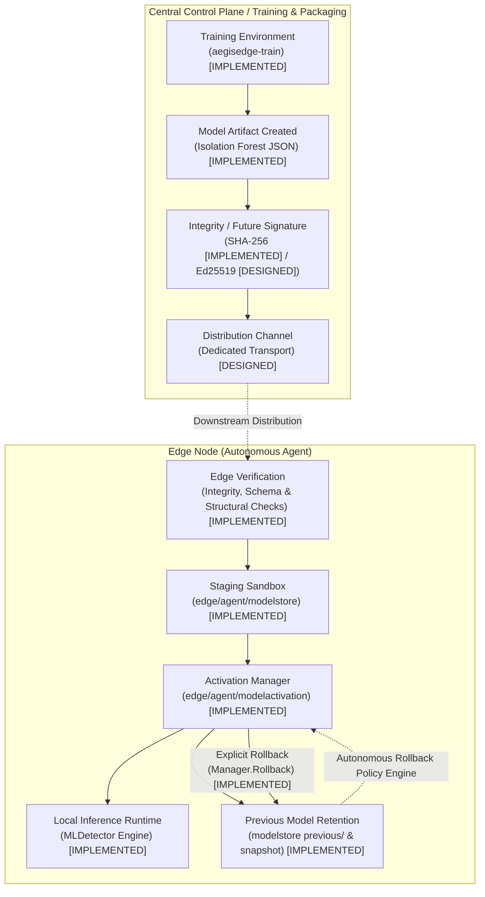
```mermaid
flowchart TD
    subgraph ControlPlane ["Central Control Plane / Training & Packaging"]
        TRAIN["Training Environment\n(aegisedge-train) [IMPLEMENTED]"] --> ART["Model Artifact Created\n(Isolation Forest JSON) [IMPLEMENTED]"]
        ART --> INT["Integrity / Future Signature\n(SHA-256 [IMPLEMENTED] / Ed25519 [DESIGNED])"]
        INT --> DIST["Distribution Channel\n(Dedicated Transport) [DESIGNED]"]
    end

    subgraph EdgeNode ["Edge Node (Autonomous Agent)"]
        DIST -. "Downstream Distribution" .-> VER["Edge Verification\n(Integrity, Schema & Structural Checks) [IMPLEMENTED]"]
        VER --> STAGE["Staging Sandbox\n(edge/agent/modelstore) [IMPLEMENTED]"]
        STAGE --> ACT["Activation Manager\n(edge/agent/modelactivation) [IMPLEMENTED]"]
        ACT --> INF["Local Inference Runtime\n(MLDetector Engine) [IMPLEMENTED]"]
        ACT --> PREV["Previous Model Retention\n(modelstore previous/ & snapshot) [IMPLEMENTED]"]
        ACT -- "Explicit Rollback\n(Manager.Rollback) [IMPLEMENTED]" --> PREV
        PREV -. "Autonomous Rollback Policy Engine" .-> ACT
    end
```

### Core Architecture & Operating Invariants:

1. **Central Safety Invariant**:
   $$\textbf{"An edge node must never replace its active model with an unverified, incompatible, malformed, or unsupported model."}$$
2. **MODEL AVAILABLE $\neq$ MODEL ACTIVE**:
   The presence or announcement of an available candidate model in the control plane or local staging grants zero authority for edge execution. Only successful multi-stage verification, structural validation, and explicit promotion permit real-time inference.
3. **Strict Decoupling from Telemetry Synchronization**:
   Model deployment operates across a separate downstream channel. It does not depend on, block, or reuse telemetry `BatchID`, monotonic sequence numbers, or telemetry ACK semantics. The existing telemetry path (`SQLite -> PENDING -> NATS/HTTP -> Control Plane`) remains completely independent. Repeated delivery of the same valid model artifact must not cause an unsafe or inconsistent activation.
4. **Offline Autonomy Invariant**:
   $$\textbf{CONTROL PLANE OFFLINE } \longrightarrow \textbf{ ACTIVE MODEL REMAINS ACTIVE } \longrightarrow \textbf{ LOCAL DETECTION CONTINUES}$$
   If the control plane, registry, or network is unavailable, the edge agent continues anomaly detection using its currently validated active model, subject to local hardware, storage, and runtime availability.
5. **Runtime Activation & Rollback Architecture (Phase 5.6C & 5.6D Implemented)**:
   * **In-Memory**: Concurrency-safe runtime model switching is implemented via `sync.RWMutex` protecting active model pointer swaps and dynamic `RuntimeDetector` dispatching. Multiple goroutines can obtain the current detector concurrently through the existing read-lock path; inference calculation occurs after the detector reference has been acquired. Multiple activation and rollback attempts are serialized via sync.Mutex.
   * **Failure Safety**: If activation validation, rollback validation, or runtime model construction fails, the existing active model remains unchanged and continues to serve subsequent inference requests.
   * **Filesystem Durability & Rollback (Phase 5.6D Implemented)**: The local model store retains active and previous model artifacts in ctive/ and previous/ directories using temporary-directory-based safe local swap. Explicit rollback validates the previous model artifact, constructs a new runtime detector, performs safe local filesystem rotation between active and previous states, and updates the in-memory detector under sync.RWMutex. The implementation protects the logical active/previous model state during normal operation, but crash consistency of filesystem rotation across arbitrary process or machine failures is not formally guaranteed or verified in this phase. Automated drift/panic-based rollback policies are designed for future implementation phases.
6. **Previous Model Retention & Rollback (Phase 5.6D Implemented)**:
   The activation manager and model store retain the complete artifact and metadata of the superseded active model in `previous/`. Explicit invocation of `Rollback(ctx)` performs full pre-promotion validation before performing safe local filesystem rotation between active and previous states, supporting repeated valid back-and-forth rollbacks ($A \leftrightarrow B$).
7. **Integrity vs. Authenticity**:
   The current SHA-256 checksum strictly guarantees file integrity against corruption, bit-rot, and truncation. SHA-256 alone does NOT provide origin authentication, non-repudiation, publisher identity, or replay/downgrade protection. Cryptographic authenticity via asymmetric signatures (e.g. Ed25519) is strictly future design.
8. **Potential Future Degradation Hierarchy**:
   Active ML model $\rightarrow$ Previous validated ML model $\rightarrow$ Statistical detector $\rightarrow$ Threshold detector. Automatic runtime detector failover is future work and is not implemented in Phase 5.6C. The existing `ThresholdDetector`, `StatisticalDetector`, and `MLDetector` are separate existing components; their automatic runtime orchestration is not yet implemented.
