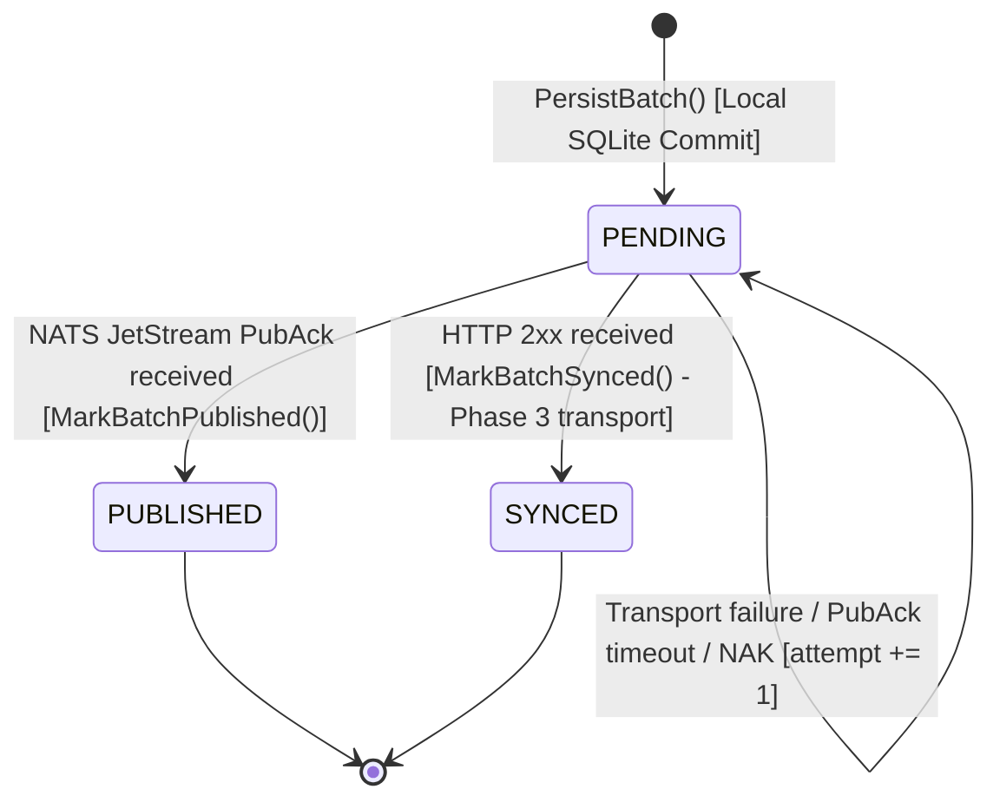

# ADR-0008: NATS JetStream Resilience, Redelivery, and Recovery Design

**Status**: Accepted (Phase 4.4 Architecture & Design)  
**Date**: 2026-09-23  
**Deciders**: AegisEdge engineering team  
**Supersedes**: None  
**Relates to**: ADR-0004 (SQLite WAL Durability), ADR-0005 (HTTP Sync & Offline Recovery), ADR-0006 (NATS Event-Driven Messaging Architecture), ADR-0007 (NATS JetStream Application Integration)

---

## 1. Context

In Phase 4.1 through Phase 4.3, AegisEdge transitioned from direct point-to-point HTTP synchronization to a decoupled event-driven pipeline powered by NATS JetStream:
1. **Phase 4.1 (ADR-0006)** defined the event envelope specification, subject hierarchy, and delivery contracts.
2. **Phase 4.2** provisioned the `AEGISEDGE_TELEMETRY` stream on a standalone NATS JetStream server.
3. **Phase 4.3 (ADR-0007)** implemented the live end-to-end integration:
   $$\text{SQLite WAL} \rightarrow \text{PENDING} \rightarrow \text{NATS JetStream} \rightarrow \text{PubAck} \rightarrow \text{PUBLISHED} \rightarrow \text{Consumer} \rightarrow \text{Idempotent Ingestion} \rightarrow \text{ACK}$$

Distributed messaging across intermittent physical networks inevitably encounters disconnections, timeouts, crashes, duplicate deliveries, and partial failures. To ensure AegisEdge operates safely and predictably under all conditions, Phase 4.4 formalizes the comprehensive resilience, redelivery, and recovery model for the NATS/JetStream pipeline.

---

## 2. Core Architectural Invariant

$$\textbf{PERSIST LOCALLY FIRST. PUBLISH SECOND.}$$

**SQLite remains the primary local durability boundary for the edge node.**
NATS JetStream is an asynchronous, durable streaming transport; it **never** replaces SQLite as the edge persistence boundary.

The edge agent must never dispatch an in-memory telemetry batch directly to NATS. Every batch is validated against domain contracts and committed to local SQLite storage in Write-Ahead Logging (WAL) mode with `sync_status = 'PENDING'` *before* any NATS publication is attempted. If NATS is partitioned, degraded, or offline, telemetry remains buffered in SQLite according to configured SQLite durability semantics, subject to local storage capacity limits.

---

## 3. Durability & Authority Boundaries

A distributed system contains distinct layers of state. Conflating these layers leads to false reliability assumptions:

```text
+-------------------+       +-----------------------+       +-------------------------+
|    Edge SQLite    |       |     NATS JetStream    |       |   Control Plane (CP)    |
| Durability Layer  | ----> | Stream Buffer Layer   | ----> | Ingestion / Processing  |
| (Local Authority) |       | (Transport Authority) |       | (Application Authority) |
+-------------------+       +-----------------------+       +-------------------------+
  sync_status: PENDING        Stream: AEGISEDGE_TELEMETRY     In-memory Ingested Map
  sync_status: PUBLISHED      File-backed persistence         Idempotency: BatchID
  sync_status: SYNCED         Retention: Limits (7d/512MB)    Explicit Message ACK
```

| Layer | Component | Authority Scope | Guarantees & Constraints |
| :--- | :--- | :--- | :--- |
| **Local Durability** | Edge SQLite WAL | What telemetry was collected and persisted on this edge node. | Committed via SQLite transaction (`PRAGMA synchronous=NORMAL`). Authoritative on the edge. Protected against process crash. |
| **Transport Buffering** | NATS JetStream | What telemetry events have been received and buffered for subscribers. | At-least-once durable streaming subject to configured stream retention limits (7 days, 512 MB, 100k msgs). |
| **Ingestion Idempotency** | Control Plane Consumer | What telemetry batches have been accepted into the control plane. | Currently in-memory map keyed on `BatchID`. Enforces idempotency for the current process lifetime; reset on restart. |
| **Delivery Ack** | Consumer JetStream ACK | Confirmation to broker that processing succeeded. | Issued **only after** successful application-level ingestion. |

---

## 4. State Machine & Batch Lifecycle

AegisEdge maintains strict, explicit batch states. No existing state is reinterpreted:



### State Semantics
* **`PENDING`**: The batch is committed to local SQLite WAL storage but has **not** received an authoritative upstream acknowledgment from the active transport. Pending batches are eligible for retrieval by synchronization workers.
* **`PUBLISHED`**: The batch was dispatched over NATS and JetStream returned a verified `PubAck` (stream sequence allocated). The batch is marked with `published_at` and is excluded from subsequent pending queries.
* **`SYNCED`**: The batch was delivered via the Phase 3 direct HTTP transport and acknowledged with HTTP 201/200. It remains fully supported for backward compatibility and environments where NATS is disabled.
* **`SYNCING` / `FAILED`**: Reserved in the enumeration for future explicit leasing or dead-letter handling. **Not used** in Phase 4.4.

---

## 5. Comprehensive Failure Matrix (Scenarios A through S)

The following matrix documents the exact behavior, authoritative state, and recovery semantics across nineteen distributed failure scenarios:

| ID | Failure Scenario | Failure Point | Local SQLite State | JetStream State | CP Consumer State | Retry Occurs? | Duplicate Possible? | ACK Occurs? | Recovery Behavior & Remaining Limitations |
| :--- | :--- | :--- | :--- | :--- | :--- | :---: | :---: | :---: | :--- |
| **A** | NATS server unavailable before publish | Edge publisher dial / connection check | `PENDING` (attempt counter incremented on cycle failure) | No record | No record | Yes | No | No | Edge records cycle failure via `RecordSyncAttempt()`, halts sequence for this node, and buffers batches in SQLite. Retries on next sync ticker. Finite disk space limit. |
| **B** | NATS connection lost during publish socket write | TCP write to NATS socket | `PENDING` | Message uncommitted or lost in socket buffer | No record | Yes | Unlikely | No | Go client detects disconnect; publish fails; batch remains `PENDING`. On reconnection, batch is republished. |
| **C** | JetStream PubAck timeout | Broker accepted message or dropped it; response timed out | `PENDING` | Unknown (may or may not have committed) | Unknown | Yes | **Yes** | No | Edge assumes failure because PubAck was not received. Retries on next cycle with same `EventID`/`BatchID`. JetStream deduplicates if within 24h window. |
| **D** | JetStream rejects publish (e.g. stream full, discard rule) | Broker stream commit | `PENDING` | Rejected | No record | Yes | No | No | Publisher receives error from `js.PublishMsg()`; batch remains `PENDING`. Syncer halts sequence. Edge buffer continues holding data until stream capacity recovers. |
| **E** | JetStream accepts & sends PubAck, but local `MarkBatchPublished()` fails | Local SQLite `UPDATE` failed (disk I/O error or lock) | `PENDING` | Committed in stream | Ingested or pending delivery | Yes | **Yes** | Broker ACKed, but edge DB failed | Edge believes batch is `PENDING`. Next sync cycle republishes. Broker suppresses or consumer deduplicates by `BatchID`. See Section 6 for detailed analysis. |
| **F** | Edge process crashes before publishing | Edge crash during or immediately after batch collection | `PENDING` | No record | No record | Yes | No | No | On agent restart, startup sequence queries `MAX(sequence_number)` and un-synced `PENDING` records. Publication begins cleanly from pending records. |
| **G** | Edge process crashes after SQLite commit but before publish | Process termination between `PersistBatch` and syncer loop | `PENDING` | No record | No record | Yes | No | No | SQLite WAL guarantees batch durability across crash. Upon agent restart, batch is discovered by `GetPendingNodes()` and published in order. |
| **H** | Edge process crashes after NATS PubAck but before `MarkBatchPublished()` | Process termination in the microsecond window between PubAck and SQLite write | `PENDING` | Committed in stream | Delivered or queued in JetStream | Yes | **Yes** | Broker ACKed | Identical distributed outcome to Scenario E: edge still holds `PENDING`. On restart, syncer re-reads SQLite and republishes. Idempotency filter protects control plane. |
| **I** | Normal happy path: consumer receives, processes, ACKs | Normal operation | `PUBLISHED` | Committed, delivered, ACKed | Ingested in map (`Count` +1) | No | No | Yes | Message consumed, validated, ingested, and explicitly ACKed. Sequence advances smoothly. |
| **J** | Consumer receives message and crashes before ACK | Consumer process crash before `IngestBatch()` completes OR after successful ingestion before `msg.Ack()` | `PUBLISHED` | Unacknowledged in consumer group | Ingested in dying process (lost on crash) or uncommitted | Yes (NATS redelivery) | **Yes** | No | JetStream consumer ack timeout expires; message is redelivered. Sub-case 1: If crash occurred before ingestion completed, message is ingested normally on redelivery. Sub-case 2: If crash occurred after ingestion before ACK, the in-memory idempotency store was wiped by process termination; the restarted consumer treats the redelivery as a new message, so duplicate processing occurs. |
| **K** | Consumer processes successfully, but network fails before ACK reaches NATS | TCP/NATS failure on `msg.Ack()` | `PUBLISHED` | Unacknowledged in JetStream | Ingested in memory | Yes (NATS redelivery) | **Yes** | Attempted, not registered | JetStream does not record ACK. Redelivers message. Consumer inspects `BatchID`, recognizes duplicate, logs idempotent no-op, and **re-ACKs**. |
| **L** | Consumer receives duplicate delivery | Redelivery from scenario C, E, H, J, or K | `PUBLISHED` or `PENDING` | Delivered | Already present in `ingested` map | No | Handled idempotently | Yes | Consumer `IngestBatch()` returns `ErrDuplicateBatch`. Consumer logs idempotent event, calls `msg.Ack()`, and avoids duplicate state mutation. |
| **M** | Control plane restarts while messages remain in JetStream | Central control plane service reboot | Independent (`PUBLISHED` or `PENDING`) | Durable stream preserves un-ACKed messages | In-memory map reset to empty | NATS redelivers un-ACKed msgs | **Yes** (to new CP process) | Re-ACKed | Durable consumer resumes from last durable stream offset and processes unacknowledged messages. If a previously ACKed message is redelivered after restart (e.g. from an edge retry outside the broker deduplication window or stream replay), the in-memory BatchID idempotency map may no longer contain the identity, so duplicate processing MAY occur. |
| **N** | Edge node restarts while batches remain `PENDING` | Edge power cycle or OS reboot | `PENDING` | No record (or un-ACKed) | Unaware | Yes | Possible if previously published without local mark | SQLite recovery replays WAL safely. Agent startup queries pending records and resumes publishing strictly in `SequenceNumber` order. |
| **O** | Network partition between edge and NATS | WAN outage isolating edge facility | `PENDING` accumulates in SQLite | Inactive for this node | Idle | Yes (deferred) | No | No | Edge collector persists locally at full cadence. Syncer fails, increments `attempt`, and sleeps. When partition heals, syncer flushes queue in order. |
| **P** | Network partition between consumer and NATS | Central network failure isolating control plane | `PUBLISHED` (if edge still reaches NATS) | Messages buffer safely in JetStream file stream | Idle / disconnected | JetStream holds messages | No | Deferred | Edge continues publishing to NATS. JetStream stores up to 512 MB / 100k msgs. When consumer reconnects, it pulls backlog. |
| **Q** | JetStream restart (clean or crash) | NATS broker process reboot | Unaffected (`PENDING` or `PUBLISHED`) | File storage reloads stream and consumer state | Reconnects | Pending fetches resume | Possible across server restart | Resumes | JetStream file storage recovers stream state and message logs. Consumers and publishers reconnect automatically via client reconnect handlers. |
| **R** | NATS Core restart | NATS daemon restart | `PENDING` if publish attempted during downtime | Re-initialized | Reconnects | Retries upon reconnect | Possible | Resumes | NATS client automatically reconnects with exponential backoff (up to 60 attempts). In-flight publishes fail and trigger standard retry. |
| **S** | Long outage followed by reconnection | Edge isolated for multi-day period exceeding limits | `PENDING` in SQLite (capped by edge disk) | Older messages may exceed 7-day / 512MB stream limits | Resumes | Catch-up sync | Possible | Resumes | Edge replays all pending batches in sequence order. If the JetStream deduplication window (24h) expired, retried publications might not be suppressed at the broker level. Consumer-level idempotency suppresses duplicate processing only while the relevant BatchID remains in the current control-plane in-memory idempotency map. If the control plane restarted, persistent duplicate detection is NOT available in Phase 4.3 and duplicate processing may occur. |

---

## 6. The Critical Two-Phase Consistency Window

A classical problem in distributed systems occurs when an external side-effect succeeds but the local recording of that success fails:

```text
Edge Local Store                     NATS JetStream                      Control Plane
      |                                    |                                   |
[1] PersistBatch() -> PENDING              |                                   |
      |                                    |                                   |
[2] PublishMsg(Nats-Msg-Id=BatchID) -----> |                                   |
      |                                    | [3] Commits to Stream             |
      | <---- PubAck(Seq=1042) ----------- |                                   |
      |                                    | ======> Deliver to Consumer =====>|
[4] MarkBatchPublished() FAILS!            |                                   | [5] IngestBatch()
    (Disk full / SQLite locked)            |                                   |     msg.Ack()
      |                                    |                                   |
      v                                    v                                   v
Edge State: PENDING                  Stream State: Committed             CP State: Ingested
```

### Analysis of this Boundary:
1. **What does the edge believe?**  
   The edge relies strictly on its local SQLite state. Because `MarkBatchPublished()` failed, the batch remains `sync_status = 'PENDING'`.
2. **What does JetStream contain?**  
   JetStream has received the message, validated it, committed it to disk at sequence 1042, and potentially already delivered it to the control plane.
3. **What happens on the next sync cycle?**  
   The edge syncer queries `GetPendingBatchesByNode()`, finds the batch again, and dispatches it a second time.
4. **Why is duplicate delivery possible on retry?**  
   At-least-once delivery requires republishing; JetStream broker deduplication and the control-plane BatchID idempotency filter reduce duplicate effects within their respective retention and process-lifetime boundaries. Persistent duplicate detection across control-plane restarts is deferred to a future persistent ingestion store.
5. **How does Event identity protect the system?**
   * **Broker Level**: The publisher sets `Nats-Msg-Id = batch.BatchID`. If the retry occurs within the 24-hour deduplication window, JetStream detects the identical ID, returns a synthetic `PubAck(duplicate=true)`, and **does not** append a duplicate record to the stream.
   * **Consumer Level**: If the retry occurs outside the deduplication window or if JetStream delivers before suppressing, the control plane evaluates `IngestBatch()`. The in-memory map detects the existing `BatchID`, records an idempotent no-op, and returns `ErrDuplicateBatch`, which causes the consumer to issue an `Ack` without corrupting state.
6. **Remaining Limitation**:  
   If the control plane restarted between the first delivery and the retry, and the retry occurred outside the JetStream 24-hour window, the duplicate will be logically re-ingested because the consumer idempotency map is currently in-memory.

---

## 7. Consumer Failure Semantics: Receive $\rightarrow$ Process $\rightarrow$ ACK

```text
Message Arrives
      │
      ▼
[Phase 1: Decode & Validate] ── Invalid Envelope / Corrupted JSON ──► msg.Nak() / Log Error
      │
      ▼ (Valid Envelope & Payload)
[Phase 2: IngestBatch()] ───── Duplicate BatchID ───────────────────► Log Idempotent ──► msg.Ack()
      │                                                                                     ▲
      ├─────────────────────── Processing / Storage Failure ──────► msg.Nak()               │
      │                                                                                     │
      ▼ (First-Time Success)                                                                │
[Phase 3: Successful Ingestion] ────────────────────────────────────────────────────────────┘
```

### Distinction Between Failure Points:
* **Case 1: Processing Fails Before ACK**  
  If envelope validation fails or database insertion fails in `IngestBatch()`, the consumer calls `msg.Nak()`. JetStream retains the message and redelivers it according to consumer backoff policies.
* **Case 2: Consumer Crash Before ACK (Scenario J)**
  * **Sub-case 2A (Crash before `IngestBatch()` completes)**: The message was not committed to the ingestion store. JetStream's ack timeout expires, redelivering the message to the restarted consumer, which ingests it as normal.
  * **Sub-case 2B (Crash after `IngestBatch()` succeeds, before `msg.Ack()`)**: The batch was successfully ingested into memory by the dying process, but the process crashed before issuing `msg.Ack()`. Because the current control-plane idempotency store is in-memory and scoped strictly to process lifetime, the crash wipes the store. When JetStream redelivers the message to the restarted process, the new process has no memory of the prior ingestion and processes it again. Persistent duplicate detection across restarts requires a persistent database store (planned for future phases).
* **Case 3: Processing Succeeds, but Network Fails During ACK (Scenario K)**  
  The batch is committed to the control-plane store and the consumer process remains alive, but the network fails before `msg.Ack()` reaches NATS. JetStream marks the delivery as timed out and redelivers. Upon redelivery to the same running process, the consumer invokes `IngestBatch()`, detects the existing `BatchID` in its in-memory map, treats it as an idempotent duplicate, and **issues an ACK**.

$$\textbf{Conclusion: AegisEdge does not provide or claim exactly-once delivery semantics across failure and retry boundaries.}$$
$$\textbf{The architecture relies on at-least-once delivery combined with idempotent consumer processing.}$$

---

## 8. Idempotency Identity Hierarchy

A single deterministic identity must link every layer of the distributed pipeline:

```text
types.TelemetryBatch.BatchID  (Origin: Edge Sensor Collection)
          │  (Strict Equality: EventID == BatchID)
          ▼
types.TelemetryEvent.EventID  (Canonical Metadata Envelope)
          │  (Header: Nats-Msg-Id = BatchID)
          ▼
NATS Message Header           (JetStream Broker Deduplication)
          │  (Ingestion Key: map[string]*IngestedBatch)
          ▼
Control Plane Ingestion Store (Application-Level Idempotency)
```

### Invariants:
1. **Zero ID Regeneration on Retry**: When a batch fails to sync and is retried 1, 5, or 50 times, the `BatchID`, `EventID`, and `Nats-Msg-Id` **never change**. The `published_at` timestamp is updated to reflect the transmission attempt, but the causal identifiers and `occurred_at` / `collected_at` timestamps remain completely immutable.
2. **Current Limitations**:
   * **Finite Broker Window**: JetStream's duplicate suppression window is configured to `24 hours` (`duplicate_window: 86400000000000` ns). Retries occurring after 24 hours of total disconnection will not be deduplicated by the broker.
   * **In-Memory Control Plane Boundary**: Phase 4.3 control plane stores ingested batches in an in-memory map (`server.ingested`). Process restarts discard this map. Persistent duplicate detection across control-plane restarts is deferred to a future persistent storage phase (PostgreSQL / persistent SQLite).

---

## 9. Recovery Strategy & Burst Mitigation

When an edge node reconnects after an extended outage, it may hold thousands of accumulated batches in SQLite:

```text
[Outage Occurs] ──► SQLite Buffers PENDING Batches (Seq 101 .. 500)
                          │
[NATS Returns]  ◄─────────┘
      │
      ▼
Syncer discovers Node in GetPendingNodes()
      │
      ▼
Fetches batch chunk: GetPendingBatchesByNode(NodeID, limit=50) ORDER BY sequence_number ASC
      │
      ▼
Iterates sequentially:
   PublishBatch(Seq 101) ──► PubAck ──► MarkBatchPublished(Seq 101)
   PublishBatch(Seq 102) ──► PubAck ──► MarkBatchPublished(Seq 102)
   ...
   PublishBatch(Seq 150) ──► PubAck ──► MarkBatchPublished(Seq 150)
      │
      ▼
Next Syncer Cycle fetches next chunk (Seq 151 .. 200) until queue drained
```

### Recovery Principles:
1. **Chunked Recovery (Bounded Bursts)**: Batches are processed in bounded chunks (configured via `Syncer.SyncPendingBatches(ctx, 50)` in `edge/agent/main.go`, defaulting to `50` per node per cycle in `edge/agent/sync/syncer.go`), preventing edge memory exhaustion and preventing a sudden thundering herd from overwhelming the NATS broker.
2. **Rate Limiting & Cadence**: The syncer loop runs on a configurable ticker (`sync_interval`, default `5s`). Recovery is throttled naturally by the round-trip latency of sequential `PubAck` confirmations.
3. **Finite Storage Headroom**: If the outage persists until edge disk capacity reaches critical thresholds, local storage policies must govern data retention (e.g., stopping collection or shedding oldest un-synced data based on explicit retention rules).

---

## 10. Per-Node Ordering Guarantees

AegisEdge enforces causality strictly per-device:

$$\textbf{Ordering Scope: } (\text{NodeID}, \text{SequenceNumber})$$

### Behavior During Mid-Stream Failure:
Consider Node A with pending sequence numbers `41`, `42`, and `43`:
1. Sequence `41` publishes successfully $\rightarrow$ marked `PUBLISHED`.
2. Sequence `42` encounters a network timeout / PubAck failure.
3. **Can Sequence 43 be published?**  
   **NO.** The syncer immediately breaks the loop for Node A. Sequence `43` is **not** attempted.
4. **Why must 43 wait?**  
   Allowing `43` to publish while `42` is pending would create an out-of-order gap in JetStream and violate causal telemetry sequence on the consumer.
5. **What happens to Node B?**  
   The outer loop in `Syncer.SyncPendingBatches()` moves to the next node in `GetPendingNodes()`. Node B continues synchronizing independently. **Node A's failure never blocks Node B.**

---

## 11. JetStream Stream Configuration Analysis (Development vs. Production)

Review of current `infra/nats/streams/telemetry-stream.json`:

```json
{
  "name": "AEGISEDGE_TELEMETRY",
  "subjects": ["aegisedge.v1.telemetry.*"],
  "retention": "limits",
  "max_msgs": 100000,
  "max_bytes": 536870912,
  "max_age": 604800000000000,
  "max_msg_size": 1048576,
  "storage": "file",
  "discard": "old",
  "duplicate_window": 86400000000000,
  "num_replicas": 1
}
```

| Parameter | Current Value | Technical Implication & Limitations | Production Requirement |
| :--- | :--- | :--- | :--- |
| `retention` | `limits` | Messages are retained until limits (`max_age`, `max_bytes`, `max_msgs`) are reached, regardless of consumer acknowledgments. Allows multiple independent consumer groups to replay history. | Keep `limits` for multi-consumer telemetry streaming. |
| `max_age` | 7 days | Telemetry older than 7 days is automatically purged from the broker stream. If a consumer is offline for >7 days, un-consumed data is discarded from the broker. | Sized according to central data lake ingestion SLA. |
| `max_bytes` | 512 MB | Storage footprint capped at 512 MB. Prevents runaway disk consumption on development hosts. Under high volume, older data is deleted once 512 MB is exceeded. | Scale to gigabytes/terabytes based on fleet size. |
| `max_msgs` | 100,000 | Caps total message count in the stream. Rough capacity illustration: assuming an average generation cadence of 1 batch every 5 seconds per node (720 batches/hour/node), 100,000 messages mathematically corresponds to approximately 138.8 node-hours of retention (for example, ~10 nodes offline for ~13.8 hours, or 1 node offline for ~5.8 days). This is an illustrative upper bound based solely on message count; actual retention is also strictly constrained by `max_bytes` (512 MB) and actual serialized payload sizes (e.g. number of metrics per batch), whichever threshold is reached first. | Scale with fleet size $\times$ collection frequency and byte budget. |
| `max_msg_size`| 1 MB | Enforces sanity limit on payload size. Prevents massive corrupted batches from degrading broker memory. Matches HTTP transport limit. | Maintain 1 MB limit. |
| `storage` | `file` | Stream records are persisted to disk in the container volume/data directory. Survives NATS broker restarts. | Retain `file` storage on dedicated high-IOPS NVMe. |
| `discard` | `old` | When `max_bytes` or `max_msgs` is reached, the oldest messages are dropped to accept new messages. Ensures real-time telemetry is never rejected due to backlog. | Review per compliance requirements. |
| `duplicate_window`| 24 hours | Broker tracks `Nats-Msg-Id` hashes for 24 hours. Duplicate publishes within 24h are suppressed. Disconnections $>24\text{h}$ lose broker deduplication. | Maintain 24h–48h window. |
| `num_replicas`| 1 | Single broker instance (R=1). **Zero cluster redundancy.** A disk failure or host crash on the NATS machine halts messaging. | **`num_replicas: 3` (RAFT cluster)** required for HA. |

---

## 12. Production Gap Analysis: Current vs. Future

| Area | Current Phase 4.3 Architecture | Future Production Requirement (Phase 5+) |
| :--- | :--- | :--- |
| **Broker Redundancy** | Single standalone NATS node (`num_replicas: 1`). | 3-node or 5-node clustered JetStream with RAFT consensus (`num_replicas: 3`). |
| **Authentication & Transport Security** | Plaintext TCP (`nats://127.0.0.1:4222`), no credentials or TLS. | Mutual TLS (mTLS), NATS decentralized user tokens (NKeys/JWT) with subject-based permissions. |
| **Consumer State Durability** | Durable pull consumer configured in broker, but ingestion deduplication map is in-memory in Go process. | Persistent database-backed idempotency store (PostgreSQL `ON CONFLICT DO NOTHING` or edge-persisted control-plane SQLite). |
| **Edge Storage Management** | SQLite WAL file grows indefinitely if network is partitioned. | Configurable edge retention policy (FIFO pruning, storage quota enforcement, alert on disk threshold). |
| **Dead-Letter Handling (DLQ)** | Invalid payloads trigger `msg.Nak()`, causing indefinite redelivery loops. | Maximum delivery limit (`max_deliver: 5`) with routing to a Dead Letter Queue (`AEGISEDGE_DLQ`) and operator alert. |
| **Network Topology** | Edge connects directly over WAN to central NATS broker. | NATS Leaf Nodes running on edge gateways for local buffering and WAN optimization. |
| **Observability** | Structured JSON logging to `os.Stdout`. | OpenTelemetry traces, Prometheus metrics, and Grafana dashboard alerts. |

---

## 13. Controlled Chaos & Failure Experimentation Plan

The following controlled experiments are designed for future automated verification. **They are design specifications only; no destructive automation is executed in this phase.**

### Experiment 1: Upstream Broker Failure During Telemetry Collection
* **Procedure**: While edge agent is generating telemetry, abruptly stop the NATS process (`Stop-Process -Name nats-server`).
* **Expected Result**: Edge agent logs publish connection errors; local collection continues uninterrupted; batches accumulate in SQLite with `sync_status = 'PENDING'`; zero data corruption in SQLite WAL.

### Experiment 2: Broker Recovery & Resumption
* **Procedure**: Following Experiment 1, restart the NATS server.
* **Expected Result**: Edge agent's NATS client reconnects automatically; syncer queries pending batches in order; publishes backlog in sequential chunks; all local statuses transition from `PENDING` to `PUBLISHED`.

### Experiment 3: Consumer Crash Prior to Acknowledgment
* **Procedure**: Publish a valid telemetry event; consumer executes `IngestBatch()`; abruptly kill control-plane process before `msg.Ack()` executes.
* **Expected Result**: JetStream consumer `AckWait` timer expires; message is redelivered upon control-plane restart; consumer recognizes `BatchID` or re-ingests idempotently; explicit ACK is completed.

### Experiment 4: Forced Duplicate Publication Delivery
* **Procedure**: Manually publish the exact same `TelemetryEvent` envelope twice with identical `EventID` and `Nats-Msg-Id`.
* **Expected Result**: JetStream suppresses duplicate if within window; if delivered, control-plane consumer's `IngestBatch()` returns `ErrDuplicateBatch`; consumer issues `msg.Ack()`; internal ingested counter increments only once.

### Experiment 5: Control Plane Restart Under In-Flight Stream Backlog
* **Procedure**: Edge publishes 100 batches to NATS while control plane is completely stopped. Start control plane.
* **Expected Result**: Consumer connects with durable consumer name; fetches unacknowledged messages sequentially from JetStream; processes all 100 batches into store without dropped events.

### Experiment 6: Edge Hardware Partition Simulation
* **Procedure**: Block outbound port 4222 via software firewall rule on edge node for 30 minutes.
* **Expected Result**: Agent logs timeout warnings; batches safely buffer in SQLite; when firewall rule is removed, complete sequence streams upstream without gaps.

---

## 14. Observability & Telemetry Requirements

To operate the NATS pipeline reliably in production, the following metrics and structured log fields are required:

### Edge Agent Metrics:
* `aegisedge_edge_pending_batches_count`: Gauge tracking number of records in SQLite with `status = 'PENDING'`.
* `aegisedge_edge_oldest_pending_batch_age_seconds`: Gauge tracking latency between current time and `collected_at` of oldest un-synced batch.
* `aegisedge_edge_publish_duration_seconds`: Histogram measuring round-trip latency of `NATSPublisher.PublishBatch()` inclusive of `PubAck`.
* `aegisedge_edge_publish_errors_total`: Counter partitioned by error reason (`connection_refused`, `timeout`, `broker_nack`).

### Central Broker & Consumer Metrics:
* `aegisedge_nats_stream_messages_count`: Gauge of total messages currently retained in `AEGISEDGE_TELEMETRY`.
* `aegisedge_nats_stream_bytes`: Gauge of total disk bytes consumed by JetStream file store.
* `aegisedge_consumer_unacknowledged_messages`: Gauge of messages currently in-flight / un-ACKed.
* `aegisedge_consumer_redeliveries_total`: Counter tracking messages delivered more than once (`msg.Metadata().NumDelivered > 1`).
* `aegisedge_consumer_duplicate_batches_total`: Counter tracking batches recognized as duplicate by `IngestBatch()`.
* `aegisedge_consumer_processing_duration_seconds`: Histogram measuring execution duration of `IngestBatch()` and domain validation.

---

## 15. Explicit Limitations & Boundaries

1. **No Exactly-Once Claims**: AegisEdge does not provide or claim exactly-once delivery semantics across failure and retry boundaries (such as network partitions, broker reconnects, consumer crashes, or acknowledgment timeouts). The architecture relies strictly on **at-least-once delivery combined with idempotent consumer processing**.
2. **Finite Storage Limits**: The edge agent does not possess infinite durability. If disconnected indefinitely, local storage capacity will eventually be exhausted.
3. **In-Memory Ingestion Boundary in Phase 4.3**: Control-plane duplicate detection is currently bounded by the lifetime of the Go process. A control-plane restart wipes the deduplication cache.
4. **Non-Clustered Broker**: The current development environment runs a single NATS server without clustering or multi-datacenter replication.

---

## 16. Decision

AegisEdge formally adopts the resilience, redelivery, and recovery specifications documented in this ADR. Local persistence in SQLite WAL remains the single non-negotiable durability boundary. NATS JetStream acts as an at-least-once, file-backed streaming transport. Idempotency is enforced end-to-end via immutable `BatchID` / `EventID` identity.
