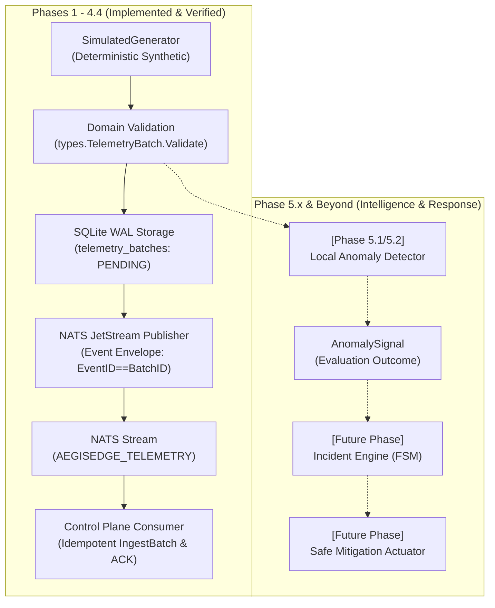
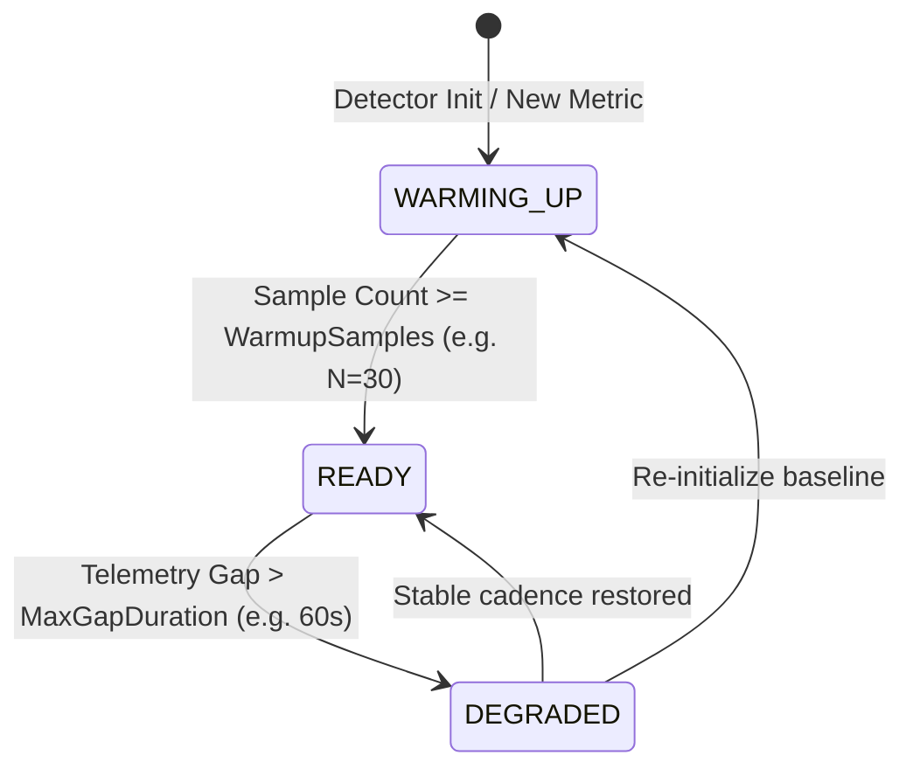
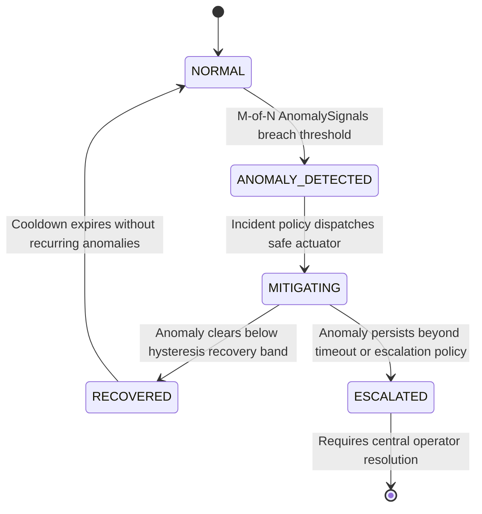

# ADR-0009: Edge Anomaly Detection Architecture & Design

**Status**: Accepted (Phase 5.1 Architecture & Design)  
**Date**: 2026-09-25  
**Deciders**: AegisEdge engineering team  
**Supersedes**: None  
**Relates to**: ADR-0001 (Language & Architecture Selection), ADR-0002 (Offline Synchronization), ADR-0003 (Domain Event & Incident Contracts), ADR-0004 (SQLite WAL Durability), ADR-0005 (HTTP Synchronization), ADR-0006 (NATS Event-Driven Messaging), ADR-0007 (NATS JetStream Integration), ADR-0008 (NATS Resilience & Recovery)

---

## 1. Status

**Accepted** — Architecture and Design Specification for Phase 5.1.  
*Implementation of detector components is deferred to subsequent engineering phases (Phase 5.2+).*

---

## 2. Context

Through Phases 1 to 4.4, AegisEdge established a durable, distributed telemetry infrastructure:
* **Edge Durability**: Metrics are validated and committed locally to SQLite WAL storage (`PRAGMA synchronous=NORMAL`) before attempting any transmission.
* **Offline Resilience**: The edge agent functions autonomously when disconnected from central servers.
* **Streaming Transport**: NATS JetStream provides decoupled, at-least-once streaming with broker deduplication (`Nats-Msg-Id`).
* **Ingestion Idempotency**: Control-plane consumers enforce idempotent batch processing based on immutable `BatchID` keys.

However, collecting and streaming telemetry is only the foundation. The primary mission of AegisEdge is **autonomous edge incident detection and safe response**. In real-world edge deployments (industrial gateways, remote utility stations, defense hardware, transport infrastructure), devices frequently operate in degraded, intermittent, or air-gapped network conditions. An edge platform that depends on centralized cloud analytics to detect operational failure cannot guarantee device survival.

---

## 3. Problem Statement

Centralized or cloud-dependent anomaly detection suffers from four disqualifying flaws in edge environments:
1. **Network Latency & Partitions**: Uplinks fluctuate or drop for extended durations. If anomaly detection resides in the cloud or central control plane, anomalies occurring during a partition remain completely undetected until connectivity returns—often long after unrecoverable hardware or filesystem damage has occurred.
2. **Bandwidth Costs & Quotas**: Continuous transmission of high-frequency raw telemetry (10–100 Hz across dozens of sensors) over metered LTE/satellite uplinks is financially and technically unsustainable.
3. **Delayed Incident Triage**: Resource exhaustion (e.g., rapid disk consumption, runaway process memory leaks, thermal saturation) can destabilize an edge node in seconds. Triage must occur within milliseconds on the node itself.
4. **Coupling of Intelligence to Infrastructure**: Naively bolting third-party machine learning frameworks (Python, PyTorch, TensorFlow) into an embedded edge agent introduces heavy memory footprints, fragile native dependencies, non-deterministic execution, and large attack surfaces.

Edge anomaly detection must be local-first, lightweight, explainable, and independent of external network availability.

---

## 4. Goals

* **Autonomous Local Detection**: The edge agent evaluates telemetry and identifies anomalies while completely disconnected from NATS, the control plane, the internet, and external ML services.
* **Strict Pipeline Decoupling**: Establish clear conceptual and functional boundaries separating Telemetry Collection, Anomaly Detection, Incident Detection, Incident Management, and Mitigation.
* **Stable Anomaly Signal Contract**: Define a strongly typed domain contract (`AnomalySignal`) with deterministic validation, provenance tracking, and evidence metadata.
* **Deterministic First Implementation**: Specify a lightweight, low-overhead, highly explainable first detector (static threshold with bounded rate-of-change) requiring zero external runtimes.
* **Seamless Evolution Path**: Provide an architectural path from deterministic rules (v1) to statistical/adaptive baselines (v2) to hybrid ML inference (v3) without modifying downstream incident management or mitigation engines.
* **Safety & Security Invariance**: Enforce the non-negotiable rule that anomaly signals never directly execute mutations or shell commands.

---

## 5. Non-Goals

The following are explicitly **out of scope** for Phase 5.1:
* Writing Go detector implementation code (`detector.go` or rule engines).
* Introducing Python, scikit-learn, PyTorch, TensorFlow, or ONNX runtimes.
* Adding Go or Python third-party dependencies.
* Modifying SQLite schemas or creating new database tables.
* Altering NATS subjects, JetStream stream configurations, or publishing logic.
* Building the Incident Detection Engine or modifying the Phase 1 Incident Finite State Machine (FSM).
* Implementing autonomous remediation actuators or policy executors.
* Provisioning Docker, Kubernetes, or cloud infrastructure.
* Executing destructive chaos experiments.

---

## 6. Existing Architecture Review

The current AegisEdge architecture enforces:

$$\textbf{EDGE OPERATES OFFLINE } \longrightarrow \textbf{ PERSISTS LOCALLY } \longrightarrow \textbf{ SYNCHRONIZES WHEN CONNECTED}$$



The existing contracts in `shared/types/types.go` already define domain foundations:
* `MetricSample`: Unit measurement (`Name`, `Value`, `Timestamp`, `NodeID`, `Labels`).
* `TelemetryBatch`: Chronological collection of metrics with sequence monotonicity.
* `Incident`: Formal operational incident (`IncidentID`, `NodeID`, `RuleName`, `Severity`, `Status`, `TriggeredAt`, `Mitigation`).
* `MitigationAction`: Safely simulated action (`ActionID`, `IncidentID`, `ActionType`, `Status`).

Phase 5.1 designs the component that bridges raw telemetry to incident evaluation.

---

## 7. The Anomaly Detection Role & Architectural Boundary

A critical failure mode in distributed telemetry systems is conflating metric observation with operational triage and remediation. AegisEdge enforces five strictly decoupled stages:

```
Telemetry Collection
        ↓
Anomaly Detection
        ↓
Incident Detection
        ↓
Incident Management
        ↓
Mitigation
```

| Pipeline Stage | Scope & Responsibility | Authority | Does NOT Do |
| :--- | :--- | :--- | :--- |
| **Telemetry Collection** | Periodically samples physical or synthetic host/sensor metrics (`MetricSample`). | Measurement | Does not judge normality or store incident state. |
| **Anomaly Detection** | Evaluates observed metrics against expected statistical or rule-based baselines. Produces candidate `AnomalySignal` records. | Observation & Scoring | Does not declare operational incidents or trigger actions. |
| **Incident Detection** | Evaluates anomaly signals against operational policies (persistence, consecutive violations, multi-metric correlation, time-of-day). | Policy Evaluation | Does not execute remediation or alter telemetry storage. |
| **Incident Management** | Tracks the lifecycle of accepted incidents through the deterministic FSM (`NORMAL` $\rightarrow$ `ANOMALY_DETECTED` $\rightarrow$ `MITIGATING` $\rightarrow$ `RECOVERED`). | Operational Lifecycle | Does not evaluate raw sensor data. |
| **Mitigation** | Dispatches allowlisted, non-destructive remediation actions via safe actuators. | Actuation | Does not detect anomalies or formulate policies. |

$$\textbf{Core Principle: An anomaly is a mathematical observation. An incident is an operational decision.}$$

---

## 8. Domain Anomaly Signal Contract

The anomaly detector emits a strongly typed, deterministic domain signal: `AnomalySignal`.

### 8.1 Conceptual Go Struct Definition

```go
package detection

import (
    "time"
)

// AnomalySignal represents a discrete mathematical deviation detected in a telemetry stream.
// It is an intermediate domain entity emitted by detectors and consumed by the Incident Engine.
type AnomalySignal struct {
    // AnomalyID is the globally unique identifier for this detection instance (UUIDv4).
    // Required, Stable.
    AnomalyID string `json:"anomaly_id"`

    // NodeID identifies the edge device on which the anomaly was detected.
    // Required, Stable.
    NodeID string `json:"node_id"`

    // MetricName identifies the specific telemetry metric evaluated (e.g. "cpu_utilization_percent").
    // Required, Stable.
    MetricName string `json:"metric_name"`

    // ObservedValue is the numerical value that triggered the detection.
    // Required, Stable.
    ObservedValue float64 `json:"observed_value"`

    // ExpectedValue is the baseline, nominal threshold, or predicted center point.
    // Required, Derived/Configured.
    ExpectedValue float64 `json:"expected_value"`

    // Deviation is the mathematical distance between observed and expected (Observed - Expected).
    // Required, Derived.
    Deviation float64 `json:"deviation"`

    // AnomalyScore is the normalized deviation magnitude [0.0 to 1.0], or statistical z-score.
    // Required, Derived. (Note: AnomalyScore != IncidentSeverity).
    AnomalyScore float64 `json:"anomaly_score"`

    // DetectionMethod identifies the algorithm or strategy (e.g., "static_threshold", "ewma", "z_score").
    // Required, Stable.
    DetectionMethod string `json:"detection_method"`

    // DetectedAt is the immutable edge UTC timestamp when the anomaly was recognized.
    // Required, Immutable.
    DetectedAt time.Time `json:"detected_at"`

    // Evidence provides diagnostic key-value context (e.g. window_size, sample_count, rolling_mean, stddev).
    // Optional, Informational.
    Evidence map[string]string `json:"evidence,omitempty"`

    // CorrelationID links the signal to a causal batch or trace context.
    // Optional, Informational.
    CorrelationID string `json:"correlation_id,omitempty"`

    // DetectorVersion is the SemVer identifier of the rule set or model producing this signal.
    // Required, Stable.
    DetectorVersion string `json:"detector_version"`
}
```

### 8.2 Field Classification & Justification Matrix

| Field | Type | Classification | Stability | Justification |
| :--- | :--- | :--- | :--- | :--- |
| `AnomalyID` | `string` (UUIDv4) | Required | Stable | Enables downstream deduplication, auditing, and correlation with incidents. |
| `NodeID` | `string` | Required | Stable | Provenance tracking; guarantees anomalies are partitioned per physical device. |
| `MetricName` | `string` | Required | Stable | Identifies the telemetry channel; prevents ambiguous or polymorphic signal payloads. |
| `ObservedValue` | `float64` | Required | Stable | Ground truth reading for auditability and forensic review. |
| `ExpectedValue` | `float64` | Required | Derived | Explains the reference baseline or boundary that was breached. |
| `Deviation` | `float64` | Required | Derived | Quantifies the raw numerical breach magnitude (`Observed - Expected`). |
| `AnomalyScore` | `float64` | Required | Derived | Normalized intensity $[0.0 - 1.0]$ for algorithmic comparison across disparate metric units. |
| `DetectionMethod` | `string` | Required | Stable | Audit provenance; distinguishes static breaches from statistical or ML outputs. |
| `DetectedAt` | `time.Time` | Required | Immutable | Chronological timestamp; independent of transmission latency or clock skew. |
| `Evidence` | `map[string]string` | Optional | Informational | Contextual diagnostic values (e.g., rolling mean, variance) without rigid schema bloat. |
| `CorrelationID` | `string` | Optional | Informational | Links signal to originating `BatchID` or higher-level transaction. |
| `DetectorVersion` | `string` | Required | Stable | Version verification for reproducible triage and regression tracking. |

### 8.3 Validation Contract
In keeping with `shared/types` principles, `AnomalySignal.Validate()` must strictly reject:
* Empty `AnomalyID`, `NodeID`, `MetricName`, `DetectionMethod`, or `DetectorVersion`.
* Zero-valued `DetectedAt`.
* `ObservedValue`, `ExpectedValue`, `Deviation`, or `AnomalyScore` containing `NaN`, `+Inf`, or `-Inf`.
* `AnomalyScore` outside the normalized range $[0.0, 1.0]$ (when normalized scoring is configured).

---

## 9. Detection Strategy Evaluation

To determine the appropriate architecture for edge deployment, six candidate strategies were evaluated against edge constraints:

| Evaluation Criteria | A. Static Threshold | B. Rolling Baseline (SMA) | C. Statistical (Z-Score) | D. EWMA (Adaptive) | E. Isolation Forest (ML) | F. Hybrid (Rules + ML) |
| :--- | :--- | :--- | :--- | :--- | :--- | :--- |
| **Computational Cost** | Extremely Low ($O(1)$) | Very Low ($O(1)$ amortized) | Low ($O(1)$ with Welford) | Very Low ($O(1)$) | Moderate-High ($O(T \cdot \log S)$) | Moderate ($O(1) + O(\text{ML})$) |
| **Memory Footprint** | Negligible ($\sim 100$ B/rule) | Low ($W \times 8$ B/metric) | Low ($O(1)$ state per metric) | Very Low (16 B/metric) | Moderate (KBs to MBs for trees) | Moderate |
| **Offline Suitability** | Native / Perfect | Native / Perfect | Native / Perfect | Native / Perfect | Native (if pre-compiled) | Native |
| **Explainability** | Complete (Explicit rule) | High (Mean comparison) | High (Standard deviations) | High (Exponential baseline) | Low (Ensemble tree depth) | High (Rule fallback) |
| **Cold-Start Behavior** | Instantaneous ($N=1$) | Lagged ($N \ge W$) | Lagged ($N \ge 30$) | Lagged ($\alpha$ convergence) | Severe (Needs training batch) | Tiered (Rules active first) |
| **False Positive Risk** | Moderate (Rigid to load) | Moderate (Adapts to drift) | High if non-Gaussian | Moderate | Moderate-High on unseen | Low (Rules gate ML) |
| **False Negative Risk** | High for subtle drift | Moderate for spikes | Moderate for non-spikes | Low for trend drift | Low for complex multi-var | Lowest |
| **Determinism** | 100% Deterministic | 100% Deterministic | 100% Deterministic | 100% Deterministic | Non-deterministic unless seeded | 100% Deterministic baseline |
| **Model Maintenance** | Simple config updates | Zero maintenance | Zero maintenance | Zero maintenance | High (Retraining, drift) | Moderate |
| **Edge Suitability** | **Ideal for v1** | **Strong for v2** | **Strong for v2** | **Ideal for v2** | **Deferred to v3** | **Target Architecture** |

---

## 10. Recommended First Implementation (Version 1)

$$\textbf{Recommendation: Static Threshold Detection with Explicit Boundary Rules}$$

### 10.1 Technical Justification for v1:
1. **Zero External Dependencies**: Implemented in pure Go using standard library primitives.
2. **Instant Cold-Start**: Immediately operational upon process start; does not require historical warm-up windows.
3. **100% Explainable**: Operators can instantly verify why an anomaly was raised (`Observed 94.2% > Threshold 90.0%`).
4. **Deterministic & Testable**: Eliminates non-deterministic test flakiness, race conditions, and floating-point ambiguity.
5. **Ultra-Low Overhead**: Microsecond evaluation latency; consumes negligible CPU and memory, ensuring edge resource priority remains with core telemetry collection.

### 10.2 Architectural Evolution Roadmap
The detector interface is designed to evolve across three distinct generations **without modifying downstream incident management, storage, or transport components**:

```
Version 1 (Phase 5.2):
  Static Threshold Detector (Absolute ceilings, floors, and rates-of-change)
       ↓
Version 2 (Phase 5.4):
  Adaptive Statistical Detector (Welford's algorithm z-score + EWMA rolling baselines)
       ↓
Version 3 (Future):
  Hybrid Engine (Deterministic safety guardrails + embedded ML anomaly scoring)
```

Because downstream components consume the uniform `AnomalySignal` contract, the detection algorithm can be swapped or combined transparently.

---

## 11. Baseline and Windowing Strategy

### 11.1 Window Strategies Evaluated:
* **Single Sample ($W=1$)**: Evaluates current reading against static bounds. Zero memory state. Best for hard safety ceilings (e.g. `disk_usage > 95%`).
* **Fixed-Count Rolling Window ($N$ samples)**: Retains last $N$ measurements in a ring buffer. Calculates moving average and variance. Sensitive to sample cadence changes.
* **Time-Based Window ($T$ seconds)**: Retains samples within a sliding duration (e.g., past 5 minutes). Handles variable sampling intervals, but requires memory allocation for sample slices.
* **Exponentially Weighted History (EWMA)**: Retains running statistics using a smoothing factor $\alpha$:
  $$S_t = \alpha Y_t + (1 - \alpha) S_{t-1}$$
  Requires $O(1)$ memory (storing only prior mean and variance).

### 11.2 Decision for Version 1 and Future Version 2:
* **Version 1**: Uses **Single Sample ($W=1$)** against static boundaries plus consecutive violation tracking in the Incident Engine.
* **Version 2 (Future)**: Adopts **EWMA + Welford's Algorithm** for $O(1)$ running statistical baselines without unbounded ring buffer allocation.

### 11.3 Process Restart & Persistence Strategy:
* In Version 1, detection rules are static configuration; process restarts cause **zero state loss**.
* In Version 2, statistical baselines will accumulate in-memory. If an edge process restarts, the baseline is reset to cold-start mode (`WARMING_UP`), during which static thresholds act as immediate safety guardrails.
* **Design for Future Baseline Persistence**: If baselines require persistence across restarts, an additive SQLite table will be designed in a future phase:
  ```sql
  -- DESIGN SPECIFICATION ONLY (NOT TO BE IMPLEMENTED IN PHASE 5.1)
  CREATE TABLE IF NOT EXISTS detector_baselines (
      metric_name TEXT PRIMARY KEY,
      running_mean REAL NOT NULL,
      running_variance REAL NOT NULL,
      sample_count INTEGER NOT NULL,
      updated_at TEXT NOT NULL
  );
  ```

---

## 12. Cold-Start Behavior

When an edge node boots, restarts, or observes a metric for the first time, historical context is absent. Producing anomalies on uninitialized data generates false alarms that degrade operator trust.

### Lifecycle States:



* **`WARMING_UP`**:
  * Active when historical sample count $n < N_{min}$ (e.g. 30 samples).
  * Statistical/adaptive anomaly detection is **suppressed**.
  * Static ceiling guardrails (e.g., hard critical thresholds) remain active to catch catastrophic failures.
  * Emits diagnostic log: `detector in warming_up state; suppressing statistical evaluations`.
* **`READY`**:
  * Activated once sufficient samples establish statistical convergence.
  * Full anomaly detection rules are active.
* **`DEGRADED`**:
  * Entered if telemetry gaps exceed nominal interval (e.g. missing 5 consecutive collection cycles).
  * Suppresses rate-of-change detection; maintains static bounds.

---

## 13. Telemetry Validation & Malformed Input Semantics

The detector is an observer and must never crash or corrupt state due to malformed input. It strictly leverages the validation contracts defined in `shared/types`:

| Anomaly / Edge Case | Detector Behavior | State / Baseline Impact | Log / Diagnostic Action |
| :--- | :--- | :--- | :--- |
| **`NaN` / `+Inf` / `-Inf`** | Rejected immediately via `sample.Validate()`. | Discarded; **not** added to window or baseline. | Logged as warning (`invalid metric value rejected`). |
| **Missing Metric / Omission** | No evaluation performed for absent metric. | Unchanged; existing baseline preserved. | Tracked as missing sample counter. |
| **Duplicate Timestamp** | Discarded if timestamp $\le$ last evaluated timestamp. | Ignored. | Debug log (`duplicate telemetry sample skipped`). |
| **Out-of-Order Sample** | Rejected if sample timestamp predates current window. | Ignored. | Warning (`out-of-order sample rejected`). |
| **Sudden Cadence Change** | Evaluated on absolute value; time-rate metrics normalize by $\Delta t$. | Window adapts dynamically. | Informational log. |
| **Long Sampling Gap** | Triggers transition from `READY` $\rightarrow$ `DEGRADED`. | Baseline history decayed or cleared. | State transition event emitted. |

---

## 14. Severity vs. Anomaly Score: A Critical Distinction

$$\textbf{Anomaly Score } \neq \textbf{ Incident Severity}$$

Conflating mathematical deviation with operational urgency creates alert fatigue and dangerous misclassifications. AegisEdge enforces an explicit architectural separation:

```
+------------------------------------+       +------------------------------------+
|       Anomaly Detector             |       |        Incident Engine             |
|                                    |       |                                    |
| Metric: cpu_utilization_percent    | ----> | Context: Node Role (Edge Gateway)  |
| Observed: 98.5% | Baseline: 50.0%  |       | Policy: Sustained for > 60 seconds |
| Output: AnomalyScore = 0.97        |       | Output: Severity = CRITICAL        |
+------------------------------------+       +------------------------------------+
```

* **Anomaly Score ($[0.0 - 1.0]$)**:
  * An objective, mathematical measurement of distance from expected baseline.
  * Emitted by the detector.
  * A score of `0.9` means the metric deviates significantly from normal behavior, regardless of what the metric represents.
* **Incident Severity (`LOW`, `MEDIUM`, `HIGH`, `CRITICAL`)**:
  * A subjective, operational judgment of business impact and urgency.
  * Assigned by the **Incident Engine**, not the anomaly detector.
  * Evaluated against operational context:
    * Metric Type (Disk fill at 98% is `CRITICAL`; CPU spike at 98% during scheduled backup is `LOW`).
    * Device Role (Industrial controller vs. non-critical sensor proxy).
    * Temporal Duration (Transient spike vs. sustained saturation).

---

## 15. False-Positive Suppression & The Incident Boundary

An anomaly detector that alerts on every transient spike causes alert flapping and system instability. The transition from anomaly signal to operational incident is governed by four defensive barriers:

```
[Raw Anomaly Signal] ──► [Consecutive Count Filter (M-of-N)]
                                     │
                                     ▼
                         [Hysteresis Thresholds]
                                     │
                                     ▼
                         [Suppression & Cooldown]
                                     │
                                     ▼
                         [Incident Engine: Raise Incident]
```

1. **Consecutive Violation Requirement ($M$-of-$N$)**:
   A single anomalous sample never directly creates an incident. The Incident Engine requires $M$ anomalous evaluations within $N$ consecutive collection windows (e.g. 3 violations out of 5 cycles).
2. **Hysteresis Bands (Dual Thresholds)**:
   Prevents rapid flapping between states near the boundary:
   * **Breach Threshold ($T_{high}$)**: Value required to enter anomaly state (e.g., CPU $> 90\%$).
   * **Recovery Threshold ($T_{low}$)**: Value required to clear anomaly state (e.g., CPU $< 80\%$).
3. **Suppression & Cooldown**:
   Once an incident is triggered or resolved, a cooldown timer prevents re-triggering for a configurable dampening period (e.g., 60 seconds).

---

## 16. Integration with the Incident Lifecycle FSM

The Phase 1 deterministic Incident Finite State Machine (`types.IncidentStatus`) remains authoritative:



### Exact Detector Placement:
* The anomaly detector runs continuously as an evaluation step immediately following local telemetry persistence (`PersistBatch`).
* When the FSM is in `NORMAL`, detector signals feed the incident policy evaluator. If policy criteria ($M$-of-$N$) are met, the FSM transitions to `ANOMALY_DETECTED`.
* When the FSM is in `ANOMALY_DETECTED` or `MITIGATING`, the detector continues evaluating. When observed readings drop below the recovery threshold ($T_{low}$) for the required confirmation window, the engine transitions the FSM to `RECOVERED`.

---

## 17. Multi-Metric Anomalies: Composite vs. Independent Signals

Real-world failures often manifest across multiple metric channels simultaneously (e.g., runaway process causing high CPU, high memory allocation, and high disk write latency).

### Architectural Decision:
1. **Detectors Emit Independent Point Signals**:
   Each metric detector evaluates its assigned channel independently and produces distinct `AnomalySignal` instances (`cpu_utilization_percent`, `memory_rss_bytes`).
2. **Correlation Belongs to the Incident Engine**:
   The anomaly detector does **not** perform complex cross-metric multi-dimensional correlation. Cross-metric correlation is the explicit responsibility of the Incident Engine, which aggregates multiple co-occurring `AnomalySignal` events sharing the same `NodeID` and overlapping time windows into a unified multi-variant `Incident`.

This prevents the anomaly detector from becoming a bloated, tightly coupled rules engine.

---

## 18. Temporal Anomaly Lifecycle States

While the Incident Engine manages the macro operational state (`NORMAL`, `ANOMALY_DETECTED`, etc.), candidate anomalies progress through micro temporal lifecycle states:

```
[Candidate Sample] ──► DETECTED (First breach observed)
                             │
                             ▼
                       PERSISTING (Consecutive breaches continue)
                             │
                             ▼
                       RECOVERING (Readings fall below breach, above recovery band)
                             │
                             ▼
                       CLEARED (Readings firmly inside nominal envelope)
```

* **`DETECTED`**: A single metric evaluation breached threshold boundaries. Candidate flag raised; internal counter initialized to 1.
* **`PERSISTING`**: Subsequent evaluations in consecutive windows continue to breach boundaries. Counter increments.
* **`RECOVERING`**: Current reading has dropped below $T_{high}$ but remains above $T_{low}$.
* **`CLEARED`**: Reading has remained below $T_{low}$ for the full recovery confirmation duration. Anomaly instance closed.

---

## 19. Edge Resource Constraints & Bounded Execution

Edge computing hardware operates under strict constraints: low CPU core counts, restricted RAM (e.g. 512 MB to 2 GB total system memory), flash storage write endurance limits, and battery or solar power budgets.

### Resource Engineering Principles:
* **Zero Allocations in Hot Paths**: Detection evaluation must minimize heap allocations, reusing scratch buffers where possible.
* **Configurable Metric Scope**: The detector tracks a bounded, explicit set of metrics (e.g., maximum 50 active rules/channels per agent).
* **Deterministic Execution Time**: Evaluation latency must remain strictly bounded ($O(1)$ complexity per sample in Version 1/2), ensuring that telemetry processing never blocks the agent collection loop.
* **Degradation Under Pressure**: Under high system load or low battery, the agent can shed statistical feature extraction and revert strictly to static boundary checks.
* **No Unsubstantiated Benchmarks**: Performance and latency numbers must be empirically measured under controlled profiling in future phases rather than assumed.

---

## 20. Determinism & Explainability

A safety-critical incident response platform must be deterministic and explainable:
* **Zero Hidden Randomness**: The Version 1 and Version 2 detectors contain zero stochastic processes, unseeded random seeds, or non-deterministic heuristics. Identical inputs and configurations produce identical outputs.
* **Full Auditability**: Every emitted `AnomalySignal` includes complete ground-truth metadata (`ObservedValue`, `ExpectedValue`, `Deviation`, `AnomalyScore`, `DetectionMethod`, `DetectorVersion`). An operator or automated test can reconstruct the exact arithmetic that triggered detection.
* **Model Artifact Integrity (Future ML)**: If statistical weights or ML models are introduced in later phases, they must be versioned with cryptographic hashes (SHA-256) and packaged with explicit feature normalization bounds.

---

## 21. Safety & Security Boundary: Anomaly $\neq$ Execution

$$\textbf{AI/ML Output MUST NEVER Become an Arbitrary Shell Command.}$$

Allowing anomaly detection or machine learning outputs to directly trigger system execution creates catastrophic security and operational risks (arbitrary command injection, runaway flapping reboot loops, destructive filesystem formatting).

AegisEdge enforces a mandatory five-stage safety firewall:

```
AnomalySignal Emitted
          ↓
[Safety Boundary 1] Incident Policy Evaluation (Requires M-of-N persistence)
          ↓
[Safety Boundary 2] Allowlisted Mitigation Mapping (Look up fixed types.ActionType)
          ↓
[Safety Boundary 3] Parameter Validation (Strict domain checks; no shell interpolation)
          ↓
[Safety Boundary 4] Rate Limiting & Cooldown Guard (Max 1 action per incident)
          ↓
[Safety Boundary 5] Simulated Actuator Execution (Safe, audited non-destructive execution)
```

Mitigation action types remain strictly constrained to compile-time allowlisted constants defined in `shared/types` (`ActionTypeSimulatedThrottle`, `ActionTypeSimulatedRestartService`, `ActionTypeSimulatedClearCache`). Arbitrary shell strings or dynamic command execution are structurally forbidden.

---

## 22. Offline-First Anomaly Detection Failure Matrix

The following matrix documents detector behavior, state transitions, and recovery semantics across fifteen edge failure scenarios:

| ID | Scenario | Local Telemetry | Detector Behavior | Anomaly State | Incident Impact | Recovery Semantics |
| :--- | :--- | :--- | :--- | :--- | :--- | :--- |
| **A** | NATS broker unavailable | Persisted to SQLite (`PENDING`) | Evaluates normally | Normal detection active | Incidents created locally | Zero detection impact. Full offline operation. |
| **B** | Control plane offline | Persisted to SQLite (`PENDING`) | Evaluates normally | Normal detection active | Incidents created locally | Zero detection impact. Incidents buffer locally. |
| **C** | Internet disconnected | Persisted to SQLite (`PENDING`) | Evaluates normally | Normal detection active | Incidents created locally | Zero detection impact. Local autonomy preserved. |
| **D** | Telemetry available locally | Persisted to SQLite (`PENDING`) | Evaluates batch metrics | Normal detection active | Normal incident triage | Standard happy path. |
| **E** | Telemetry persistence succeeds | Persisted (`PENDING`) | Evaluates post-commit | Normal detection active | Full incident lifecycle | Complete local auditability. |
| **F** | Telemetry persistence fails (disk full) | In-memory only (uncommitted) | Evaluates in-memory batch | Evaluated; logs critical disk anomaly | Escalated incident raised | Detector flags storage exhaustion; buffers in memory if possible. |
| **G** | Insufficient history ($n < N_{min}$) | Persisted to SQLite | Enters `WARMING_UP` | Suppresses statistical anomalies; static bounds active | Prevents false alarms | Transitions to `READY` when sample count reaches threshold. |
| **H** | Detector init failure (bad config) | Persisted to SQLite | Enters `DEGRADED` mode | Fails open or uses fallback static limits | Alert raised on agent status | Agent continues collecting telemetry; logs error. |
| **I** | Malformed telemetry (NaN / Inf) | Rejected by domain validation | Discards invalid sample | No anomaly emitted | No spurious incidents | Discarded sample omitted from rolling window. |
| **J** | Missing telemetry (cadence drop) | Gaps in SQLite sequence | Tracks gap duration | Transitions to `DEGRADED` if gap $> 60$s | Suppresses rate anomalies | Resumes normal evaluation upon telemetry restoration. |
| **K** | Detector runtime panic/error | Persisted to SQLite | Catches panic via `recover()` | Fallback to nominal state | No action taken | Agent collection loop remains operational; logs error. |
| **L** | Edge process reboot | WAL recovered safely | Re-initializes detector | Begins in `WARMING_UP` | Continues from SQLite sequence | Recovers state; static bounds active immediately. |
| **M** | Prolonged multi-day offline | Buffers in SQLite (disk capped) | Evaluates continuously | Continuous local triage | Autonomous mitigation active | Edge remains fully protected throughout partition. |
| **N** | High telemetry burst | Persisted in bounded chunks | Evaluates sequential samples | Processes in order | Throttled by chunk size | Evaluates chunks without unbounded memory spike. |
| **O** | Detector config unavailable | Persisted to SQLite | Reverts to compiled defaults | Uses safe default bounds | Safe default triage | Prevents unmonitored silent failure. |

---

## 23. Observability Architecture for Anomaly Detection

To operate, tune, and audit the detector in production, the following metrics and structured log fields are required:

### Prometheus / OpenTelemetry Metrics (Design Specification):
* `aegisedge_detector_evaluations_total`: Counter tracking total metric evaluations performed.
* `aegisedge_detector_anomalies_detected_total`: Counter tracking total `AnomalySignal` events emitted, partitioned by `metric_name` and `detection_method`.
* `aegisedge_detector_anomalies_cleared_total`: Counter tracking anomalies resolved through recovery hysteresis.
* `aegisedge_detector_evaluation_duration_seconds`: Histogram measuring microsecond latency of `Detect()` calls.
* `aegisedge_detector_errors_total`: Counter tracking invalid samples, validation failures, and runtime catches.
* `aegisedge_detector_state`: Gauge indicating operational mode (`0 = WARMING_UP`, `1 = READY`, `2 = DEGRADED`).
* `aegisedge_detector_tracked_metrics_count`: Gauge tracking total metrics currently registered for evaluation.
* `aegisedge_detector_baseline_readiness_ratio`: Gauge $[0.0 - 1.0]$ representing warmup completion percentage.

### Structured Log Contract:
All detector logs must output structured JSON with fixed fields:
```json
{
  "timestamp": "2026-09-25T18:00:00.123456Z",
  "level": "WARN",
  "component": "anomaly_detector",
  "node_id": "edge-node-01",
  "anomaly_id": "550e8400-e29b-41d4-a716-446655440000",
  "metric_name": "cpu_utilization_percent",
  "observed_value": 94.2,
  "threshold": 90.0,
  "deviation": 4.2,
  "anomaly_score": 0.88,
  "detection_method": "static_threshold",
  "detector_version": "1.0.0",
  "msg": "telemetry metric anomaly detected"
}
```

---

## 24. Comprehensive Testing Strategy

Future detector implementations will be validated against a four-tier testing hierarchy:

### 24.1 Unit Testing
* **Nominal Envelope**: Validates that telemetry within safe limits produces zero anomaly signals.
* **Threshold Breaches**: Tests upper ceiling breaches, lower floor breaches, and inverted boundaries.
* **Hysteresis Bands**: Verifies that values between $T_{low}$ and $T_{high}$ maintain current state without flapping.
* **Edge & Boundary Values**: Tests exact threshold values, zero values, and negative metric values.
* **Malformed Rejection**: Confirms that `NaN`, `+Inf`, and `-Inf` return errors and do not corrupt baselines.
* **Cold-Start Warmup**: Verifies that statistical detectors enforce `WARMING_UP` until $N_{min}$ samples arrive.

### 24.2 Property-Based & Invariant Testing
* **Monotonic Sensitivity**: For any metric where higher is worse, if $x_1 > x_2 > T_{high}$, then $\text{Score}(x_1) \ge \text{Score}(x_2)$.
* **Score Boundedness**: $\forall x \in \mathbb{R}, 0.0 \le \text{AnomalyScore}(x) \le 1.0$.
* **Determinism Invariant**: $\text{Detect}(x) \equiv \text{Detect}(x)$ across arbitrary test repetitions.

### 24.3 Integration Testing
* **Pipeline Flow**: `TelemetryBatch` generation $\rightarrow$ SQLite persistence $\rightarrow$ Detector evaluation $\rightarrow$ `AnomalySignal` generation.
* **Incident Boundary**: $M$-of-$N$ `AnomalySignal` sequence $\rightarrow$ Incident Engine triggers `types.Incident`.

### 24.4 Restart & Fault Recovery Testing
* **Agent Restart**: Verifies clean detector re-initialization and graceful transition through `WARMING_UP`.
* **Telemetry Gaps**: Simulates network/sensor pauses and verifies transition to `DEGRADED`.
* **Storage Exhaustion**: Confirms detector operates even if SQLite commits fail.

---

## 25. Future Machine Learning Evolution Strategy

AegisEdge requires an architectural path to advanced ML capabilities without tightly coupling the core Go binary to complex Python runtimes.

### Five Architectural Models Evaluated:

| Architecture Model | Implementation Pattern | Strengths | Weaknesses | Recommendation |
| :--- | :--- | :--- | :--- | :--- |
| **Option A: Python Daemon** | Separate Python daemon running PyTorch/Scikit-Learn communicating via IPC. | Full access to ML ecosystem. | Massive memory footprint ($\ge 300$ MB), Python runtime fragility, complex packaging. | **Rejected** for edge. |
| **Option B: Embedded Cgo/ONNX** | Embedding ONNX Runtime or TensorFlow Lite via Cgo. | Fast in-process inference. | Cgo cross-compilation complexity, platform-specific shared libraries, crash risk. | Secondary option. |
| **Option C: Local Sidecar Container** | Dedicated lightweight inference microservice (REST/gRPC/UDS). | Strict process isolation, decoupled lifecycles. | Requires container engine (Docker/Podman); unsupported on minimal bare-metal. | Good for gateway tier. |
| **Option D: Pure Go Pre-Trained Engine** | Exporting tree ensembles (Isolation Forest, Random Cut Forest) to pure Go evaluation trees. | Zero native dependencies, single static binary, instant cold start, minimal memory. | Requires offline training and code/model export pipeline. | **Strong candidate for Phase 5.4**. |
| **Option E: Hybrid Rule + ML Guardrails** | Deterministic rule engine as primary safety baseline; ML score as auxiliary feature/confidence boost. | **Maximum resilience**: If ML crashes or is uninitialized, deterministic rules guarantee safety. | Two detection paths to configure. | **Target Architecture**. |

$$\textbf{Decision: Pure Go Deterministic Baseline (v1) } \longrightarrow \textbf{ Pure Go Adaptive Statistical (v2) } \longrightarrow \textbf{ Hybrid ML Engine (v3)}$$

The core edge agent must remain 100% operational even if an optional ML sidecar is unavailable, uninitialized, or crashed.

---

## 26. Alternatives Considered

1. **Cloud-Only Centralized Anomaly Detection**: Rejected. Violates core offline-first resilience invariant; leaves edge devices unprotected during WAN partitions.
2. **Third-Party Agent (Prometheus Node Exporter + Alertmanager on Edge)**: Rejected. Heavy resource footprint; external daemon dependencies; lacks deep integration with AegisEdge SQLite storage and autonomous mitigation FSM.
3. **Hardcoded Ad-Hoc Threshold Checks inside Collector**: Rejected. Tightly couples metric gathering with triage logic; violates separation of concerns; prevents future ML model integration.
4. **Immediate Python/Scikit-Learn Microservice in Phase 5**: Rejected. Premature complexity; adds massive memory overhead to resource-constrained edge gateways.

---

## 27. Explicit Limitations & Boundaries

1. **No Implementation in Phase 5.1**: This document is an architectural specification. No detector algorithms, rule configs, or incident engines are implemented in this phase.
2. **Static Scope of Version 1**: Version 1 static thresholds cannot detect gradual trend drift or subtle multi-variant correlations that do not cross absolute ceilings.
3. **In-Memory State in Initial Versions**: Early statistical versions will maintain rolling statistics in process memory. Edge agent restarts reset the warmup window.
4. **Finite Edge Resources**: Anomaly detection consumes CPU cycles. On extremely low-power microcontrollers, evaluation frequency must be throttled.

---

## 28. Decision & Next Steps

AegisEdge formally adopts the Edge Anomaly Detection Architecture defined in this ADR:
1. **Pipeline Decoupling**: Telemetry $\rightarrow$ Anomaly Detection $\rightarrow$ Incident Detection $\rightarrow$ Incident Management $\rightarrow$ Mitigation.
2. **Domain Signal**: Adoption of the canonical `AnomalySignal` contract with explicit separation of `AnomalyScore` from `IncidentSeverity`.
3. **First Implementation Target (Phase 5.2)**: A pure Go, deterministic static threshold detector with hysteresis bands and $M$-of-$N$ consecutive sample gating.
4. **Future ML Roadmap**: Pure Go statistical engines (v2) evolving to a hybrid deterministic/ML architecture (v3).
5. **Phase Boundary**: All implementation work is deferred to Phase 5.2. Phase 5.1 is design only.
