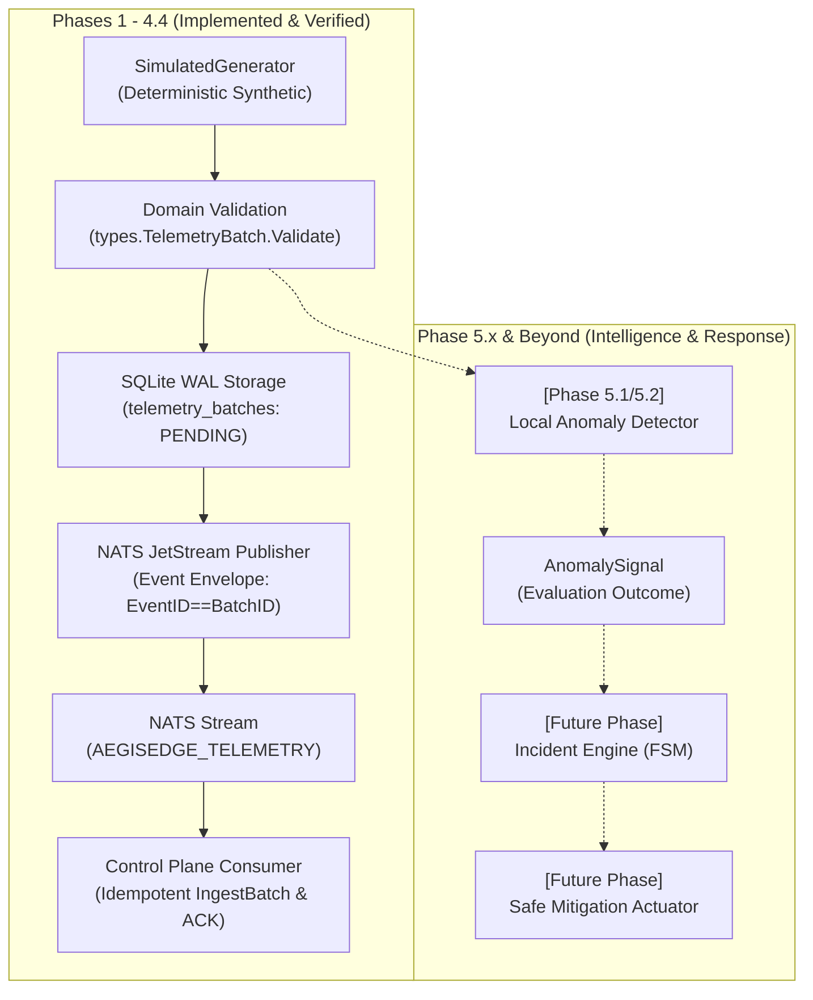
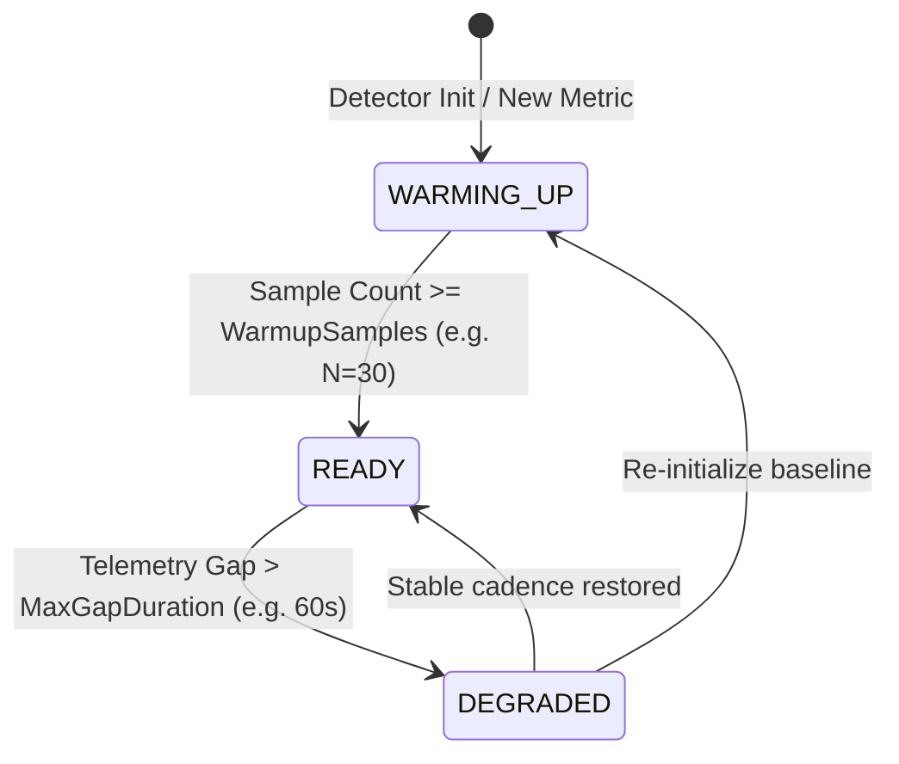
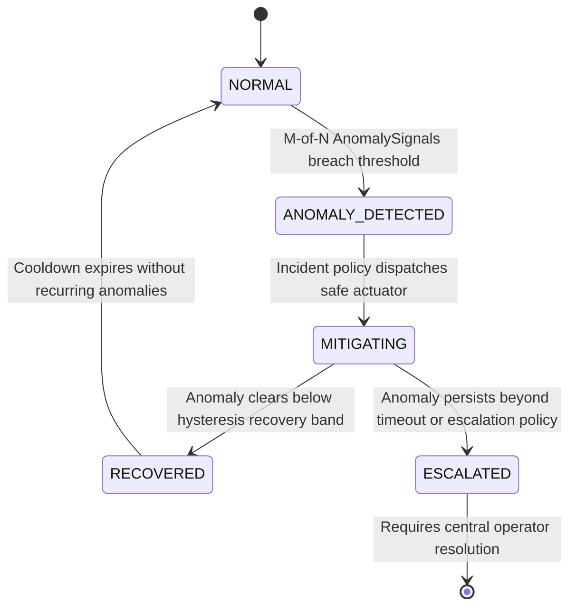

# ADR-0009: Edge Anomaly Detection Architecture & Design

**Status**: Accepted (Phase 5.1 Architecture & Design)  
**Date**: 2026-09-25  
**Deciders**: AegisEdge engineering team  
**Supersedes**: None  
**Relates to**: ADR-0001 (Language & Architecture Selection), ADR-0002 (Offline Synchronization), ADR-0003 (Domain Event & Incident Contracts), ADR-0004 (SQLite WAL Durability), ADR-0005 (HTTP Synchronization), ADR-0006 (NATS Event-Driven Messaging), ADR-0007 (NATS JetStream Integration), ADR-0008 (NATS Resilience & Recovery)

---

## 1. Status

**Accepted** — Architecture and Design Specification for Phase 5.1.  
*Implementation of detector components is deferred to subsequent engineering phases (Phase 5.2+).*

---

## 2. Context

Through Phases 1 to 4.4, AegisEdge established a durable, distributed telemetry infrastructure:
* **Edge Durability**: Metrics are validated and committed locally to SQLite WAL storage (`PRAGMA synchronous=NORMAL`) before attempting any transmission.
* **Offline Resilience**: The edge agent functions autonomously when disconnected from central servers.
* **Streaming Transport**: NATS JetStream provides decoupled, at-least-once streaming with broker deduplication (`Nats-Msg-Id`).
* **Ingestion Idempotency**: Control-plane consumers enforce idempotent batch processing based on immutable `BatchID` keys.

However, collecting and streaming telemetry is only the foundation. The primary mission of AegisEdge is **autonomous edge incident detection and safe response**. In real-world edge deployments (industrial gateways, remote utility stations, defense hardware, transport infrastructure), devices frequently operate in degraded, intermittent, or air-gapped network conditions. An edge platform that depends on centralized cloud analytics to detect operational failure cannot guarantee device survival.

---

## 3. Problem Statement

Centralized or cloud-dependent anomaly detection suffers from four disqualifying flaws in edge environments:
1. **Network Latency & Partitions**: Uplinks fluctuate or drop for extended durations. If anomaly detection resides in the cloud or central control plane, anomalies occurring during a partition remain completely undetected until connectivity returns—often long after unrecoverable hardware or filesystem damage has occurred.
2. **Bandwidth Costs & Quotas**: Continuous transmission of high-frequency raw telemetry (10–100 Hz across dozens of sensors) over metered LTE/satellite uplinks is financially and technically unsustainable.
3. **Delayed Incident Triage**: Resource exhaustion (e.g., rapid disk consumption, runaway process memory leaks, thermal saturation) can destabilize an edge node in seconds. Triage must occur within milliseconds on the node itself.
4. **Coupling of Intelligence to Infrastructure**: Naively bolting third-party machine learning frameworks (Python, PyTorch, TensorFlow) into an embedded edge agent introduces heavy memory footprints, fragile native dependencies, non-deterministic execution, and large attack surfaces.

Edge anomaly detection must be local-first, lightweight, explainable, and independent of external network availability.

---

## 4. Goals

* **Autonomous Local Detection**: The edge agent evaluates telemetry and identifies anomalies while completely disconnected from NATS, the control plane, the internet, and external ML services.
* **Strict Pipeline Decoupling**: Establish clear conceptual and functional boundaries separating Telemetry Collection, Anomaly Detection, Incident Detection, Incident Management, and Mitigation.
* **Stable Anomaly Signal Contract**: Define a strongly typed domain contract (`AnomalySignal`) with deterministic validation, provenance tracking, and evidence metadata.
* **Deterministic First Implementation**: Specify a lightweight, low-overhead, highly explainable first detector (static threshold with bounded rate-of-change) requiring zero external runtimes.
* **Seamless Evolution Path**: Provide an architectural path from deterministic rules (v1) to statistical/adaptive baselines (v2) to hybrid ML inference (v3) without modifying downstream incident management or mitigation engines.
* **Safety & Security Invariance**: Enforce the non-negotiable rule that anomaly signals never directly execute mutations or shell commands.

---

## 5. Non-Goals

The following are explicitly **out of scope** for Phase 5.1:
* Writing Go detector implementation code (`detector.go` or rule engines).
* Introducing Python, scikit-learn, PyTorch, TensorFlow, or ONNX runtimes.
* Adding Go or Python third-party dependencies.
* Modifying SQLite schemas or creating new database tables.
* Altering NATS subjects, JetStream stream configurations, or publishing logic.
* Building the Incident Detection Engine or modifying the Phase 1 Incident Finite State Machine (FSM).
* Implementing autonomous remediation actuators or policy executors.
* Provisioning Docker, Kubernetes, or cloud infrastructure.
* Executing destructive chaos experiments.

---

## 6. Existing Architecture Review

The current AegisEdge architecture enforces:

$$\textbf{EDGE OPERATES OFFLINE } \longrightarrow \textbf{ PERSISTS LOCALLY } \longrightarrow \textbf{ SYNCHRONIZES WHEN CONNECTED}$$


```mermaid
flowchart TD
    subgraph Implemented ["Phases 1 - 4.4 (Implemented & Verified)"]
        GEN["SimulatedGenerator\n(Deterministic Synthetic)"] --> VAL["Domain Validation\n(types.TelemetryBatch.Validate)"]
        VAL --> WAL["SQLite WAL Storage\n(telemetry_batches: PENDING)"]
        WAL --> PUB["NATS JetStream Publisher\n(Event Envelope: EventID==BatchID)"]
        PUB --> JS["NATS Stream\n(AEGISEDGE_TELEMETRY)"]
        JS --> CP["Control Plane Consumer\n(Idempotent IngestBatch & ACK)"]
    end

    subgraph FutureScope ["Phase 5.x & Beyond (Intelligence & Response)"]
        VAL -.-> AD["[Phase 5.1/5.2]\nLocal Anomaly Detector"]
        AD -.-> SIG["AnomalySignal\n(Evaluation Outcome)"]
        SIG -.-> IE["[Future Phase]\nIncident Engine (FSM)"]
        IE -.-> MIT["[Future Phase]\nSafe Mitigation Actuator"]
    end
```

The existing contracts in `shared/types/types.go` already define domain foundations:
* `MetricSample`: Unit measurement (`Name`, `Value`, `Timestamp`, `NodeID`, `Labels`).
* `TelemetryBatch`: Chronological collection of metrics with sequence monotonicity.
* `Incident`: Formal operational incident (`IncidentID`, `NodeID`, `RuleName`, `Severity`, `Status`, `TriggeredAt`, `Mitigation`).
* `MitigationAction`: Safely simulated action (`ActionID`, `IncidentID`, `ActionType`, `Status`).

Phase 5.1 designs the component that bridges raw telemetry to incident evaluation.

---

## 7. The Anomaly Detection Role & Architectural Boundary

A critical failure mode in distributed telemetry systems is conflating metric observation with operational triage and remediation. AegisEdge enforces five strictly decoupled stages:

```
Telemetry Collection
        ↓
Anomaly Detection
        ↓
Incident Detection
        ↓
Incident Management
        ↓
Mitigation
```

| Pipeline Stage | Scope & Responsibility | Authority | Does NOT Do |
| :--- | :--- | :--- | :--- |
| **Telemetry Collection** | Periodically samples physical or synthetic host/sensor metrics (`MetricSample`). | Measurement | Does not judge normality or store incident state. |
| **Anomaly Detection** | Evaluates observed metrics against expected statistical or rule-based baselines. Produces candidate `AnomalySignal` records. | Observation & Scoring | Does not declare operational incidents or trigger actions. |
| **Incident Detection** | Evaluates anomaly signals against operational policies (persistence, consecutive violations, multi-metric correlation, time-of-day). | Policy Evaluation | Does not execute remediation or alter telemetry storage. |
| **Incident Management** | Tracks the lifecycle of accepted incidents through the deterministic FSM (`NORMAL` $\rightarrow$ `ANOMALY_DETECTED` $\rightarrow$ `MITIGATING` $\rightarrow$ `RECOVERED`). | Operational Lifecycle | Does not evaluate raw sensor data. |
| **Mitigation** | Dispatches allowlisted, non-destructive remediation actions via safe actuators. | Actuation | Does not detect anomalies or formulate policies. |

$$\textbf{Core Principle: An anomaly is a mathematical observation. An incident is an operational decision.}$$

---

## 8. Domain Anomaly Signal Contract

The anomaly detector emits a strongly typed, deterministic domain signal: `AnomalySignal`.

### 8.1 Conceptual Go Struct Definition

```go
package detection

import (
    "time"
)

// AnomalySignal represents a discrete mathematical deviation detected in a telemetry stream.
// It is an intermediate domain entity emitted by detectors and consumed by the Incident Engine.
type AnomalySignal struct {
    // AnomalyID is the globally unique identifier for this detection instance (UUIDv4).
    // Required, Stable.
    AnomalyID string `json:"anomaly_id"`

    // NodeID identifies the edge device on which the anomaly was detected.
    // Required, Stable.
    NodeID string `json:"node_id"`

    // MetricName identifies the specific telemetry metric evaluated (e.g. "cpu_utilization_percent").
    // Required, Stable.
    MetricName string `json:"metric_name"`

    // ObservedValue is the numerical value that triggered the detection.
    // Required, Stable.
    ObservedValue float64 `json:"observed_value"`

    // ExpectedValue is the baseline, nominal threshold, or predicted center point.
    // Required, Derived/Configured.
    ExpectedValue float64 `json:"expected_value"`

    // Deviation is the mathematical distance between observed and expected (Observed - Expected).
    // Required, Derived.
    Deviation float64 `json:"deviation"`

    // AnomalyScore is the normalized deviation magnitude [0.0 to 1.0], or statistical z-score.
    // Required, Derived. (Note: AnomalyScore != IncidentSeverity).
    AnomalyScore float64 `json:"anomaly_score"`

    // DetectionMethod identifies the algorithm or strategy (e.g., "static_threshold", "ewma", "z_score").
    // Required, Stable.
    DetectionMethod string `json:"detection_method"`

    // DetectedAt is the immutable edge UTC timestamp when the anomaly was recognized.
    // Required, Immutable.
    DetectedAt time.Time `json:"detected_at"`

    // Evidence provides diagnostic key-value context (e.g. window_size, sample_count, rolling_mean, stddev).
    // Optional, Informational.
    Evidence map[string]string `json:"evidence,omitempty"`

    // CorrelationID links the signal to a causal batch or trace context.
    // Optional, Informational.
    CorrelationID string `json:"correlation_id,omitempty"`

    // DetectorVersion is the SemVer identifier of the rule set or model producing this signal.
    // Required, Stable.
    DetectorVersion string `json:"detector_version"`
}
```

### 8.2 Field Classification & Justification Matrix

| Field | Type | Classification | Stability | Justification |
| :--- | :--- | :--- | :--- | :--- |
| `AnomalyID` | `string` (UUIDv4) | Required | Stable | Enables downstream deduplication, auditing, and correlation with incidents. |
| `NodeID` | `string` | Required | Stable | Provenance tracking; guarantees anomalies are partitioned per physical device. |
| `MetricName` | `string` | Required | Stable | Identifies the telemetry channel; prevents ambiguous or polymorphic signal payloads. |
| `ObservedValue` | `float64` | Required | Stable | Ground truth reading for auditability and forensic review. |
| `ExpectedValue` | `float64` | Required | Derived | Explains the reference baseline or boundary that was breached. |
| `Deviation` | `float64` | Required | Derived | Quantifies the raw numerical breach magnitude (`Observed - Expected`). |
| `AnomalyScore` | `float64` | Required | Derived | Normalized intensity $[0.0 - 1.0]$ for algorithmic comparison across disparate metric units. |
| `DetectionMethod` | `string` | Required | Stable | Audit provenance; distinguishes static breaches from statistical or ML outputs. |
| `DetectedAt` | `time.Time` | Required | Immutable | Chronological timestamp; independent of transmission latency or clock skew. |
| `Evidence` | `map[string]string` | Optional | Informational | Contextual diagnostic values (e.g., rolling mean, variance) without rigid schema bloat. |
| `CorrelationID` | `string` | Optional | Informational | Links signal to originating `BatchID` or higher-level transaction. |
| `DetectorVersion` | `string` | Required | Stable | Version verification for reproducible triage and regression tracking. |

### 8.3 Validation Contract
In keeping with `shared/types` principles, `AnomalySignal.Validate()` must strictly reject:
* Empty `AnomalyID`, `NodeID`, `MetricName`, `DetectionMethod`, or `DetectorVersion`.
* Zero-valued `DetectedAt`.
* `ObservedValue`, `ExpectedValue`, `Deviation`, or `AnomalyScore` containing `NaN`, `+Inf`, or `-Inf`.
* `AnomalyScore` outside the normalized range $[0.0, 1.0]$ (when normalized scoring is configured).

---

## 9. Detection Strategy Evaluation

To determine the appropriate architecture for edge deployment, six candidate strategies were evaluated against edge constraints:

| Evaluation Criteria | A. Static Threshold | B. Rolling Baseline (SMA) | C. Statistical (Z-Score) | D. EWMA (Adaptive) | E. Isolation Forest (ML) | F. Hybrid (Rules + ML) |
| :--- | :--- | :--- | :--- | :--- | :--- | :--- |
| **Computational Cost** | Extremely Low ($O(1)$) | Very Low ($O(1)$ amortized) | Low ($O(1)$ with Welford) | Very Low ($O(1)$) | Moderate-High ($O(T \cdot \log S)$) | Moderate ($O(1) + O(\text{ML})$) |
| **Memory Footprint** | Negligible ($\sim 100$ B/rule) | Low ($W \times 8$ B/metric) | Low ($O(1)$ state per metric) | Very Low (16 B/metric) | Moderate (KBs to MBs for trees) | Moderate |
| **Offline Suitability** | Native / Perfect | Native / Perfect | Native / Perfect | Native / Perfect | Native (if pre-compiled) | Native |
| **Explainability** | Complete (Explicit rule) | High (Mean comparison) | High (Standard deviations) | High (Exponential baseline) | Low (Ensemble tree depth) | High (Rule fallback) |
| **Cold-Start Behavior** | Instantaneous ($N=1$) | Lagged ($N \ge W$) | Lagged ($N \ge 30$) | Lagged ($\alpha$ convergence) | Severe (Needs training batch) | Tiered (Rules active first) |
| **False Positive Risk** | Moderate (Rigid to load) | Moderate (Adapts to drift) | High if non-Gaussian | Moderate | Moderate-High on unseen | Low (Rules gate ML) |
| **False Negative Risk** | High for subtle drift | Moderate for spikes | Moderate for non-spikes | Low for trend drift | Low for complex multi-var | Lowest |
| **Determinism** | 100% Deterministic | 100% Deterministic | 100% Deterministic | 100% Deterministic | Non-deterministic unless seeded | 100% Deterministic baseline |
| **Model Maintenance** | Simple config updates | Zero maintenance | Zero maintenance | Zero maintenance | High (Retraining, drift) | Moderate |
| **Edge Suitability** | **Ideal for v1** | **Strong for v2** | **Strong for v2** | **Ideal for v2** | **Deferred to v3** | **Target Architecture** |

---

## 10. Recommended First Implementation (Version 1)

$$\textbf{Recommendation: Static Threshold Detection with Explicit Boundary Rules}$$

### 10.1 Technical Justification for v1:
1. **Zero External Dependencies**: Implemented in pure Go using standard library primitives.
2. **Instant Cold-Start**: Immediately operational upon process start; does not require historical warm-up windows.
3. **100% Explainable**: Operators can instantly verify why an anomaly was raised (`Observed 94.2% > Threshold 90.0%`).
4. **Deterministic & Testable**: Eliminates non-deterministic test flakiness, race conditions, and floating-point ambiguity.
5. **Ultra-Low Overhead**: Microsecond evaluation latency; consumes negligible CPU and memory, ensuring edge resource priority remains with core telemetry collection.

### 10.2 Architectural Evolution Roadmap
The detector interface is designed to evolve across three distinct generations **without modifying downstream incident management, storage, or transport components**:

```
Version 1 (Phase 5.2):
  Static Threshold Detector (Absolute ceilings, floors, and rates-of-change)
       ↓
Version 2 (Phase 5.4):
  Adaptive Statistical Detector (Welford's algorithm z-score + EWMA rolling baselines)
       ↓
Version 3 (Future):
  Hybrid Engine (Deterministic safety guardrails + embedded ML anomaly scoring)
```

Because downstream components consume the uniform `AnomalySignal` contract, the detection algorithm can be swapped or combined transparently.

---

## 11. Baseline and Windowing Strategy

### 11.1 Window Strategies Evaluated:
* **Single Sample ($W=1$)**: Evaluates current reading against static bounds. Zero memory state. Best for hard safety ceilings (e.g. `disk_usage > 95%`).
* **Fixed-Count Rolling Window ($N$ samples)**: Retains last $N$ measurements in a ring buffer. Calculates moving average and variance. Sensitive to sample cadence changes.
* **Time-Based Window ($T$ seconds)**: Retains samples within a sliding duration (e.g., past 5 minutes). Handles variable sampling intervals, but requires memory allocation for sample slices.
* **Exponentially Weighted History (EWMA)**: Retains running statistics using a smoothing factor $\alpha$:
  $$S_t = \alpha Y_t + (1 - \alpha) S_{t-1}$$
  Requires $O(1)$ memory (storing only prior mean and variance).

### 11.2 Decision for Version 1 and Future Version 2:
* **Version 1**: Uses **Single Sample ($W=1$)** against static boundaries plus consecutive violation tracking in the Incident Engine.
* **Version 2 (Future)**: Adopts **EWMA + Welford's Algorithm** for $O(1)$ running statistical baselines without unbounded ring buffer allocation.

### 11.3 Process Restart & Persistence Strategy:
* In Version 1, detection rules are static configuration; process restarts cause **zero state loss**.
* In Version 2, statistical baselines will accumulate in-memory. If an edge process restarts, the baseline is reset to cold-start mode (`WARMING_UP`), during which static thresholds act as immediate safety guardrails.
* **Design for Future Baseline Persistence**: If baselines require persistence across restarts, an additive SQLite table will be designed in a future phase:
  ```sql
  -- DESIGN SPECIFICATION ONLY (NOT TO BE IMPLEMENTED IN PHASE 5.1)
  CREATE TABLE IF NOT EXISTS detector_baselines (
      metric_name TEXT PRIMARY KEY,
      running_mean REAL NOT NULL,
      running_variance REAL NOT NULL,
      sample_count INTEGER NOT NULL,
      updated_at TEXT NOT NULL
  );
  ```

---

## 12. Cold-Start Behavior

When an edge node boots, restarts, or observes a metric for the first time, historical context is absent. Producing anomalies on uninitialized data generates false alarms that degrade operator trust.

### Lifecycle States:


```mermaid
stateDiagram-v2
    [*] --> WARMING_UP : Detector Init / New Metric
    WARMING_UP --> READY : Sample Count >= WarmupSamples (e.g. N=30)
    READY --> DEGRADED : Telemetry Gap > MaxGapDuration (e.g. 60s)
    DEGRADED --> WARMING_UP : Re-initialize baseline
    DEGRADED --> READY : Stable cadence restored
```

* **`WARMING_UP`**:
  * Active when historical sample count $n < N_{min}$ (e.g. 30 samples).
  * Statistical/adaptive anomaly detection is **suppressed**.
  * Static ceiling guardrails (e.g., hard critical thresholds) remain active to catch catastrophic failures.
  * Emits diagnostic log: `detector in warming_up state; suppressing statistical evaluations`.
* **`READY`**:
  * Activated once sufficient samples establish statistical convergence.
  * Full anomaly detection rules are active.
* **`DEGRADED`**:
  * Entered if telemetry gaps exceed nominal interval (e.g. missing 5 consecutive collection cycles).
  * Suppresses rate-of-change detection; maintains static bounds.

---

## 13. Telemetry Validation & Malformed Input Semantics

The detector is an observer and must never crash or corrupt state due to malformed input. It strictly leverages the validation contracts defined in `shared/types`:

| Anomaly / Edge Case | Detector Behavior | State / Baseline Impact | Log / Diagnostic Action |
| :--- | :--- | :--- | :--- |
| **`NaN` / `+Inf` / `-Inf`** | Rejected immediately via `sample.Validate()`. | Discarded; **not** added to window or baseline. | Logged as warning (`invalid metric value rejected`). |
| **Missing Metric / Omission** | No evaluation performed for absent metric. | Unchanged; existing baseline preserved. | Tracked as missing sample counter. |
| **Duplicate Timestamp** | Discarded if timestamp $\le$ last evaluated timestamp. | Ignored. | Debug log (`duplicate telemetry sample skipped`). |
| **Out-of-Order Sample** | Rejected if sample timestamp predates current window. | Ignored. | Warning (`out-of-order sample rejected`). |
| **Sudden Cadence Change** | Evaluated on absolute value; time-rate metrics normalize by $\Delta t$. | Window adapts dynamically. | Informational log. |
| **Long Sampling Gap** | Triggers transition from `READY` $\rightarrow$ `DEGRADED`. | Baseline history decayed or cleared. | State transition event emitted. |

---

## 14. Severity vs. Anomaly Score: A Critical Distinction

$$\textbf{Anomaly Score } \neq \textbf{ Incident Severity}$$

Conflating mathematical deviation with operational urgency creates alert fatigue and dangerous misclassifications. AegisEdge enforces an explicit architectural separation:

```
+------------------------------------+       +------------------------------------+
|       Anomaly Detector             |       |        Incident Engine             |
|                                    |       |                                    |
| Metric: cpu_utilization_percent    | ----> | Context: Node Role (Edge Gateway)  |
| Observed: 98.5% | Baseline: 50.0%  |       | Policy: Sustained for > 60 seconds |
| Output: AnomalyScore = 0.97        |       | Output: Severity = CRITICAL        |
+------------------------------------+       +------------------------------------+
```

* **Anomaly Score ($[0.0 - 1.0]$)**:
  * An objective, mathematical measurement of distance from expected baseline.
  * Emitted by the detector.
  * A score of `0.9` means the metric deviates significantly from normal behavior, regardless of what the metric represents.
* **Incident Severity (`LOW`, `MEDIUM`, `HIGH`, `CRITICAL`)**:
  * A subjective, operational judgment of business impact and urgency.
  * Assigned by the **Incident Engine**, not the anomaly detector.
  * Evaluated against operational context:
    * Metric Type (Disk fill at 98% is `CRITICAL`; CPU spike at 98% during scheduled backup is `LOW`).
    * Device Role (Industrial controller vs. non-critical sensor proxy).
    * Temporal Duration (Transient spike vs. sustained saturation).

---

## 15. False-Positive Suppression & The Incident Boundary

An anomaly detector that alerts on every transient spike causes alert flapping and system instability. The transition from anomaly signal to operational incident is governed by four defensive barriers:

```
[Raw Anomaly Signal] ──► [Consecutive Count Filter (M-of-N)]
                                     │
                                     ▼
                         [Hysteresis Thresholds]
                                     │
                                     ▼
                         [Suppression & Cooldown]
                                     │
                                     ▼
                         [Incident Engine: Raise Incident]
```

1. **Consecutive Violation Requirement ($M$-of-$N$)**:
   A single anomalous sample never directly creates an incident. The Incident Engine requires $M$ anomalous evaluations within $N$ consecutive collection windows (e.g. 3 violations out of 5 cycles).
2. **Hysteresis Bands (Dual Thresholds)**:
   Prevents rapid flapping between states near the boundary:
   * **Breach Threshold ($T_{high}$)**: Value required to enter anomaly state (e.g., CPU $> 90\%$).
   * **Recovery Threshold ($T_{low}$)**: Value required to clear anomaly state (e.g., CPU $< 80\%$).
3. **Suppression & Cooldown**:
   Once an incident is triggered or resolved, a cooldown timer prevents re-triggering for a configurable dampening period (e.g., 60 seconds).

---

## 16. Integration with the Incident Lifecycle FSM

The Phase 1 deterministic Incident Finite State Machine (`types.IncidentStatus`) remains authoritative:


```mermaid
stateDiagram-v2
    [*] --> NORMAL
    NORMAL --> ANOMALY_DETECTED : M-of-N AnomalySignals breach threshold
    ANOMALY_DETECTED --> MITIGATING : Incident policy dispatches safe actuator
    MITIGATING --> RECOVERED : Anomaly clears below hysteresis recovery band
    MITIGATING --> ESCALATED : Anomaly persists beyond timeout or escalation policy
    RECOVERED --> NORMAL : Cooldown expires without recurring anomalies
    ESCALATED --> [*] : Requires central operator resolution
```

### Exact Detector Placement:
* The anomaly detector runs continuously as an evaluation step immediately following local telemetry persistence (`PersistBatch`).
* When the FSM is in `NORMAL`, detector signals feed the incident policy evaluator. If policy criteria ($M$-of-$N$) are met, the FSM transitions to `ANOMALY_DETECTED`.
* When the FSM is in `ANOMALY_DETECTED` or `MITIGATING`, the detector continues evaluating. When observed readings drop below the recovery threshold ($T_{low}$) for the required confirmation window, the engine transitions the FSM to `RECOVERED`.

---

## 17. Multi-Metric Anomalies: Composite vs. Independent Signals

Real-world failures often manifest across multiple metric channels simultaneously (e.g., runaway process causing high CPU, high memory allocation, and high disk write latency).

### Architectural Decision:
1. **Detectors Emit Independent Point Signals**:
   Each metric detector evaluates its assigned channel independently and produces distinct `AnomalySignal` instances (`cpu_utilization_percent`, `memory_rss_bytes`).
2. **Correlation Belongs to the Incident Engine**:
   The anomaly detector does **not** perform complex cross-metric multi-dimensional correlation. Cross-metric correlation is the explicit responsibility of the Incident Engine, which aggregates multiple co-occurring `AnomalySignal` events sharing the same `NodeID` and overlapping time windows into a unified multi-variant `Incident`.

This prevents the anomaly detector from becoming a bloated, tightly coupled rules engine.

---

## 18. Temporal Anomaly Lifecycle States

While the Incident Engine manages the macro operational state (`NORMAL`, `ANOMALY_DETECTED`, etc.), candidate anomalies progress through micro temporal lifecycle states:

```
[Candidate Sample] ──► DETECTED (First breach observed)
                             │
                             ▼
                       PERSISTING (Consecutive breaches continue)
                             │
                             ▼
                       RECOVERING (Readings fall below breach, above recovery band)
                             │
                             ▼
                       CLEARED (Readings firmly inside nominal envelope)
```

* **`DETECTED`**: A single metric evaluation breached threshold boundaries. Candidate flag raised; internal counter initialized to 1.
* **`PERSISTING`**: Subsequent evaluations in consecutive windows continue to breach boundaries. Counter increments.
* **`RECOVERING`**: Current reading has dropped below $T_{high}$ but remains above $T_{low}$.
* **`CLEARED`**: Reading has remained below $T_{low}$ for the full recovery confirmation duration. Anomaly instance closed.

---

## 19. Edge Resource Constraints & Bounded Execution

Edge computing hardware operates under strict constraints: low CPU core counts, restricted RAM (e.g. 512 MB to 2 GB total system memory), flash storage write endurance limits, and battery or solar power budgets.

### Resource Engineering Principles:
* **Zero Allocations in Hot Paths**: Detection evaluation must minimize heap allocations, reusing scratch buffers where possible.
* **Configurable Metric Scope**: The detector tracks a bounded, explicit set of metrics (e.g., maximum 50 active rules/channels per agent).
* **Deterministic Execution Time**: Evaluation latency must remain strictly bounded ($O(1)$ complexity per sample in Version 1/2), ensuring that telemetry processing never blocks the agent collection loop.
* **Degradation Under Pressure**: Under high system load or low battery, the agent can shed statistical feature extraction and revert strictly to static boundary checks.
* **No Unsubstantiated Benchmarks**: Performance and latency numbers must be empirically measured under controlled profiling in future phases rather than assumed.

---

## 20. Determinism & Explainability

A safety-critical incident response platform must be deterministic and explainable:
* **Zero Hidden Randomness**: The Version 1 and Version 2 detectors contain zero stochastic processes, unseeded random seeds, or non-deterministic heuristics. Identical inputs and configurations produce identical outputs.
* **Full Auditability**: Every emitted `AnomalySignal` includes complete ground-truth metadata (`ObservedValue`, `ExpectedValue`, `Deviation`, `AnomalyScore`, `DetectionMethod`, `DetectorVersion`). An operator or automated test can reconstruct the exact arithmetic that triggered detection.
* **Model Artifact Integrity (Future ML)**: If statistical weights or ML models are introduced in later phases, they must be versioned with cryptographic hashes (SHA-256) and packaged with explicit feature normalization bounds.

---

## 21. Safety & Security Boundary: Anomaly $\neq$ Execution

$$\textbf{AI/ML Output MUST NEVER Become an Arbitrary Shell Command.}$$

Allowing anomaly detection or machine learning outputs to directly trigger system execution creates catastrophic security and operational risks (arbitrary command injection, runaway flapping reboot loops, destructive filesystem formatting).

AegisEdge enforces a mandatory five-stage safety firewall:

```
AnomalySignal Emitted
          ↓
[Safety Boundary 1] Incident Policy Evaluation (Requires M-of-N persistence)
          ↓
[Safety Boundary 2] Allowlisted Mitigation Mapping (Look up fixed types.ActionType)
          ↓
[Safety Boundary 3] Parameter Validation (Strict domain checks; no shell interpolation)
          ↓
[Safety Boundary 4] Rate Limiting & Cooldown Guard (Max 1 action per incident)
          ↓
[Safety Boundary 5] Simulated Actuator Execution (Safe, audited non-destructive execution)
```

Mitigation action types remain strictly constrained to compile-time allowlisted constants defined in `shared/types` (`ActionTypeSimulatedThrottle`, `ActionTypeSimulatedRestartService`, `ActionTypeSimulatedClearCache`). Arbitrary shell strings or dynamic command execution are structurally forbidden.

---

## 22. Offline-First Anomaly Detection Failure Matrix

The following matrix documents detector behavior, state transitions, and recovery semantics across fifteen edge failure scenarios:

| ID | Scenario | Local Telemetry | Detector Behavior | Anomaly State | Incident Impact | Recovery Semantics |
| :--- | :--- | :--- | :--- | :--- | :--- | :--- |
| **A** | NATS broker unavailable | Persisted to SQLite (`PENDING`) | Evaluates normally | Normal detection active | Incidents created locally | Zero detection impact. Full offline operation. |
| **B** | Control plane offline | Persisted to SQLite (`PENDING`) | Evaluates normally | Normal detection active | Incidents created locally | Zero detection impact. Incidents buffer locally. |
| **C** | Internet disconnected | Persisted to SQLite (`PENDING`) | Evaluates normally | Normal detection active | Incidents created locally | Zero detection impact. Local autonomy preserved. |
| **D** | Telemetry available locally | Persisted to SQLite (`PENDING`) | Evaluates batch metrics | Normal detection active | Normal incident triage | Standard happy path. |
| **E** | Telemetry persistence succeeds | Persisted (`PENDING`) | Evaluates post-commit | Normal detection active | Full incident lifecycle | Complete local auditability. |
| **F** | Telemetry persistence fails (disk full) | In-memory only (uncommitted) | Evaluates in-memory batch | Evaluated; logs critical disk anomaly | Escalated incident raised | Detector flags storage exhaustion; buffers in memory if possible. |
| **G** | Insufficient history ($n < N_{min}$) | Persisted to SQLite | Enters `WARMING_UP` | Suppresses statistical anomalies; static bounds active | Prevents false alarms | Transitions to `READY` when sample count reaches threshold. |
| **H** | Detector init failure (bad config) | Persisted to SQLite | Enters `DEGRADED` mode | Fails open or uses fallback static limits | Alert raised on agent status | Agent continues collecting telemetry; logs error. |
| **I** | Malformed telemetry (NaN / Inf) | Rejected by domain validation | Discards invalid sample | No anomaly emitted | No spurious incidents | Discarded sample omitted from rolling window. |
| **J** | Missing telemetry (cadence drop) | Gaps in SQLite sequence | Tracks gap duration | Transitions to `DEGRADED` if gap $> 60$s | Suppresses rate anomalies | Resumes normal evaluation upon telemetry restoration. |
| **K** | Detector runtime panic/error | Persisted to SQLite | Catches panic via `recover()` | Fallback to nominal state | No action taken | Agent collection loop remains operational; logs error. |
| **L** | Edge process reboot | WAL recovered safely | Re-initializes detector | Begins in `WARMING_UP` | Continues from SQLite sequence | Recovers state; static bounds active immediately. |
| **M** | Prolonged multi-day offline | Buffers in SQLite (disk capped) | Evaluates continuously | Continuous local triage | Autonomous mitigation active | Edge remains fully protected throughout partition. |
| **N** | High telemetry burst | Persisted in bounded chunks | Evaluates sequential samples | Processes in order | Throttled by chunk size | Evaluates chunks without unbounded memory spike. |
| **O** | Detector config unavailable | Persisted to SQLite | Reverts to compiled defaults | Uses safe default bounds | Safe default triage | Prevents unmonitored silent failure. |

---

## 23. Observability Architecture for Anomaly Detection

To operate, tune, and audit the detector in production, the following metrics and structured log fields are required:

### Prometheus / OpenTelemetry Metrics (Design Specification):
* `aegisedge_detector_evaluations_total`: Counter tracking total metric evaluations performed.
* `aegisedge_detector_anomalies_detected_total`: Counter tracking total `AnomalySignal` events emitted, partitioned by `metric_name` and `detection_method`.
* `aegisedge_detector_anomalies_cleared_total`: Counter tracking anomalies resolved through recovery hysteresis.
* `aegisedge_detector_evaluation_duration_seconds`: Histogram measuring microsecond latency of `Detect()` calls.
* `aegisedge_detector_errors_total`: Counter tracking invalid samples, validation failures, and runtime catches.
* `aegisedge_detector_state`: Gauge indicating operational mode (`0 = WARMING_UP`, `1 = READY`, `2 = DEGRADED`).
* `aegisedge_detector_tracked_metrics_count`: Gauge tracking total metrics currently registered for evaluation.
* `aegisedge_detector_baseline_readiness_ratio`: Gauge $[0.0 - 1.0]$ representing warmup completion percentage.

### Structured Log Contract:
All detector logs must output structured JSON with fixed fields:
```json
{
  "timestamp": "2026-09-25T18:00:00.123456Z",
  "level": "WARN",
  "component": "anomaly_detector",
  "node_id": "edge-node-01",
  "anomaly_id": "550e8400-e29b-41d4-a716-446655440000",
  "metric_name": "cpu_utilization_percent",
  "observed_value": 94.2,
  "threshold": 90.0,
  "deviation": 4.2,
  "anomaly_score": 0.88,
  "detection_method": "static_threshold",
  "detector_version": "1.0.0",
  "msg": "telemetry metric anomaly detected"
}
```

---

## 24. Comprehensive Testing Strategy

Future detector implementations will be validated against a four-tier testing hierarchy:

### 24.1 Unit Testing
* **Nominal Envelope**: Validates that telemetry within safe limits produces zero anomaly signals.
* **Threshold Breaches**: Tests upper ceiling breaches, lower floor breaches, and inverted boundaries.
* **Hysteresis Bands**: Verifies that values between $T_{low}$ and $T_{high}$ maintain current state without flapping.
* **Edge & Boundary Values**: Tests exact threshold values, zero values, and negative metric values.
* **Malformed Rejection**: Confirms that `NaN`, `+Inf`, and `-Inf` return errors and do not corrupt baselines.
* **Cold-Start Warmup**: Verifies that statistical detectors enforce `WARMING_UP` until $N_{min}$ samples arrive.

### 24.2 Property-Based & Invariant Testing
* **Monotonic Sensitivity**: For any metric where higher is worse, if $x_1 > x_2 > T_{high}$, then $\text{Score}(x_1) \ge \text{Score}(x_2)$.
* **Score Boundedness**: $\forall x \in \mathbb{R}, 0.0 \le \text{AnomalyScore}(x) \le 1.0$.
* **Determinism Invariant**: $\text{Detect}(x) \equiv \text{Detect}(x)$ across arbitrary test repetitions.

### 24.3 Integration Testing
* **Pipeline Flow**: `TelemetryBatch` generation $\rightarrow$ SQLite persistence $\rightarrow$ Detector evaluation $\rightarrow$ `AnomalySignal` generation.
* **Incident Boundary**: $M$-of-$N$ `AnomalySignal` sequence $\rightarrow$ Incident Engine triggers `types.Incident`.

### 24.4 Restart & Fault Recovery Testing
* **Agent Restart**: Verifies clean detector re-initialization and graceful transition through `WARMING_UP`.
* **Telemetry Gaps**: Simulates network/sensor pauses and verifies transition to `DEGRADED`.
* **Storage Exhaustion**: Confirms detector operates even if SQLite commits fail.

---

## 25. Future Machine Learning Evolution Strategy

AegisEdge requires an architectural path to advanced ML capabilities without tightly coupling the core Go binary to complex Python runtimes.

### Five Architectural Models Evaluated:

| Architecture Model | Implementation Pattern | Strengths | Weaknesses | Recommendation |
| :--- | :--- | :--- | :--- | :--- |
| **Option A: Python Daemon** | Separate Python daemon running PyTorch/Scikit-Learn communicating via IPC. | Full access to ML ecosystem. | Massive memory footprint ($\ge 300$ MB), Python runtime fragility, complex packaging. | **Rejected** for edge. |
| **Option B: Embedded Cgo/ONNX** | Embedding ONNX Runtime or TensorFlow Lite via Cgo. | Fast in-process inference. | Cgo cross-compilation complexity, platform-specific shared libraries, crash risk. | Secondary option. |
| **Option C: Local Sidecar Container** | Dedicated lightweight inference microservice (REST/gRPC/UDS). | Strict process isolation, decoupled lifecycles. | Requires container engine (Docker/Podman); unsupported on minimal bare-metal. | Good for gateway tier. |
| **Option D: Pure Go Pre-Trained Engine** | Exporting tree ensembles (Isolation Forest, Random Cut Forest) to pure Go evaluation trees. | Zero native dependencies, single static binary, instant cold start, minimal memory. | Requires offline training and code/model export pipeline. | **Strong candidate for Phase 5.4**. |
| **Option E: Hybrid Rule + ML Guardrails** | Deterministic rule engine as primary safety baseline; ML score as auxiliary feature/confidence boost. | **Maximum resilience**: If ML crashes or is uninitialized, deterministic rules guarantee safety. | Two detection paths to configure. | **Target Architecture**. |

$$\textbf{Decision: Pure Go Deterministic Baseline (v1) } \longrightarrow \textbf{ Pure Go Adaptive Statistical (v2) } \longrightarrow \textbf{ Hybrid ML Engine (v3)}$$

The core edge agent must remain 100% operational even if an optional ML sidecar is unavailable, uninitialized, or crashed.

---

## 26. Alternatives Considered

1. **Cloud-Only Centralized Anomaly Detection**: Rejected. Violates core offline-first resilience invariant; leaves edge devices unprotected during WAN partitions.
2. **Third-Party Agent (Prometheus Node Exporter + Alertmanager on Edge)**: Rejected. Heavy resource footprint; external daemon dependencies; lacks deep integration with AegisEdge SQLite storage and autonomous mitigation FSM.
3. **Hardcoded Ad-Hoc Threshold Checks inside Collector**: Rejected. Tightly couples metric gathering with triage logic; violates separation of concerns; prevents future ML model integration.
4. **Immediate Python/Scikit-Learn Microservice in Phase 5**: Rejected. Premature complexity; adds massive memory overhead to resource-constrained edge gateways.

---

## 27. Explicit Limitations & Boundaries

1. **No Implementation in Phase 5.1**: This document is an architectural specification. No detector algorithms, rule configs, or incident engines are implemented in this phase.
2. **Static Scope of Version 1**: Version 1 static thresholds cannot detect gradual trend drift or subtle multi-variant correlations that do not cross absolute ceilings.
3. **In-Memory State in Initial Versions**: Early statistical versions will maintain rolling statistics in process memory. Edge agent restarts reset the warmup window.
4. **Finite Edge Resources**: Anomaly detection consumes CPU cycles. On extremely low-power microcontrollers, evaluation frequency must be throttled.

---

## 28. Decision & Next Steps

AegisEdge formally adopts the Edge Anomaly Detection Architecture defined in this ADR:
1. **Pipeline Decoupling**: Telemetry $\rightarrow$ Anomaly Detection $\rightarrow$ Incident Detection $\rightarrow$ Incident Management $\rightarrow$ Mitigation.
2. **Domain Signal**: Adoption of the canonical `AnomalySignal` contract with explicit separation of `AnomalyScore` from `IncidentSeverity`.
3. **First Implementation Target (Phase 5.2)**: A pure Go, deterministic static threshold detector with hysteresis bands and $M$-of-$N$ consecutive sample gating.
4. **Future ML Roadmap**: Pure Go statistical engines (v2) evolving to a hybrid deterministic/ML architecture (v3).
5. **Phase Boundary**: All implementation work is deferred to Phase 5.2. Phase 5.1 is design only.

---

## 29. Phase 5.4: Rolling Statistical Anomaly Detection (Implemented)

### 29.1 Overview & Scope

In Phase 5.4, AegisEdge introduces a deterministic, local-first rolling statistical anomaly detector (`StatisticalDetector`).

$$\textbf{IMPLEMENTED NOW (Phase 5.4)}$$
* Pure Go rolling statistical detection using sample mean, standard deviation, and z-score.
* Bounded rolling observation window per stream (`WindowSize`).
* Warm-up suppression gate (`MinObservations`).
* Uncontaminated baseline calculation (current observation is evaluated prior to being appended to history).
* Deterministic zero/near-zero standard deviation handling without NaN, +Inf, or -Inf generation.
* Stream state isolation partitioned strictly by `(NodeID, MetricName)`.
* Deterministic anomaly identity generation (`DefaultDeterministicAnomalyID` via SHA-256).
* Normalized `AnomalyScore` in $[0.0, 1.0]$ derived from `z_score / maxZScore`.
* Seamless integration into canonical `Incident` domain mapping via `MapAnomalyToIncident`.

$$\textbf{FUTURE WORK (Out of Scope for Phase 5.4)}$$
* Machine learning algorithms (Isolation Forest, Random Cut Forest, neural networks).
* EWMA or adaptive continuous baseline drift tracking.
* Dynamic multi-metric multivariate correlation within the detector (remains the responsibility of the Incident Engine).
* Persistence of rolling window state across process restarts (SQLite baselines table).
* Autonomous response or remediation actuation.

> [!NOTE]
> Statistical z-score detection is **not** machine learning. It is an algorithmic statistical baseline over historical measurements. The default threshold ($Z=3.0$) is an initial engineering setting and is not claimed to be empirically validated or optimal for every metric. Statistical detection does **not** guarantee zero false positives or complete anomaly detection.

### 29.2 Baseline Algorithm & Evaluation Lifecycle

The detector maintains an isolated, bounded slice of recent float64 observations for each `nodeID:metricName` stream.

1. **Validation**: Incoming `MetricSample` values are validated immediately. Any invalid sample (`NaN`, `+Inf`, `-Inf`, empty metric name) is rejected with an error; invalid values never touch or contaminate the rolling history.
2. **Warm-Up Guard**: If historical observation count $N < \text{MinObservations}$, the sample is appended to the rolling window and evaluation returns `(nil, nil)`. No anomalies are emitted during warm-up.
3. **Uncontaminated Baseline**:
   $$\mu = \frac{1}{N} \sum_{i=1}^{N} x_i$$
   $$\sigma = \sqrt{\frac{1}{N} \sum_{i=1}^{N} (x_i - \mu)^2}$$
   Baseline statistics ($\mu$ and $\sigma$) are calculated strictly using the $N$ prior historical observations. The candidate reading is **not** included in the baseline calculation.
4. **Zero / Near-Zero Variance Handling**:
   If $\sigma \le \epsilon$ ($\epsilon = 10^{-9}$):
   * If $|x_{\text{current}} - \mu| \le \text{minDiff}$ ($10^{-6}$): treated as nominal; no anomaly is triggered ($z = 0.0$).
   * If $|x_{\text{current}} - \mu| > \text{minDiff}$: treated as a step-change anomaly relative to an invariant baseline. The z-score is assigned deterministically without division by zero:
     $$z = \max\left(Z_{\text{threshold}}, \frac{|x_{\text{current}} - \mu|}{\max(|\mu|, 1.0)} \cdot Z_{\text{threshold}}\right)$$
     This guarantees no `NaN`, `+Inf`, or `-Inf` values can ever be emitted.
5. **Standard Deviation Evaluation**:
   If $\sigma > \epsilon$:
   $$z = \frac{|x_{\text{current}} - \mu|}{\sigma}$$
   If $z \ge Z_{\text{threshold}}$, an anomaly is flagged.
6. **Window Update**: The candidate reading is appended to the rolling history. If length exceeds `WindowSize`, the oldest reading is evicted, ensuring strictly bounded $O(W)$ memory footprint.
7. **Signal Emission**: If an anomaly is flagged, an `AnomalySignal` is emitted with:
   * `ExpectedValue` = historical mean $\mu$.
   * `Deviation` = $x_{\text{current}} - \mu$.
   * `AnomalyScore` = $\min(1.0, \max(0.0, z / \text{maxZScore}))$.
   * `Evidence` containing $\mu$, $\sigma$, $z$, $Z_{\text{threshold}}$, $W$, $N$, direction, and version.

### 29.3 Concurrency & Process Restart Semantics

* **Thread-Safety**: The detector uses an internal `sync.RWMutex` protecting the rules registry and the per-stream rolling window state.
* **Process Restarts**: In Phase 5.4, the rolling window state is purely in-memory. Process restarts reset streams to the warm-up state (`MinObservations`), during which statistical signals are suppressed until the window refills. Static threshold detectors continue to provide instant cold-start safety guardrails.

---

## 30. Phase 5.5A: Machine Learning Anomaly Detection Architecture & Design (Design Only)

### 30.1 Purpose & Architectural Scope

This section establishes the formal architectural design for incorporating Machine Learning (ML) based anomaly detection into AegisEdge.

$$\textbf{PHASE 5.5A STATUS: DESIGN ONLY}$$
* **No ML code, models, or dependencies are introduced in this phase.**
* **No Python, Cgo, ONNX runtime, TensorFlow Lite, PyTorch, or external C libraries are added.**
* **No Go detector implementations or SQLite schemas are modified.**

$$\textbf{IMPLEMENTED NOW (Phases 5.1 – 5.4)}$$
1. **Deterministic Static Threshold Detection (`ThresholdDetector`)**: Instant cold-start ($W=1$), absolute ceilings/floors, hysteresis recovery bands, rate-of-change limits.
2. **Deterministic Rolling Statistical Detection (`StatisticalDetector`)**: Multi-sample rolling window ($W \le 20$), uncontaminated sample mean and standard deviation, z-score breach evaluation, zero-variance handling.
3. **Local Incident Lifecycle Engine (`IncidentEngine`)**: $M$-of-$N$ temporal correlation, deduplication, deterministic FSM transitions (`NORMAL` $\rightarrow$ `ANOMALY_DETECTED` $\rightarrow$ `MITIGATING` $\rightarrow$ `RECOVERED` $\rightarrow$ `NORMAL`).

$$\textbf{DESIGNED HERE (Phase 5.5A Target Architecture for Phase 5.5B+)}$$
1. **Multivariate ML Detector (`MLDetector`)**: Coexists behind the existing `Detector` interface; consumes multi-metric feature vectors from edge telemetry.
2. **Offline-Trained, Pure-Go Evaluated Isolation Forest**: Pre-trained tree ensemble serialized into an immutable, versioned manifest and traversed via native Go code (zero native C/Python dependencies).
3. **Strict Boundary Decoupling**: Centralized offline training vs. localized edge inference.
4. **Resilient Failure Safety**: If the ML model is missing, corrupt, incompatible, or times out, ML inference is skipped without emitting an anomaly or triggering remediation; the deterministic threshold and statistical detectors remain fully active.

---

### 30.2 The ML Pipeline Boundary & Separation of Concerns

The ML detector operates strictly within the existing decoupled five-stage architecture:

```
Telemetry Collection (MetricSample / TelemetryBatch)
         ↓
  Anomaly Detector (Threshold / Statistical / [ML Detector])
         ↓
   AnomalySignal (Mathematical deviation contract)
         ↓
  Incident Mapper (MapAnomalyToIncident)
         ↓
  Incident Engine (M-of-N correlation & FSM lifecycle)
         ↓
Safe Actuator Execution (Allowlisted, non-destructive mitigations)
```

$$\textbf{Mandatory Invariant: AI/ML Inference Never Directly Mutates the Host.}$$

The `MLDetector` is an observational component whose sole responsibility is:
$$\text{Feature Vector } \mathbf{x} \longrightarrow \text{Inference Algorithm} \longrightarrow \text{AnomalySignal (or nil)}$$

It does **not**:
* Execute shell commands, modify process priority, or invoke OS syscalls.
* Declare operational incidents (this authority belongs exclusively to the `IncidentEngine`).
* Assign operational `IncidentSeverity` directly (severity mapping is mediated by deterministic policy).
* Automatically trigger or dispatch remediation actions.

---

### 30.3 Evaluation & Selection of Machine Learning Algorithm

To select an initial ML approach appropriate for resource-constrained edge computing (e.g. gateways with 512 MB – 2 GB RAM, ARM/x86_64 CPUs, intermittent connectivity), four candidate paradigms were evaluated:

| Evaluation Criteria | A. Isolation Forest (iForest) | B. Deep Autoencoder (PyTorch/ONNX) | C. One-Class SVM (OC-SVM) | D. Statistical Baseline (Phase 5.4) |
| :--- | :--- | :--- | :--- | :--- |
| **Edge Inference Suitability** | **Excellent**: Low complexity ($O(t \cdot \log \psi)$ tree traversal). | Poor–Moderate: Matrix multiplications require neural runtime. | Moderate: Kernel evaluation against support vectors ($O(N_{sv} \cdot d)$). | **Excellent**: $O(1)$ scalar arithmetic. |
| **Training Requirements** | Low: Unsupervised, sub-sampled ($n=256$), fast convergence. | High: Iterative backpropagation, hyperparameter tuning, GPU beneficial. | Moderate: Quadratic in samples $O(n^2)$ without approximation. | None: Dynamic streaming calculation. |
| **Computational Cost (CPU)** | **Minimal**: Integer/float threshold comparisons per tree node. | Moderate–High: Dense floating-point tensor operations. | Moderate: Dot products across high-dimensional support vectors. | **Minimal**: Scalar mean and variance. |
| **Memory Footprint** | **Tiny**: 100 trees $\times$ depth 8 $\approx$ 200–500 KB total. | Heavy: 15–100 MB for runtime + model weights. | Moderate: Scales with number of support vectors (1–10 MB). | **Negligible**: $< 2$ KB per metric stream. |
| **Explainability** | **High**: Tree path lengths, split thresholds, and isolating features. | Low: Latent space reconstruction error is opaque ("black box"). | Low–Moderate: Distance to hyperplane in kernel feature space. | **Complete**: Exact mean, stddev, and z-score distance. |
| **Dependency Complexity** | **Zero Native Dependencies**: Evaluated in pure Go via serialized decision trees. | Severe: Requires Cgo, ONNX Runtime (`.so`/`.dll`), or Python daemon. | High: Requires native LibSVM/Cgo bindings for non-linear kernels. | **Zero**: Pure Go standard library. |
| **Offline Operation** | **Native**: Runs entirely self-contained in process memory. | Native (if runtime packaged), but fragile to shared library drift. | Native (if compiled), but heavy memory retention. | **Native**: 100% offline. |
| **Small-Data Behavior** | **Robust**: Standard sub-sample size $\psi=256$ prevents swamping/masking. | Poor: Prone to overfitting or failure to reconstruct without large datasets. | Sensitive to parameter $\nu$ and kernel bandwidth $\gamma$. | Limited to univariate rolling window. |
| **Model Update Complexity** | Simple: JSON/binary artifact replacement over HTTP/NATS. | Complex: Weight checkpointing, tensor format versioning. | Moderate: Dual coefficient and support vector serialization. | Instant: Runtime parameter update. |
| **Deterministic Inference** | **100% Deterministic**: Immutable tree structure and fixed split points. | Dependent on floating-point SIMD/BLAS implementation. | **100% Deterministic** once support vectors are fixed. | **100% Deterministic**. |
| **Ease of Go Integration** | **Trivial**: Can be represented as a slice of Go structs with integer indices. | Difficult: Requires Cgo bindings, cross-compilation toolchains. | Moderate: Requires Cgo or custom Go kernel implementation. | **Native**. |

#### Concrete Selection Decision: Isolation Forest (iForest)
AegisEdge formally selects the **Isolation Forest** ensemble as its initial machine learning anomaly detection algorithm for Phase 5.5.

**Technical Rationale**:
1. **Zero External Runtime Footprint**: Unlike neural network autoencoders that require massive C++ runtimes (ONNX Runtime, LibTorch) with complex Cgo cross-compilation and shared library dependencies, an Isolation Forest consists strictly of binary decision trees. These can be evaluated in pure Go with zero Cgo dependencies and minimal CPU overhead.
2. **Sub-Sampling Efficiency**: An Isolation Forest operates by isolating anomalies rather than profiling normal data points. Because anomalies have few similar points and distinct values, they are isolated close to the root of the tree ($E(h(x)) \ll c(\psi)$). Standard sub-sample sizes ($\psi = 256$) are small, training completes in seconds on modest hardware, and inference requires only $O(t \cdot \log \psi)$ comparisons per sample.
3. **Multivariate Correlation**: While Phase 5.4 statistical z-scores evaluate single metric streams independently, an Isolation Forest evaluates a unified $d$-dimensional feature vector ($d=4$: CPU, Memory, Disk, Temperature). It detects multi-variant anomalies (e.g., moderate CPU elevation combined with rapid temperature rise and high memory pressure) where no individual metric crosses a univariate threshold.
4. **Predictable Memory & Execution Bounds**: A forest of 100 trees with maximum depth $\lceil \log_2(256) \rceil = 8$ contains at most $100 \times (2^9 - 1) \approx 51,100$ nodes, consuming under 500 KB of RAM. Evaluation executes in tens of microseconds on embedded edge cores.

---

### 30.4 Training vs. Inference Boundary

AegisEdge enforces a strict structural separation between where models are trained and where they are evaluated:

```
[ Central Control Plane / Analytics Pipeline ]
  1. Ingest historical TelemetryBatches from SQLite/NATS
  2. Filter, clean, and validate training dataset (DatasetID, Version)
  3. Train Isolation Forest (Python/Scikit-Learn or Go CLI tooling)
  4. Extract feature normalization bounds (mean, stddev / min, max)
  5. Export immutable, signed Model Manifest (JSON/CBOR + SHA-256)
                       │
                       │ Secure Model Distribution (Signed Artifact)
                       ▼
[ Edge Node (Autonomous Agent) ]
  1. Verify manifest integrity (SHA-256 checksum & signature)
  2. Validate feature schema version compatibility
  3. Deserialize trees into pure Go memory structures
  4. Local Real-Time Inference: Telemetry -> Features -> Tree Traversal -> AnomalySignal
  5. Independent of network availability, control plane, or cloud connectivity
```

* **Where Training Occurs**: Strictly centralized in the control-plane or an offline ML pipeline. Edge nodes **never** execute training algorithms, backpropagation, or tree generation.
* **What Data Is Used**: Validated historical telemetry batches previously ingested and persisted in control-plane storage, representing known normal operating baselines.
* **When Training Happens**: Asynchronous, scheduled batch jobs or operator-triggered pipeline runs.
* **How Models Reach the Edge**: Packaged as immutable, versioned model manifests distributed over existing sync/configuration channels (or pre-baked into container/OS images).
* **Behavior If No Model Exists**: If an edge node boots without an ML model manifest, the `MLDetector` enters the `MODEL_MISSING` state and skips inference. The node remains fully protected by the deterministic `ThresholdDetector` and `StatisticalDetector`.
* **Compatibility Verification**: The model manifest contains an explicit `feature_schema_version`. If the edge agent's telemetry generator does not match the model's feature schema, the model is rejected.

---

### 30.5 Edge-First Local Inference Invariants

Local inference on the edge must adhere to the following bounded guarantees:
1. **Network Independence**: Local inference is independent of network availability, subject to model availability and local compute/resources. Once a valid model manifest is loaded into process memory, zero network I/O, DNS lookups, or RPC calls occur during evaluation.
2. **Bounded Execution**: Evaluation latency is deterministic and bounded by the maximum tree depth. It must not block telemetry ingestion or persistence.
3. **No Durability Coupling**: ML inference operates on in-memory feature vectors; inference state is ephemeral and resets cleanly on process reboot.

---

### 30.6 Dedicated Model Metadata Contract

The model artifact is governed by a dedicated contract (`MLModelManifest`) completely decoupled from operational incident schemas:

```go
package ml

import (
    "time"
)

// ModelStatus represents the lifecycle state of a deployed model artifact.
type ModelStatus string

const (
    ModelStatusActive   ModelStatus = "ACTIVE"
    ModelStatusStale    ModelStatus = "STALE"
    ModelStatusDisabled ModelStatus = "DISABLED"
)

// FeatureNormalizationParams stores immutable scaling parameters computed during training.
type FeatureNormalizationParams struct {
    MetricName string  `json:"metric_name"`
    Mean       float64 `json:"mean"`
    StdDev     float64 `json:"std_dev"`
    Min        float64 `json:"min"`
    Max        float64 `json:"max"`
}

// IsolationTreeNode represents a single node in a pure Go compiled decision tree.
type IsolationTreeNode struct {
    FeatureIndex int     `json:"feature_index"` // -1 for leaf nodes
    SplitValue   float64 `json:"split_value"`
    LeftChild    int     `json:"left_child"`    // index in tree slice; -1 if leaf
    RightChild   int     `json:"right_child"`   // index in tree slice; -1 if leaf
    Size         int     `json:"size"`          // number of samples in leaf
}

// IsolationTree represents a single isolation tree.
type IsolationTree struct {
    RootIndex int                 `json:"root_index"`
    Nodes     []IsolationTreeNode `json:"nodes"`
}

// MLModelManifest defines the complete, self-contained, serializable model artifact.
type MLModelManifest struct {
    ModelID              string                       `json:"model_id"`
    ModelVersion         string                       `json:"model_version"`
    Algorithm            string                       `json:"algorithm"` // e.g. "isolation_forest"
    FeatureSchemaVersion string                       `json:"feature_schema_version"` // e.g. "features.v1.0.0"
    TrainingDatasetID    string                       `json:"training_dataset_id"`
    CreatedAt            time.Time                    `json:"created_at"`
    InputDimensions      int                          `json:"input_dimensions"` // e.g. 4
    SupportedMetrics     []string                     `json:"supported_metrics"`
    NormalizationParams  []FeatureNormalizationParams `json:"normalization_params"`
    Trees                []IsolationTree              `json:"trees"`
    SubSampleSize        int                          `json:"sub_sample_size"` // e.g. 256
    DecisionThreshold    float64                      `json:"decision_threshold"` // e.g. 0.60
    ChecksumSHA256       string                       `json:"checksum_sha256"`
    Status               ModelStatus                  `json:"status"`
}
```

---

### 30.7 Feature Engineering & Schema Versioning

The initial ML detector consumes only the telemetry metrics actually generated by [`edge/agent/telemetry/generator.go`](file:///C:/AegisEdge/edge/agent/telemetry/generator.go):

| Index | Metric Name | Engineering Unit | Safe Operating Envelope | Semantics in Vector |
| :--- | :--- | :--- | :--- | :--- |
| **0** | `cpu_usage_percent` | Percentage $[0.0, 100.0]$ | $40\% \pm 20\%$ synthetic sine | Primary compute load indicator |
| **1** | `memory_usage_percent` | Percentage $[0.0, 100.0]$ | $60\% \pm 10\%$ synthetic cosine | Primary memory pressure indicator |
| **2** | `disk_usage_percent` | Percentage $[0.0, 100.0]$ | $35\% \rightarrow 40\%$ creeping ramp | Storage exhaustion indicator |
| **3** | `temperature_celsius` | Celsius $[-40.0, 125.0]$ | $50^\circ\text{C} \pm 8^\circ\text{C}$ synthetic sine | Thermal stress indicator |

**Feature Vector Definition**:
$$\mathbf{x} = \begin{bmatrix} x_{\text{cpu}} \\ x_{\text{mem}} \\ x_{\text{disk}} \\ x_{\text{temp}} \end{bmatrix} \in \mathbb{R}^4$$

* **Feature Schema Identifier**: `features.v1.0.0`
* **Ordering Guarantee**: Metrics are ordered strictly by the integer index specified in the manifest to ensure consistent tree evaluation.
* **Vector Assembly**: As telemetry samples arrive in a `TelemetryBatch`, the detector aligns them by timestamp to construct $\mathbf{x}$. If any metric in the schema is missing from the batch, the evaluation for that step is skipped.

---

### 30.8 Feature Normalization Strategy

To prevent training/serving skew (where edge nodes interpret features differently from the training pipeline):
1. **Offline Computation**: During model training on the central control plane, normalization parameters (mean $\mu_i$ and standard deviation $\sigma_i$, or minimum $min_i$ and maximum $max_i$) are calculated over the entire training baseline dataset.
2. **Artifact Embedding**: These immutable parameters are embedded directly into the `NormalizationParams` field of `MLModelManifest`.
3. **Inference Execution**: When an edge node constructs feature vector $\mathbf{x}$, it normalizes each component using the manifest's parameters:
   $$\hat{x}_i = \frac{x_i - \mu_i}{\sigma_i}$$
4. **No Local Recalculation**: Edge nodes **never** independently compute or adjust normalization parameters dynamically. This guarantees that model evaluation on the edge is mathematically identical to evaluation during offline validation.

---

### 30.9 Model Output to `AnomalySignal` Mapping

The raw Isolation Forest score represents the average path length required to isolate a sample:

$$s(\mathbf{x}, \psi) = 2^{-\frac{E(h(\mathbf{x}))}{c(\psi)}}$$

where:
* $h(\mathbf{x})$ is the path length (number of edges traversed) for sample $\mathbf{x}$ in an isolation tree.
* $E(h(\mathbf{x}))$ is the average path length across all $T$ trees in the forest.
* $c(\psi)$ is the average path length of an unsuccessful search in a Binary Search Tree (BST) built from $\psi$ samples:
  $$c(\psi) = 2 \left( \ln(\psi - 1) + 0.5772156649 \right) - \frac{2(\psi - 1)}{\psi}$$

**Interpretation**:
* When $E(h(\mathbf{x})) \to 0$, $s \to 1.0$ (sample isolates near root $\rightarrow$ highly anomalous).
* When $E(h(\mathbf{x})) \to c(\psi)$, $s \to 0.5$ (sample exhibits typical baseline behavior).
* When $E(h(\mathbf{x})) \to \psi - 1$, $s \to 0.0$ (sample requires deep search $\rightarrow$ entirely normal).

**Domain Signal Mapping**:
If $s(\mathbf{x}, \psi) \ge \tau$ (where $\tau = \text{DecisionThreshold}$, e.g. 0.60):
* `AnomalyID`: Derived deterministically using `DefaultDeterministicAnomalyID` based on SHA-256 of `(NodeID, "multivariate_telemetry", ModelVersion, Timestamp, BatchID, s)`.
* `NodeID`: Device ID from batch.
* `MetricName`: `"composite_multivariate"` (or dominant contributing metric).
* `ObservedValue`: Raw anomaly score $s$.
* `ExpectedValue`: Decision threshold $\tau$.
* `Deviation`: $s - \tau$.
* `AnomalyScore`: Normalized intensity in $[0.0, 1.0]$:
  $$\text{AnomalyScore} = \min\left(1.0, \max\left(0.0, \frac{s - \tau}{1.0 - \tau}\right)\right)$$
* `DetectionMethod`: `"ml_isolation_forest"`
* `Evidence`: Diagnostic map including `model_id`, `model_version`, `raw_score`, `threshold`, `tree_count`, `avg_path_length`, `feature_vector`, and `top_feature`.

---

### 30.10 Anomaly Score Semantics

$$\textbf{AnomalyScore is a Normalized Anomaly Indicator, NOT a Probability.}$$

AegisEdge strictly preserves the semantics of `AnomalySignal.AnomalyScore` $\in [0.0, 1.0]$:
* It quantifies the mathematical distance of the anomaly above the decision threshold $\tau$.
* An `AnomalyScore` of `0.85` means the feature vector isolated significantly faster than the threshold.
* **It does NOT mean**:
  * An 85% probability that the edge node will crash.
  * An 85% confidence score from a classifier.
  * A statistical $p$-value or significance level.

Downstream operational severity (`LOW`, `MEDIUM`, `HIGH`, `CRITICAL`) remains under the exclusive jurisdiction of the `IncidentEngine` and its operational policies.

---

### 30.11 Model Failure Safety & Degradation Strategy

The `MLDetector` must fail safely under all circumstances. Under no conditions may an ML failure cause an edge agent crash, corrupt telemetry buffers, or trigger an autonomous remediation action.

**Safety Rules**:
1. **Missing or Unloaded Model**: If no model is loaded, `Detect()` returns `(nil, nil)`.
2. **Corrupted or Checksum-Mismatched Artifact**: The detector refuses to load the model, logs an error at `WARN` level, transitions model status to `DISABLED`, and returns `(nil, nil)`.
3. **Feature Schema Mismatch**: If input telemetry does not match `InputDimensions` or expected metrics, evaluation is safely skipped (`nil, nil`).
4. **Invalid Values (`NaN`, `+Inf`, `-Inf`)**: Rejected immediately via domain validation; skipped without tree traversal.
5. **Inference Timeout or Panic**: Wrapped in an internal `recover()` block. If an evaluation panics, the panic is caught, an error counter is incremented, and `(nil, nil)` is returned.
6. **No Spurious Escalation**: A failure in the ML pipeline produces a diagnostic log event, **never** an operational `Incident` and **never** a mitigation action.

---

### 30.12 Multi-Detector Architecture

In Phase 5.5+, the edge agent will support three complementary detectors coexisting side-by-side behind the common [`Detector`](file:///C:/AegisEdge/edge/agent/detector/detector.go#L20-L35) contract:

```
                            types.TelemetryBatch
                                     │
                 ┌───────────────────┼───────────────────┐
                 ▼                   ▼                   ▼
        ThresholdDetector   StatisticalDetector     MLDetector
          (Static bounds)    (Univariate z-score)   (Multivariate)
                 │                   │                   │
                 ▼                   ▼                   ▼
           AnomalySignal       AnomalySignal       AnomalySignal
                 └───────────────────┬───────────────────┘
                                     ▼
                            MapAnomalyToIncident
                                     ▼
                              IncidentEngine
                      (M-of-N Temporal Correlation)
```

* **Independent Evaluation**: Each detector evaluates telemetry independently and emits standard `AnomalySignal` events.
* **No Score Blending**: Detector scores are **not** blended, averaged, or ensembled into a composite score. Each signal preserves its distinct `DetectionMethod` provenance.
* **Incident Engine Correlation**: The `IncidentEngine` correlates signals across time and metrics using its deterministic $M$-of-$N$ window. A threshold breach on CPU and an ML anomaly on composite telemetry can independently contribute to incident escalation according to operational policies.

---

### 30.13 Cold-Start Behavior

When an edge node boots or restarts:
1. **Static Ceilings Active Immediately**: `ThresholdDetector` provides instantaneous safety protection ($W=1$) from the very first sample.
2. **Statistical Warming Up**: `StatisticalDetector` suppresses anomalies until $N \ge \text{MinObservations}$ (e.g. 10 samples arrive).
3. **ML Model Readiness Check**:
   * If a validated model artifact is present on disk, it is loaded into memory, verified via SHA-256, and immediately ready to evaluate full feature vectors.
   * If no model is present, ML detection is disabled; no synthetic training data is generated, and no cold-start retraining is attempted on the node.

---

### 30.14 Model Versioning & Provenance

Every model artifact must include complete provenance tracking:
* `model_id`: Stable identifier (e.g. `aegisedge-iforest-gateway`).
* `model_version`: Semantic version string (e.g. `1.2.0`).
* `feature_schema_version`: Compatibility key (e.g. `features.v1.0.0`).
* `checksum_sha256`: Hexadecimal SHA-256 digest of the entire canonical manifest payload.
* `training_dataset_id`: Audit trace linking the model to the exact historical telemetry snapshot used for training.

A model artifact whose checksum does not match its payload or whose feature schema is unsupported by the agent is rejected at load time.

---

### 30.15 Model Security & Integrity

To ensure malicious or corrupted models cannot compromise edge operations:
1. **Cryptographic Checksum**: The agent verifies `checksum_sha256` before parsing model trees.
2. **Strict Schema Constraints**: Tree depths, node counts, and feature indices are bounded at parse time. A manifest specifying an invalid feature index ($< 0$ or $\ge \text{InputDimensions}$) is rejected.
3. **Memory Safety**: Because trees are pure Go data structures, traversal cannot execute arbitrary machine code, shell commands, or buffer overflows.

---

### 30.16 Explainability & Attribution

Because operators must understand why an anomaly was raised before approving or auditing responses, `MLDetector` extracts tree path attribution:
* **Average Path Length**: Reported in evidence (`"avg_path_length": "3.42"`).
* **Dominant Isolating Feature**: During tree traversal, the detector tracks which feature caused the earliest split decisions. The feature most frequently responsible for early isolation is recorded in evidence (`"top_contributor": "temperature_celsius"`).
* **Attribution Boundary**: The detector reports mathematical feature contribution; it does **not** assert unsupported causal diagnoses (e.g. it does not claim "fan failure caused CPU overheating").

---

### 30.17 Determinism

* **Inference Invariant**: Given the same immutable model artifact and the same input feature vector $\mathbf{x}$, `MLDetector.Detect()` will produce identical traversal paths, identical path lengths, identical anomaly scores, and identical AnomalyIDs across all runs and architectures.
* **Training vs. Inference**: While Isolation Forest training uses randomized sub-sampling and random split selection, once training completes, the resulting trees, split thresholds, and normalization bounds are frozen into the immutable manifest. Random seeds are never used during inference.

---

### 30.18 Edge Resource Constraints

The implementation in Phase 5.5B+ must satisfy strict operational budgets:
* **CPU Budget**: Average inference latency $< 100\,\mu\text{s}$ per feature vector on a modern x86/ARM core; $< 5\%$ CPU utilization during active 1 Hz evaluation.
* **RAM Budget**: $< 2$ MB total memory for the model manifest, tree structures, and normalization vectors.
* **Disk Footprint**: $< 500$ KB for the serialized manifest file.
* **Benchmarking Obligation**: Latency and allocation budgets must be empirically measured via Go benchmarks (`go test -bench`) during Phase 5.5B before declaring production readiness.

---

### 30.19 Future Observability Design

The ML detector will expose standard telemetry metrics once implemented:
* `aegisedge_ml_detector_inferences_total`: Counter tracking evaluations performed.
* `aegisedge_ml_detector_anomalies_detected_total`: Counter tracking signals emitted.
* `aegisedge_ml_detector_inferences_skipped_total`: Counter tracking skipped evaluations (missing metrics, uninitialized model).
* `aegisedge_ml_detector_inference_duration_seconds`: Histogram measuring evaluation latency.
* `aegisedge_ml_detector_model_status`: Gauge reflecting current lifecycle status (`0 = MISSING`, `1 = ACTIVE`, `2 = CORRUPT`, `3 = SCHEMA_MISMATCH`).

---

### 30.20 Comprehensive ML Failure Matrix

The following matrix documents designed behavior across thirteen edge ML operating conditions:

| ID | Scenario | Local Telemetry | ML Detector Behavior | AnomalySignal Behavior | Incident Engine Impact | Safety & Recovery Semantics |
| :--- | :--- | :--- | :--- | :--- | :--- | :--- |
| **A** | Model missing on boot | Persisted to SQLite | Skips inference; logs `INFO` | None emitted (`nil, nil`) | None; no spurious alerts | Safe degradation; Threshold and Statistical detectors active. |
| **B** | Model file corrupted | Persisted to SQLite | Fails load; logs `WARN` | None emitted (`nil, nil`) | None; no spurious alerts | Model status marked `DISABLED`; relies on deterministic rules. |
| **C** | Checksum mismatch | Persisted to SQLite | Rejects artifact; logs `ERROR` | None emitted (`nil, nil`) | None; no spurious alerts | Prevents execution of tampered/damaged model. |
| **D** | Feature schema mismatch | Persisted to SQLite | Skips evaluation; logs `WARN` | None emitted (`nil, nil`) | None; no spurious alerts | Safe degradation; prevents out-of-bounds array access. |
| **E** | Invalid telemetry (`NaN`/`Inf`) | Rejected by validation | Discards sample; logs `WARN` | None emitted (`nil, err`) | None; no spurious alerts | Invalid values rejected before reaching ML feature vector. |
| **F** | Inference runtime panic | Persisted to SQLite | Catches via `recover()`; logs `ERROR` | None emitted (`nil, nil`) | None; no spurious alerts | Agent loop continues running; error counter incremented. |
| **G** | Inference timeout | Persisted to SQLite | Context cancelled; returns timeout | None emitted (`nil, err`) | None; no spurious alerts | Telemetry loop never blocks waiting for inference. |
| **H** | Missing vector metrics | Persisted to SQLite | Incomplete vector; skips evaluation | None emitted (`nil, nil`) | None; no spurious alerts | Evaluation resumes when complete metric set arrives. |
| **I** | Agent restart recovery | Recovered from WAL | Re-verifies and reloads model | None during restart | Preserves active incidents | Cold-start safety; Threshold detector protects immediately. |
| **J** | Model version mismatch | Persisted to SQLite | Rejects incompatible model | None emitted (`nil, nil`) | None; no spurious alerts | Requires operator/pipeline model update with matching schema. |
| **K** | High system resource load | Persisted in batches | Throttles ML evaluation frequency | Evaluates as capacity allows | Preserves core collection | Under extreme memory pressure, ML evaluation is shed first. |
| **L** | Nominal feature vector | Persisted to SQLite | Score $s < \tau$; classified normal | None emitted (`nil, nil`) | FSM remains `NORMAL` | Standard healthy operating path. |
| **M** | Anomalous feature vector | Persisted to SQLite | Score $s \ge \tau$; anomaly flagged | Emits `AnomalySignal` | Evaluates $M$-of-$N$ policy | Enters Incident Engine correlation pipeline safely. |

---

### 30.21 Training Data, Model Drift, and Lifecycle Management

While automated online learning is out of scope, the lifecycle architecture is designed for maintainability:
1. **Baseline Dataset Freezing**: Training datasets must be extracted from verified normal operating windows, tagged with `DatasetID`, and archived in control-plane storage.
2. **Concept & Feature Drift Detection**:
   * Offline monitoring in the control plane compares incoming edge telemetry distributions against training baseline distributions using Population Stability Index (PSI) or Kolmogorov-Smirnov (KS) tests.
   * If feature drift exceeds threshold ($\text{PSI} > 0.25$), a retraining alert is raised for operators.
3. **Model Rollback**: If a newly deployed model version generates excessive false positives, the control plane dispatches a rollback directive specifying the prior stable `ModelVersion`, which the edge agent restores from its local artifact cache.

---

### 30.22 Implementation Roadmap: Phases 5.5B – 5.5D

The technical path to operational ML anomaly detection is structured across three distinct future engineering phases:
* **Phase 5.5B (Go Evaluation Engine & Artifact Parser)**:
  * Implement `MLModelManifest` parser and validator in `edge/agent/detector/ml/`.
  * Implement pure Go Isolation Forest traversal engine.
  * Implement `MLDetector` satisfying the canonical `Detector` interface.
  * Unit and property-based test suite verifying deterministic traversal and failure safety.
* **Phase 5.5C (Offline Training & Packaging Tooling)**:
  * Develop offline training CLI tool (`cmd/aegisedge-train`) to fit Isolation Forests on historical batches.
  * Export, normalize, and cryptographically sign model manifest artifacts.
* **Phase 5.5D (Integrated Verification & Benchmarking)**:
  * End-to-end integration testing across the full multi-detector pipeline: Telemetry $\rightarrow$ Persist $\rightarrow$ Threshold + Statistical + ML $\rightarrow$ Incident Engine $\rightarrow$ Verification.
  * Empirical memory and CPU profiling benchmarks under simulated edge load.
