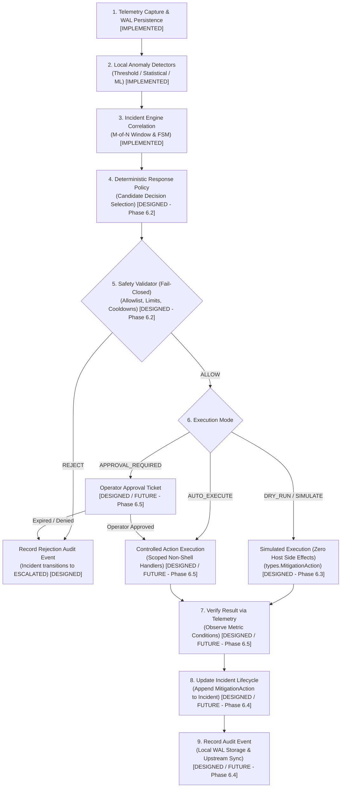
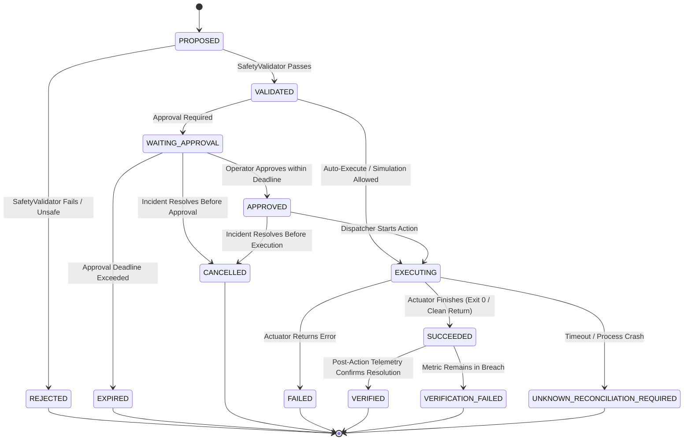

# ADR-0012: Autonomous Incident Response Architecture and Safety Design

**Status**: Accepted (Phase 6.1 Architecture & Safety Design; Phase 6.2 Policy & Validator; Phase 6.3 Simulated Action Executor; Phase 6.4 Durable Mitigation Persistence & Recovery Implemented)
**Date**: 2026-10-02  
**Deciders**: AegisEdge Core Engineering Team  
**Supersedes**: None  
**Relates to**: ADR-0003 (Domain Event & Incident Contracts), ADR-0004 (Edge-Local Persistence & WAL Durability), ADR-0009 (Edge Anomaly Detection Architecture), ADR-0010 (Local Incident Engine Architecture), ADR-0011 (Durable Incident Persistence)

---

## 1. Context & Operational Motivation

Through Phases 1 through 5.6D, AegisEdge established an offline-first telemetry ingestion, anomaly detection, incident correlation, and ML model lifecycle engine governed by the sequential pipeline:
$$\textbf{PERSIST TELEMETRY FIRST} \longrightarrow \textbf{DETECT SECOND} \longrightarrow \textbf{CORRELATE THIRD}$$

At the conclusion of Phase 5.6D, edge nodes:
1. Durably record local telemetry batches in SQLite WAL storage (`telemetry_batches`).
2. Detect mathematical threshold, statistical, and Isolation Forest ML breaches (`types.AnomalySignal`).
3. Correlate multi-signal breach sequences across time using an $M$-of-$N$ sliding window policy (`types.Incident`).
4. Manage candidate staging, active runtime switching, and explicit rollback of ML models locally without control-plane dependency.

However, incident detection and correlation alone do not resolve host anomalies. Remote edge nodes (e.g. industrial gateways, substations, wind turbines, cell towers) frequently experience extended WAN network partitions lasting hours or days. When an edge node experiences a critical resource breach during a network severance (such as runaway telemetry generation saturating memory or CPU thrashing), waiting for central cloud operator intervention is impossible.

### The Existential Risk of Unrestricted Remediation
While autonomous response is necessary, unconstrained remediation is catastrophic:
1. **The "Cure Worse Than the Disease" Dilemma**: An unconstrained remediation system executing arbitrary scripts or process terminations can kill mission-critical control daemons, corrupt filesystems, disable network interfaces, or render the node permanently unbootable.
2. **The Hallucination Danger of Generative AI / Unbounded Commands**: Passing arbitrary command strings (`exec.Command("sh", "-c", cmd)`) or AI-generated commands to a host shell introduces catastrophic security and operational failure modes: prompt injection, non-deterministic execution, and arbitrary host destruction.
3. **Flapping & Remediation Loops**: Without strict cooldowns, idempotency, and state machine integration, automated remediation can trigger cascading restart storms that consume battery reserves, corrupt local databases, and exhaust hardware write cycles.

Phase 6.1 establishes the formal **architecture, safety model, and design specification** for safe, deterministic, allowlisted autonomous response.

> [!IMPORTANT]
> **PHASE 6.1 IS ARCHITECTURE AND SAFETY DESIGN ONLY.**  
> No host mutation, no arbitrary shell commands, no real process manipulation, no database migrations, and no remote actuators are implemented in this phase.

---

## 2. Core Safety Invariants

The central, non-negotiable architectural principles of AegisEdge Autonomous Response are:

### Invariant 1: Detection Must Not Directly Execute Actions
$$\textbf{DETECTION MUST NOT DIRECTLY EXECUTE ACTIONS.}$$
An anomaly signal or incident must never trigger host operations directly. It must pass through an explicit response-policy engine and an independent, fail-closed safety boundary before any action can be authorized.

### Invariant 2: The Canonical Response Pipeline
$$\textbf{INCIDENT [IMPLEMENTED]} \longrightarrow \textbf{RESPONSE POLICY [DESIGNED]} \longrightarrow \textbf{SAFETY VALIDATION [DESIGNED]} \longrightarrow \textbf{DRY-RUN / SIMULATION [DESIGNED]} \longrightarrow \textbf{OPERATOR APPROVAL [DESIGNED]} \longrightarrow \textbf{CONTROLLED ACTION EXECUTION [DESIGNED]} \longrightarrow \textbf{VERIFY RESULT [DESIGNED]} \longrightarrow \textbf{UPDATE INCIDENT [DESIGNED]} \longrightarrow \textbf{RECORD AUDIT EVENT [DESIGNED]}$$



---

## 3. Component Architecture & Layer Boundaries

The response architecture comprises decoupled conceptual components:

```
┌────────────────────────────────────────────────────────┐
│ 1. Incident Engine (edge/agent/incident) [CURRENT]     │
│    - Correlates AnomalySignals into types.Incident     │
│    - Manages Incident FSM lifecycle                    │
│    - Strictly detects; NEVER decides host commands     │
└───────────────────────────┬────────────────────────────┘
                            │ Evaluates
                            ▼
┌────────────────────────────────────────────────────────┐
│ 2. Response Policy Engine (edge/agent/response) [FUTURE]│
│    - Pure deterministic policy evaluation              │
│    - Evaluates incident severity, rule, and cooldowns  │
│    - Proposes candidate ResponseDecision               │
└───────────────────────────┬────────────────────────────┘
                            │ Evaluates
                            ▼
┌────────────────────────────────────────────────────────┐
│ 3. Fail-Closed Safety Validator [FUTURE]               │
│    - Enforces closed ActionAllowlist                   │
│    - Validates target, parameter bounds, cooldowns     │
│    - Rejects any out-of-bounds or malformed decision   │
└───────────────────────────┬────────────────────────────┘
                            │ Authorizes
                            ▼
┌────────────────────────────────────────────────────────┐
│ 4. Execution Mode Dispatcher [FUTURE]                  │
│    - DRY_RUN: Executes simulation; zero host mutations │
│    - APPROVAL_REQUIRED: Holds ticket for operator auth │
│    - AUTO_EXECUTE: Dispatches allowlisted handler      │
└───────────────────────────┬────────────────────────────┘
                            │ Dispatches
                            ▼
┌────────────────────────────────────────────────────────┐
│ 5. Controlled Action Executor [FUTURE]                 │
│    - Strongly typed Go handlers (no shell wrappers)    │
│    - Strict execution timeout via context.Context      │
│    - Idempotent execution tokens (ActionID)            │
└───────────────────────────┬────────────────────────────┘
                            │ Observes
                            ▼
┌────────────────────────────────────────────────────────┐
│ 6. Verification Engine [FUTURE]                        │
│    - Evaluates post-execution telemetry metrics        │
│    - Confirms whether breach cleared (not just exit 0) │
└───────────────────────────┬────────────────────────────┘
                            │ Commits
                            ▼
┌────────────────────────────────────────────────────────┐
│ 7. Audit & Persistence Layer (Migration v4) [FUTURE]   │
│    - Transactionally commits MitigationAction to WAL   │
│    - Reconciles ambiguous crashes upon restart         │
└────────────────────────────────────────────────────────┘
```

---

## 4. Allowlisted Actions & Negative Boundaries

AegisEdge divides all potential system actions into three rigid categories:

```
┌────────────────────────────────────────────────────────────────────────────┐
│ 1. SIMULATED ACTIONS (Conceptual Baseline — Implementation Deferred to Phase 6.3) │
│    - SIMULATED_THROTTLE — controlled simulation of a throttling response          │
│    - SIMULATED_RESTART  — controlled simulation of a restart response             │
│    - SIMULATED_ISOLATE  — controlled simulation of an isolation response           │
│    - SIMULATED_ALERT    — controlled alert simulation                             │
├────────────────────────────────────────────────────────────────────────────┤
│ 2. CONTROLLED REAL ACTIONS (Future Scoped Actuators — Phase 6.5)           │
│    - Scoped process cgroup cpu.max throttling                              │
│    - Internal application worker goroutine restart                         │
│    - Controlled loopback firewall rule via pre-compiled binary template    │
├────────────────────────────────────────────────────────────────────────────┤
│ 3. FORBIDDEN ACTIONS (Permanently Prohibited Across All Phases)            │
│    - Arbitrary command-line strings via /bin/sh, /bin/bash, powershell.exe │
│    - Unrestricted filesystem mutation ("rm -rf ...", file deletion)        │
│    - Unrestricted process termination ("kill -9 ...", arbitrary PID kills) │
│    - Raw network command strings ("iptables ...", "ufw ...", "curl | sh")  │
│    - AI/LLM-generated natural language commands                            │
└────────────────────────────────────────────────────────────────────────────┘
```
*Note: Actual simulation behavior will be implemented in Phase 6.3.*

### Negative Boundary Specification
The response engine must **NEVER** accept, construct, or execute:
- Any arbitrary shell string: `"rm -rf /"`, `"kill -9 1234"`, `"powershell.exe -Command ..."`.
- Any command containing chaining/redirection metacharacters: `|`, `;`, `&`, `` ` ``, `$()`, `>`, `<`.
- Any unvetted dynamic script loaded from network or filesystem.

---

## 5. Action Risk Classification

To ensure appropriate operational governance, actions are categorized by operational risk:

| Risk Category | Permitted Action Types | Authorization Default | Impact on Host |
| :--- | :--- | :---: | :--- |
| **LOW RISK** | `SIMULATED_ALERT`, local log annotation, internal telemetry rate throttling | `AUTO_EXECUTE` or `DRY_RUN` | Zero disruption; non-destructive; reversible. |
| **CONTROLLED / APPROVAL REQUIRED** | `SIMULATED_RESTART`, `SIMULATED_ISOLATE`, future real service restart, future cgroup throttle | `APPROVAL_REQUIRED` (default) | Potential transient disruption; requires operator review or strict policy override. |
| **FORBIDDEN** | Arbitrary shell execution, raw process kills, arbitrary filesystem writes, arbitrary firewall mutation | **PERMANENTLY REJECTED** | Catastrophic host failure risk; structurally blocked by compiler types and validator. |

> [!NOTE]
> The exact classification thresholds and policy bindings must be finalized against the actual actuator implementations in Phase 6.3–6.5.

---

## 6. Fail-Closed Safety Validator

The `SafetyValidator` sits between policy decisions and execution authorization. It acts as an absolute gatekeeper:

$$\text{ValidateAction}(\text{Incident}, \text{ProposedAction}) \longrightarrow \textbf{ALLOW} \;\Big|\; \textbf{REJECT}$$

### Validation Checklist (All Must Pass):
1. **Allowlist Membership**: `ActionType` matches compile-time enum `types.MitigationActionType.IsValid()`.
2. **Incident Association**: `decision.IncidentID == incident.IncidentID` and `decision.NodeID == incident.NodeID`.
3. **Target Validity**: `Target` is non-empty, contains no shell metacharacters, and conforms to target allowlist.
4. **Parameter Bounds**: Numerical and duration parameters reside strictly within configured minimum/maximum safety bounds (e.g. `throttle_percent` $\in [1, 100]$, `duration_sec` $\in [1, 3600]$).
5. **Action Risk Level**: Action classification matches node execution policy.
6. **Approval Status**: If action is classified as `APPROVAL_REQUIRED`, a cryptographically valid approval token must be present and unexpired.
7. **Idempotency & Deduplication**: No identical action is currently `PENDING` or `EXECUTING`, and action has not already completed for this decision.
8. **Cooldown Verification**: Node and metric cooldown timers have elapsed since previous mitigation.
9. **Incident State**: Incident must be in `ANOMALY_DETECTED` or `MITIGATING`; incidents in `NORMAL`, `RECOVERED`, or `ESCALATED` reject new automated actions.
10. **Policy Version Integrity**: `PolicyName` and `PolicyVersion` are registered and recognized.
11. **Timeout Configured**: Bounded execution context timeout is specified ($> 0$ and $\le 30\text{s}$).

### Fail-Closed Directive
If validation cannot positively confirm that every single check passes:
$$\textbf{REJECT}$$
The validator must **never** execute on "best effort" or assume missing parameters are benign. Any validation error causes immediate rejection and transitions the driving incident to `ESCALATED`.

---

## 7. Human Approval Boundary

For actions carrying operational risk (service restarts, network isolation, host state adjustments), human-in-the-loop authorization is required:

### Three Authorization Classes:
1. **AUTOMATICALLY ALLOWED**: Low-risk, non-destructive allowlisted actions (`SIMULATED_ALERT`, bounded `SIMULATED_THROTTLE`).
2. **APPROVAL REQUIRED**: Potentially disruptive actions (`SIMULATED_RESTART`, future host service restarts).
3. **FORBIDDEN**: Permanently rejected; cannot be authorized by policy or human operator.

### Required Approval Ticket Specification:
When an action requires approval, the system generates an immutable approval ticket:
- `TicketID`: Unique identifier for the approval request.
- `ActionID`: Stable identity of the proposed action.
- `IncidentID`: Stable identity of the driving incident.
- `ActionType` & `Target`: Exactly what would be executed.
- `Parameters`: Immutable copy of proposed parameters.
- `ProposedAt`: Timestamp of ticket creation.
- `ExpiresAt`: Deterministic expiration deadline (e.g., 15 minutes). If expired, the ticket becomes invalid (`EXPIRED`).
- `ApproverIdentity`: Identifier of authorized human operator or signed control-plane service (future work).
- `ApprovedAt`: Timestamp of approval signature.
- **Future Anti-Tampering Binding**: Future approval mechanisms should cryptographically bind approval to the exact proposed action: the approval signature should bind to the exact hash of `(TicketID, ActionID, ActionType, Target, Parameters)` so that approving a ticket can never authorize a modified or substituted action.
- **Implementation Status**: Cryptographic approval/signature implementation is deferred to Phase 6.5. Cryptographic identity, public key infrastructure, and operator UI are future implementation milestones and are not implemented in Phase 6.1.

---

## 8. Dry-Run / Simulation Mode

Dry-run simulation is an architectural first-class operational mode:

For every proposed action, the system evaluates:
1. *What action would have been executed?* (e.g. `SIMULATED_THROTTLE`)
2. *Against what target?* (e.g. `"telemetry_generator"`)
3. *Why was it chosen?* (e.g. `"CPU usage exceeded 90% threshold"`)
4. *Which policy produced it?* (e.g. `"default_edge_response_policy" v1.0.0`)
5. *Which safety rules approved it?* (e.g. all 11 validator gates passed)
6. *Would approval have been required?* (e.g. `APPROVAL_REQUIRED = true`)

### Invariants of Simulation:
- Simulation executes the full pipeline up to execution, but invokes **zero host side effects**.
- Simulation reuses existing `SIMULATED_*` action types.
- The result is recorded with status `EXECUTED` or `SKIPPED` with explicit metadata `Message: "[DRY-RUN] Simulated execution succeeded"`.
- **Non-Equivalence**: Simulation verifies policy, parameter structure, and safety rules. It does **not** prove that a future real OS actuator will succeed (e.g., OS permission errors, locked processes).

---

## 9. Action Execution Lifecycle State Machine

Discrete actions transition through an explicit lifecycle that is decoupled from, but drives, the macro `types.IncidentStatus`:



### Mapping to Existing Domain Contracts:
In `shared/types/types.go`, `types.MitigationStatus` currently defines:
- `PENDING`: Encompasses `PROPOSED`, `VALIDATED`, `WAITING_APPROVAL`, `APPROVED`.
- `EXECUTING`: Action handler currently running.
- `EXECUTED`: Action handler completed cleanly.
- `FAILED`: Action handler returned error or safety rejected.
- `SKIPPED`: Action intentionally bypassed (cooldown active, dry-run skipped).
- `UNKNOWN_RECONCILIATION_REQUIRED`: Ambiguous timeout or post-execution crash.

*Future Extension Note*: In Phase 6.3–6.4, `types.MitigationStatus` may be enriched with explicit intermediate states (`WAITING_APPROVAL`, `VERIFIED`, `VERIFICATION_FAILED`, `EXPIRED`, `CANCELLED`) to provide finer-grained auditability without breaking the existing FSM.

---

## 10. Idempotency & Stable Identity

To prevent duplicate execution across network retries, duplicate anomaly deliveries, and process crashes, AegisEdge enforces an identity hierarchy:

$$\textbf{AnomalyID} \longrightarrow \textbf{IncidentID} \longrightarrow \textbf{DecisionID} \longrightarrow \textbf{ActionID}$$

1. **`AnomalyID`**: Discrete point-in-time observation signal.
2. **`IncidentID`**: Stable UUIDv4 identifying the continuous operational incident.
3. **`DecisionID`**: Deterministic SHA-256 digest:
   $$\text{DecisionID} = \text{SHA256}(\text{IncidentID} \mathbin{\Vert} \text{PolicyName} \mathbin{\Vert} \text{PolicyVersion} \mathbin{\Vert} \text{ActionType} \mathbin{\Vert} \text{Target})[:12]$$
4. **`ActionID`**: Unique execution token (`act-<uuid>`) representing the concrete execution attempt.

### At-Least-Once Request Handling with Idempotent Action Semantics
AegisEdge recognizes the **Critical Consistency Window**:
$$\text{Executor succeeds on host} \longrightarrow \textbf{[CRASH / REBOOT]} \longrightarrow \text{Result not committed to SQLite}$$
Upon agent restart, the system detects an unconfirmed in-flight action:
- It **does not blindly re-execute**.
- The action transitions to `UNKNOWN_RECONCILIATION_REQUIRED`.
- The incident transitions to `ESCALATED`.
- Subsequent evaluation requests for the same `DecisionID` within the cooldown period are idempotently suppressed.

---

## 11. Cooldown & Repeat Suppression (Anti-Flapping)

Automated remediation can trigger catastrophic oscillation (restart loops, flapping network interfaces). AegisEdge enforces four layers of defense:

1. **Per-Action Cooldown**: After an action executes, the same action type cannot execute on the same target until a configured cooldown period elapses (default: 5 minutes).
2. **Maximum Actions per Incident**: An active incident episode is capped at a strict maximum number of automated mitigations (default: 3). Once reached, automated responses cease and the incident transitions to `ESCALATED`.
3. **Circuit Breaker**: If 3 consecutive actions fail or fail verification across a metric stream, the response engine trips the circuit breaker for that stream, blocking all automated actions for 30 minutes.
4. **Operator Escalation**: Any breach of limits automatically halts automation and requests manual operator intervention.

---

## 12. Verification Semantics

A successful action execution does **not** equal incident resolution:

$$\textbf{"Command returned exit code 0" } \neq \textbf{ "Incident is resolved."}$$

For example:
- A service restart command may return exit code 0 while the service crashes immediately upon initialization.
- A throttle command may succeed while CPU consumption remains pegged due to an unthrottled thread.

### The Two-Stage Verification Protocol:
1. **Actuator Execution Verification**: Verifies that the actuator completed cleanly without errors (`SUCCEEDED`).
2. **Telemetry Condition Verification**: 
   - The edge agent continues ingesting telemetry samples following execution.
   - The verification engine monitors the driving metric (e.g. `cpu_usage_percent`) across a post-mitigation observation window (e.g. 3 consecutive nominal samples).
   - If the metric returns below recovery threshold: status becomes `VERIFIED`, and incident transitions `MITIGATING` $\to$ `RECOVERED`.
   - If the metric remains anomalous after the verification deadline: status becomes `VERIFICATION_FAILED`, and incident transitions `MITIGATING` $\to$ `ESCALATED`.

---

## 13. Comprehensive Failure Matrix (Scenarios A through T)

| Scenario | Failure Mode | System Behavior | Action Executes? | Retry Allowed? | Operator Action | Audit Requirement |
| :---: | :--- | :--- | :---: | :---: | :--- | :--- |
| **A** | **Policy Missing** | No matching policy rule found for metric/severity | **NO** | No | Alerted if severity critical | Logged as `NO_POLICY_MATCHED` |
| **B** | **Unknown Action Type** | ActionType not recognized in `MitigationActionType` | **NO** | **NO** | Incident escalated to operator | Logged as `REJECTED_UNKNOWN_ACTION_TYPE` |
| **C** | **Invalid Target** | Target empty, regex mismatch, or contains shell tokens | **NO** | **NO** | Incident escalated to operator | Logged as `REJECTED_INVALID_TARGET` |
| **D** | **Safety Validator Failure** | Parameter out of bounds, internal validator panic/error | **NO** | **NO** | Incident escalated to operator | Logged as `REJECTED_SAFETY_VIOLATION` |
| **E** | **Approval Required but Unavailable** | Action requires human approval; no operator online | **NO** | No | Ticket queued in SQLite | Logged as `APPROVAL_REQUIRED_PENDING` |
| **F** | **Approval Expired** | Approval deadline elapsed before operator signature | **NO** | No | Operator notified of expiration | Logged as `APPROVAL_EXPIRED` |
| **G** | **Incident Resolved Before Execution** | Incident transitioned to `RECOVERED` before dispatch | **NO** | No | None; auto-cleared | Logged as `CANCELLED_INCIDENT_RECOVERED` |
| **H** | **Duplicate Action Request** | ActionID/DecisionID already executed or executing | **NO** | No | None; idempotent filter | Logged as `DUPLICATE_SUPPRESSED` |
| **I** | **Executor Unavailable** | Target subsystem down, internal handler unregistered | **NO** | Yes (max 2) | Escalated if retries fail | Logged as `EXECUTOR_UNAVAILABLE` |
| **J** | **Executor Timeout** | Execution context exceeded deadline (default: 5s) | Ambiguous | **NO** | Action marked `UNKNOWN_RECONCILIATION_REQUIRED`; escalated | Logged as `FAILED_TIMEOUT` |
| **K** | **Executor Reports Failure** | Actuator returned explicit error / non-zero exit | Attempted | **NO** | Incident escalated to operator | Logged as `FAILED_EXECUTION_ERROR` |
| **L** | **Execution Succeeds but Write Fails** | Process killed after actuation but before SQLite write | Executed | **NO** | Recovery reconciles on startup; escalated | Logged as `UNKNOWN_RECONCILIATION_REQUIRED` |
| **M** | **Verification Fails** | Actuator succeeded, but telemetry metric remains bad | Executed | **NO** | Incident escalated to operator | Logged as `VERIFICATION_FAILED` |
| **N** | **Repeated Execution Attempts** | Action attempted maximum times (e.g. 3) | **NO** | **NO** | Circuit breaker tripped; operator paged | Logged as `LIMIT_EXCEEDED_CIRCUIT_TRIPPED` |
| **O** | **Node Restart During Action** | Process crash during in-flight action | Interrupted | **NO** | On startup, marked `UNKNOWN_RECONCILIATION_REQUIRED` | Logged as `CRASH_RECONCILIATION_REQUIRED` |
| **P** | **Network Partition** | Edge completely offline from control plane | **YES** (if allowlisted) | Per policy | Buffered locally; synced on reconnect | Full local audit record buffered in SQLite WAL |
| **Q** | **Control Plane Unavailable** | Remote registry or approval server offline | **YES** (local policy) | Local policy | Queues remote tickets; runs local | Logged locally in WAL |
| **R** | **Telemetry Unavailable After Action** | Sensor failure prevents verification | Executed | **NO** | Incident marked `ESCALATED` due to unverified state | Logged as `VERIFICATION_TELEMETRY_UNAVAILABLE` |
| **S** | **Policy Version Mismatch** | Local policy config hash does not match registry | **NO** | **NO** | Falls back to default safe policy; alerts operator | Logged as `POLICY_VERSION_MISMATCH` |
| **T** | **Unsafe/Malformed Action Payload** | Payload contains shell injection chars (`|`, `;`, `&`, `$`) | **NO** | **NO** | Security incident escalated immediately | Logged as `SECURITY_VIOLATION_MALFORMED_PAYLOAD` |

---

## 14. Security Boundary & Model Integrity

### Security Principles:
1. **Trusted Response Policy**: Response policies are immutable, compile-time configurations or cryptographically signed policy bundles.
2. **Zero Shell Interpolation**: No shell command strings (`exec.Command("sh", "-c", ...)`) are permitted. All actuators invoke typed Go functions.
3. **Payload Sanitization**: All action parameters are strongly typed (`int`, `float`, enum). Free-form string parameters are strictly validated against alphanumeric allowlists.
4. **Least Privilege**: The edge agent process runs under dedicated OS user credentials with strictly bounded Linux capabilities (`CAP_NET_ADMIN` only if isolation required).
5. **Auditable Response Events**: Every decision, safety check, and execution outcome is designed to be committed to local SQLite WAL storage and streamed upstream via NATS JetStream when connected. (Cryptographic tamper-evidence is future work deferred to subsequent security milestones.)

---

## 15. The AI / ML Boundary

AegisEdge strictly segregates Machine Learning / AI capabilities from Operational Response Execution:

```
┌────────────────────────────────────────────────────────┐
│ MACHINE LEARNING LAYER (Isolation Forest, etc.)        │
│                                                        │
│ PERMITTED OUTPUTS:                                     │
│  - AnomalyScore in [0.0, 1.0]                          │
│  - AnomalySignal mathematical domain event             │
│  - Normalized feature split path & depth evidence      │
│  - Confidence metric and detector metadata             │
│                                                        │
│ PROHIBITED OUTPUTS:                                    │
│  - NO arbitrary host shell commands                    │
│  - NO arbitrary action types                           │
│  - NO unrestricted file paths or targets               │
│  - NO shell scripts or execution wrappers              │
│  - NO network interface or firewall configurations     │
└───────────────────────────┬────────────────────────────┘
                            │ Produces mathematical signal only
                            ▼
┌────────────────────────────────────────────────────────┐
│ INCIDENT & RESPONSE POLICY LAYER                       │
│  - Maps mathematical signal to Incident domain entity  │
│  - Evaluates deterministic, compile-time policy rules  │
│  - SafetyValidator enforces rigid allowlist and bounds │
└────────────────────────────────────────────────────────┘
```

The response system remains **strictly deterministic and policy-driven**, even when driven by machine learning detection models.

---

## 16. Observability & Structured Audit Events

In future implementation phases, the response subsystem will emit structured domain events for every lifecycle milestone:

1. `incident.detected`: Incident correlated from anomaly signals.
2. `response.proposed`: Policy selected candidate action.
3. `response.validated`: Safety validator passed or rejected decision.
4. `response.approval_requested`: Approval ticket created for operator.
5. `response.approved` / `response.denied` / `response.expired`: Approval resolution.
6. `response.execution_started`: Actuator commenced execution.
7. `response.execution_completed`: Actuator finished successfully.
8. `response.execution_failed`: Actuator returned error or timed out.
9. `response.verification_started`: Post-action telemetry monitoring started.
10. `response.verified` / `response.verification_failed`: Operational resolution status.
11. `response.escalated`: Incident escalated to human operators.

---

## 17. Current vs. Future Implementation Roadmap

| Subsystem / Capability | Current Status (Phase 6.5) | Target Implementation Phase |
| :--- | :---: | :--- |
| **Incident Correlation & Lifecycle FSM** | **CURRENTLY IMPLEMENTED** | Phase 5.3–5.5 |
| **MitigationAction & ActionType Contracts** | **CURRENTLY IMPLEMENTED** | `shared/types/types.go` |
| **Response Architecture & Safety Specification** | *DESIGNED / DOCUMENTED* | Phase 6.1 (ADR-0012) |
| **Deterministic Response Policy Engine** | **CURRENTLY IMPLEMENTED** | Phase 6.2 (`edge/agent/response/policy.go`) |
| **Fail-Closed Safety Validator** | **CURRENTLY IMPLEMENTED** | Phase 6.2 (`edge/agent/response/validator.go`) |
| **Simulated Action Executor & Dry-Run Mode** | **CURRENTLY IMPLEMENTED** | Phase 6.3 (`edge/agent/response/executor.go`) |
| **Durable Mitigation Persistence (Migration v4)** | **CURRENTLY IMPLEMENTED** | Phase 6.4 (`edge/agent/storage/sqlite.go`) |
| **Operator Approval & Safety Gate (Migration v5)** | **CURRENTLY IMPLEMENTED** | Phase 6.5 (`edge/agent/response/approval.go`, `edge/agent/storage/sqlite.go`) |
| **Real Host Actuators & Production Remediation** | *DESIGNED (Future Implementation)* | Future Phase |
| **Automated Telemetry Verification Engine** | *DESIGNED (Future Implementation)* | Future Phase |

---

## 18. Alternatives Considered

1. **Direct Detector-to-Actuator Coupling**:
   - *Design*: Allow the anomaly detector to directly call an OS command when an anomaly is observed.
   - *Reason for Rejection*: Violates pipeline separation of concerns. Causes alert flapping and cascading restarts. Gives statistical/ML algorithms authority over host operations without safety checks.
2. **Unrestricted Shell Script Execution**:
   - *Design*: Accept shell script paths or raw command strings from configuration or central server.
   - *Reason for Rejection*: Massive security vulnerability. Introduces arbitrary code execution, command injection, privilege escalation, and unmaintainable failure modes.
3. **AI / LLM-Driven Dynamic Remediation Commands**:
   - *Design*: Pass incident telemetry to an LLM to generate dynamic remediation commands.
   - *Reason for Rejection*: Non-deterministic, unpredictable, prone to hallucinations, prompt injections, and catastrophic host destruction on edge devices.
4. **Cloud-Only Centralized Remediation Orchestration**:
   - *Design*: Require all responses to be decided and commanded remotely from the cloud control plane.
   - *Reason for Rejection*: Fails completely during WAN network partitions. Leaves unmanned remote edge devices unprotected during critical resource saturation.

---

## 19. Explicit Limitations of Phase 6.4

1. **Durable Persistence & Simulated Execution Only**: Phase 6.4 implements durable SQLite WAL persistence (`mitigation_records` via Migration v4) and startup crash recovery for simulated mitigation decisions.
2. **Zero Real Host Mutation**: Real host actuators remain strictly excluded. Zero process termination, zero service restarts, zero CPU throttling, zero network isolation, zero firewall modifications, zero filesystem remediation, and zero shell commands are executed.
3. **Startup Recovery Semantics**: If the agent process crashes while a mitigation is marked `EXECUTING`, upon restart the recovery routine transitions the record to `UNKNOWN_RECONCILIATION_REQUIRED`. The system never infers that an external action completed merely because the agent process restarted. Transition of the driving incident to `ESCALATED` upon ambiguous mitigation state is designed future orchestration and is not performed by the local storage layer in this phase.
4. **Local Durability Boundary**: Mitigation records are persisted through SQLite transactions using the project's configured WAL durability boundary. This provides the application's local durable persistence boundary under SQLite's configured semantics, but does not guarantee survival of every sudden-power-loss, storage-device, or hardware failure scenario. AegisEdge maintains strict non-claims: no zero-data-loss claim, no arbitrary physical power-loss guarantee, no hardware failure guarantee, no distributed exactly-once execution, and no distributed transaction guarantee.
5. **No Operator UI or Remote Approval APIs**: Approval ticketing workflows and cryptographic authorization signatures remain deferred to Phase 6.5. Actions classified as `APPROVAL_REQUIRED` are not auto-authorized and are marked as `SKIPPED`.
6. **No Real Host Actuators or Telemetry Verification**: Concrete host manipulation actuators and automated closed-loop telemetry verification belong to Phase 6.5.

---

## 20. Explicit Limitations of Phase 6.5

1. **Operator Approval & Simulation Only**: Phase 6.5 introduces the operator approval lifecycle (`PENDING -> APPROVED -> CONSUMED`), deterministic decision fingerprint binding (`ComputeDecisionFingerprint`), 14-point fail-closed execution-time authorization gate, durable SQLite WAL persistence (Migration v5 `approval_records`), and atomic single-use consumption. Real host actuators remain completely excluded and execution operates strictly against `SimulatedExecutor`.
2. **Zero Real Host Mutation**: Real host actuators remain strictly excluded. Zero process termination, zero service restarts, zero CPU throttling, zero network isolation, zero firewall modifications, zero filesystem remediation, and zero shell commands are executed.
3. **Application-Level Operator Identity**: Operator identity is recorded as application-level metadata strings (`approved_by`, `rejected_by`). Strong authentication, RBAC, OAuth2/OIDC, mTLS, and cryptographic approval signatures are deferred to future security milestones.
4. **Local Durability Boundary**: Approval records and mitigation records are persisted through SQLite transactions using the project's configured WAL durability boundary (`synchronous=NORMAL`). This provides local crash recovery across process restarts, but does not guarantee survival of arbitrary physical power-loss or storage hardware failure. AegisEdge maintains explicit non-claims: no zero-data-loss claim, no arbitrary power-loss guarantee, no hardware failure guarantee, no distributed exactly-once execution, and no distributed transaction guarantee.
5. **No Direct Incident FSM Mutation**: Mitigation approvals and executions operate on `mitigation_records` and `approval_records`. They do NOT mutate `IncidentStatus` to `RECOVERED` or alter the incident state machine.
6. **No Real Host Actuators or Telemetry Verification**: Concrete host manipulation actuators and automated closed-loop telemetry verification belong to future phases.

---

## 21. Verification Status

As of Phase 6.5, all 17 packages across the Go workspace compile, pass static analysis (`go vet`), and pass all automated unit and integration tests (`go test -count=1 -p 1 ./...`) cleanly.
