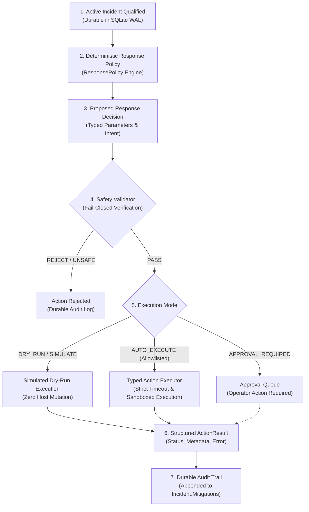
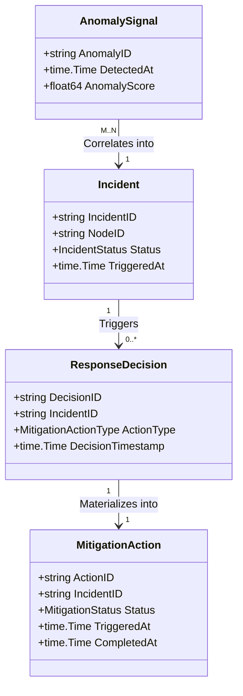
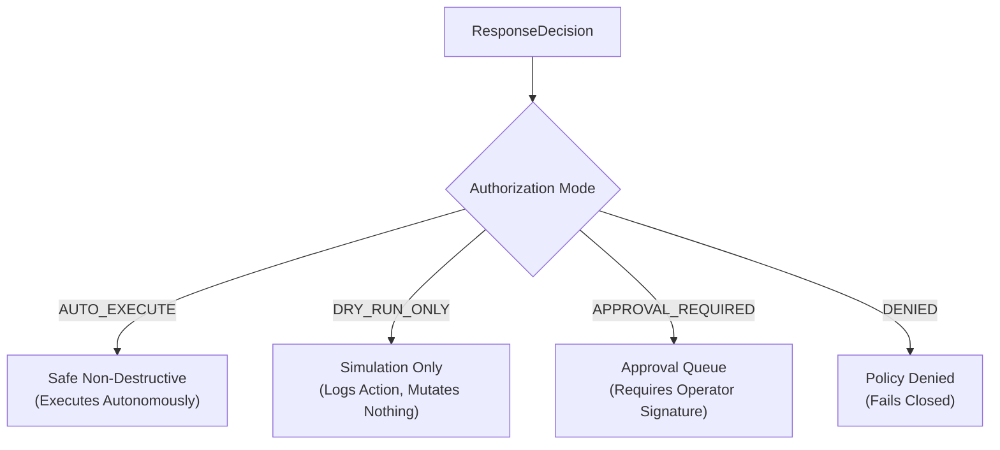
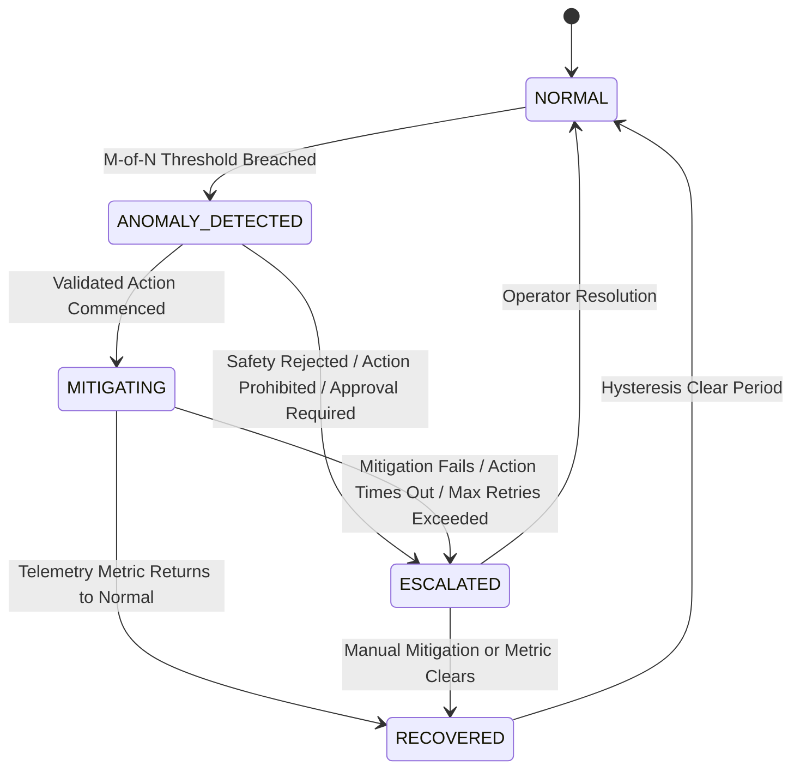

# ADR-0012: Safe Autonomous Response and Remediation Architecture

**Status**: Proposed (Phase 6.1 Architecture & Design Only — Implementation Deferred to Phase 6.2+)  
**Date**: 2026-09-28  
**Deciders**: AegisEdge Core Engineering Team  
**Supersedes**: None  
**Relates to**: ADR-0003 (Domain Event & Incident Contracts), ADR-0004 (Edge-Local Persistence & WAL Durability), ADR-0009 (Edge Anomaly Detection Architecture), ADR-0010 (Local Incident Engine Architecture), ADR-0011 (Durable Incident Persistence)

---

## 1. Context & Operational Motivation

Through Phases 1 through 5.5, AegisEdge established an offline-first telemetry and intelligence pipeline governed by the core sequential invariant:
$$\textbf{PERSIST TELEMETRY FIRST} \longrightarrow \textbf{DETECT SECOND} \longrightarrow \textbf{PERSIST INCIDENT THIRD}$$

At the conclusion of Phase 5.5, edge nodes durably capture metric time series in SQLite WAL storage (`telemetry_batches`), detect mathematical breaches via local deterministic threshold algorithms (`types.AnomalySignal`), correlate multi-signal episodes across time using an $M$-of-$N$ sliding window policy (`types.Incident`), and commit active incident lifecycles to disk (`incident_records`, `incident_observations`) with full process-restart recovery.

However, incident detection without automated response leaves edge systems vulnerable during WAN network partitions:
- Remote, unmanned edge nodes (e.g., remote industrial gateways, wind turbines, cell towers, autonomous vehicles) often operate under long-duration network partitions lasting hours or days.
- When an edge node experiences a critical resource breach (such as a runaway process saturating memory or thrashing CPU), waiting for central control-plane human operator intervention is impossible across a network severance.
- If unmitigated, localized resource exhaustion causes system crashes, kernel panics, data corruption, or physical device damage.

Consequently, edge nodes must possess the capability for **autonomous response and remediation**.

### The Existential Risk of Unrestricted Autonomous Remediation
While autonomous response is essential, poorly constrained automated remediation is catastrophic:
1. **The "Cure Worse Than the Disease" Dilemma**: An unconstrained remediation system executing arbitrary scripts or process terminations can inadvertently kill mission-critical control daemons, corrupt filesystems, disable network interfaces, or render the node permanently unreachable.
2. **The Hallucination Danger of Generative AI**: Executing unvetted, AI-generated command strings (`exec.Command("sh", "-c", command)`) on production edge nodes introduces fatal vulnerabilities: prompt injections, command hallucination, non-deterministic behaviors, and arbitrary code execution.
3. **Flapping & Remediation Loops**: Without strict cooldowns, idempotency, and state machine integration, automated remediation can trigger catastrophic cascading cycles (e.g., oscillating restart storms that consume battery reserves and corrupt local databases).

Phase 6.1 establishes the formal **architecture, safety model, and design specification** for safe, deterministic, allowlisted autonomous response. 

> [!IMPORTANT]
> **PHASE 6.1 IS ARCHITECTURE AND DESIGN ONLY.**  
> No execution code, no arbitrary shell commands, no real process manipulation, no database migrations, and no external dependencies are introduced in this phase.

---

## 2. Problem Statement

Prior to Phase 6, the `types.Incident` contract included the field:
```go
Mitigations []MitigationAction `json:"mitigations,omitempty"`
```
However, this field remained `nil` across all phases. The edge node could detect and persist incidents, but had no architectural model for:
1. Evaluating whether an active incident qualifies for an automated operational response.
2. Deciding which safe, deterministic action should be taken.
3. Validating that proposed actions cannot violate host safety boundaries or operational constraints.
4. Distinguishing dry-run / simulation modes from actual physical execution.
5. Guaranteeing strict execution idempotency across network retries, duplicate signals, and process crashes.
6. Preventing ambiguous timeout states from triggering dangerous duplicate remediations.
7. Providing a complete, explainable audit trail for human operators.

Phase 6.1 solves this architectural problem by designing a layered, fail-closed safety pipeline.

---

## 3. Core Safety Invariant

The central, non-negotiable safety invariant of AegisEdge Phase 6 is:

$$\textbf{INCIDENT} \longrightarrow \textbf{RESPONSE POLICY} \longrightarrow \textbf{SAFETY VALIDATION} \longrightarrow \textbf{ALLOWLISTED ACTION} \longrightarrow \textbf{DRY-RUN / SIMULATION} \longrightarrow \textbf{EXECUTION} \longrightarrow \textbf{RESULT} \longrightarrow \textbf{DURABLE AUDIT}$$



### The Eight Execution Gates
The system must **NEVER** execute arbitrary command strings, natural-language commands, or AI-generated scripts. 

An action may execute if and only if **all eight** of the following gates pass:
1. **Explicitly Allowlisted**: The action type belongs to the rigid, compile-time `MitigationActionType` allowlist.
2. **Valid Target**: The target resource (e.g. process name, container ID, metric subsystem) passes a strict regular expression and semantic whitelist.
3. **Validated Parameters**: All parameter fields exist, conform to expected data types, and reside within safe numerical/temporal bounds.
4. **Permitted by Policy**: The active incident's severity, rule name, and metric context match an enabled response policy.
5. **Safety Constraints Satisfied**: System cooldowns, maximum execution counts, and rate limits have not been breached.
6. **Strictly Deduplicated**: The action has not already been executed, is not currently executing, and is not a duplicate invocation.
7. **Execution Mode Conformance**: The execution mode (`DRY_RUN`, `AUTO_EXECUTE`, `APPROVAL_REQUIRED`) authorizes execution.
8. **Valid Timeout & Deadline**: A finite, deterministic deadline is configured via `context.WithTimeout`.

> [!CAUTION]
> **FAIL-CLOSED DIRECTIVE**: If the `SafetyValidator` encounters an unknown state, a corrupt parameter, an unverified constraint, or an internal error, it must **FAIL CLOSED** and **REJECT** the action immediately. It must **NEVER** attempt a "best-effort" execution.

---

## 4. Design Objectives

The Phase 6 response architecture satisfies the following design principles:

1. **Deterministic Response Policies**: Policy decisions are pure, deterministic functions of incident state, metric history, and cooldown timers. Zero non-deterministic heuristic models.
2. **Explicit Allowlist**: Only predefined, typed actions can ever be executed.
3. **Safe Parameter Validation**: Strong typing and range validation on all action arguments.
4. **Dry-Run / Simulation by Default**: Dry-run is a first-class execution mode capable of exercising the full detection $\to$ decision $\to$ validation $\to$ result pipeline without altering the host OS.
5. **Action Idempotency**: Idempotency is maintained via distinct `ActionID` identities; repeated invocations never execute duplicate physical mutations.
6. **Explicit Lifecycle Tracking**: Actions transition through an explicit state machine (`PENDING` $\to$ `EXECUTING` $\to$ `EXECUTED` / `FAILED` / `SKIPPED`).
7. **Deterministic Timeout & Deadlines**: All operations are bounded by strict contexts. Ambiguous timeouts transition the action to `UNKNOWN_RECONCILIATION_REQUIRED` (and the driving incident's `IncidentStatus` to `ESCALATED`) rather than triggering blind retries.
8. **Conservative Retry Semantics**: Only transient, idempotent execution errors may be retried. Rejections, validation failures, and ambiguous timeouts are non-retryable.
9. **Durable Auditability**: Every decision, safety check, and execution outcome is permanently recorded for operator review.
10. **Crash Consistency & Restart Recovery**: The response engine must survive sudden process crashes and power cycles, reconciling in-flight actions upon restart without duplicate execution.
11. **Node-Local & 100% Offline Autonomy**: Full response capabilities operate without external dependencies, internet access, NATS connectivity, or control-plane availability.
12. **Strict Failure Isolation**: A failure in response policy, validation, or actuation can never corrupt or roll back previously persisted telemetry batches or incident records.
13. **Defense Against AI Hallucinations**: Future AI/LLM components may act as advisory *recommenders*, but recommendations must pass through the identical `ResponsePolicy` and `SafetyValidator` gates before reaching the executor.

---

## 5. Conceptual Architecture & Component Model

The response system comprises five decoupled conceptual components:

```
  types.Incident (Durable)
            │
            ▼
┌────────────────────────┐
│   A. ResponsePolicy    │  Evaluates Incident State & Cooldowns
└───────────┬────────────┘
            │ Produces
            ▼
┌────────────────────────┐
│  B. ResponseDecision   │  Typed Candidate Action & Target
└───────────┬────────────┘
            │ Evaluates
            ▼
┌────────────────────────┐
│  C. SafetyValidator    │  Enforces Allowlist, Ranges, Limits (FAIL CLOSED)
└───────────┬────────────┘
            │ Authorizes
            ▼
┌────────────────────────┐
│   D. ActionAllowlist   │  Immutable Registry of Known Typed Actions
└───────────┬────────────┘
            │ Dispatches
            ▼
┌────────────────────────┐
│   E. ActionExecutor    │  Executes Allowlisted Action (Dry-Run or Actuation)
└───────────┬────────────┘
            │ Produces
            ▼
       ActionResult ───► Durable Audit (types.MitigationAction)
```

### Component A: `ResponsePolicy`
The `ResponsePolicy` evaluates whether an active incident warrants an autonomous operational response.

* **Inputs**:
  - `Incident`: `IncidentID`, `NodeID`, `Severity`, `Status`, `TriggerMetric`, `TriggerValue`, `Threshold`, `Evidence`, `TriggeredAt`.
  - `Historical Context`: Previous action outcomes for this incident, elapsed time since last action, node-level cooldown timers.
  - `Policy Rules`: Configured mappings (e.g., `cpu_usage_percent` $> 90\%$ with `CRITICAL` severity $\to$ `SIMULATED_THROTTLE`).
* **Outputs**: A candidate `ResponseDecision` or `NoActionDecision`.
* **Determinism**: Pure mathematical evaluation; given identical incident evidence and cooldown timestamps, the policy produces identical decisions.

### Component B: `ResponseDecision`
Represents the formal recommendation generated by a policy:
- `DecisionID`: Unique identifier for this policy evaluation.
- `IncidentID`: Stable identity of the driving incident.
- `NodeID`: Node target.
- `ActionType`: Requested allowlisted action type (`MitigationActionType`).
- `Target`: Explicit target identifier (e.g. subsystem name, service identifier).
- `Parameters`: Typed key-value configuration for the action.
- `Reason`: Machine-readable and human-readable explanation of why the decision was taken.
- `PolicyName` & `PolicyVersion`: Provenance tracking.
- `SafetyRequirements`: Required cooldown period, maximum retry count.
- `ExecutionMode`: Recommended mode (`DRY_RUN`, `AUTO_EXECUTE`, `APPROVAL_REQUIRED`).

### Component C: `SafetyValidator`
The gatekeeper of the executor. It inspects the `ResponseDecision` and validates every constraint:
- Is `ActionType` in `ActionAllowlist`?
- Is `Target` clean, valid, and non-empty?
- Are numerical parameters within defined safe minimum/maximum bounds?
- Does the `IncidentStatus` permit mitigation (must be `ANOMALY_DETECTED` or `MITIGATING`)?
- Is the node currently in an active cooldown window for this action?
- Has the maximum mitigation count per incident been reached?
- Is there already an identical action pending or executing?

**Validation Outcome**:
- `PASSED`: Proceed to execution.
- `REJECTED`: Abort immediately, return structured validation errors, and log audit event.

### Component D: `ActionAllowlist`
The static, immutable catalog of safe operations. In Phase 6, all initial actions are safe simulations matching existing domain types in [`shared/types/types.go`](file:///C:/AegisEdge/shared/types/types.go#L190-L199):

| Action Type | Target Semantics | Allowed Parameters | Default Timeout | Phase 6.1 Status |
| :--- | :--- | :--- | :--- | :--- |
| `SIMULATED_THROTTLE` | Subsystem name (e.g. `"telemetry_generator"`, `"collector"`) | `throttle_percent` (1–100), `duration_sec` (1–3600) | 5s | **Simulated / Non-Destructive** |
| `SIMULATED_RESTART` | Internal worker name (e.g. `"sync_worker"`, `"detector_worker"`) | `grace_period_sec` (1–60) | 10s | **Simulated / Non-Destructive** |
| `SIMULATED_ISOLATE` | Network target / interface (e.g. `"upstream_sync"`, `"nats_publisher"`) | `isolation_scope` (`"egress"`, `"ingress"`, `"all"`) | 5s | **Simulated / Non-Destructive** |
| `SIMULATED_ALERT` | Alert channel (e.g. `"local_syslog"`, `"audit_file"`) | `priority` (`"LOW"`, `"HIGH"`, `"CRITICAL"`), `message` | 2s | **Simulated / Non-Destructive** |

*Arbitrary command strings (e.g. `systemctl restart ...`, `rm -rf`, `kill -9`, `/bin/sh`) are strictly excluded.*

### Component E: `ActionExecutor`
The execution engine responsible for executing pre-validated actions.
- **Strict Boundary**: The executor does **not** evaluate policy and does **not** validate safety (it accepts only actions that have already passed `SafetyValidator`).
- **No Command Construction**: The executor invokes typed Go handlers (`func(ctx context.Context, params ActionParams) ActionResult`), never shell wrappers.
- **Structured Outcome**: Returns an `ActionResult` mapping to `types.MitigationAction`.

#### Action Execution State vs. Incident FSM Status
The architecture strictly decouples the lifecycle of a discrete action from the macro incident:
- **Action Execution State** (`types.MitigationStatus`): Tracks the execution lifecycle of a single action: `PENDING`, `EXECUTING`, `EXECUTED`, `FAILED`, `SKIPPED`, and the ambiguous execution state `UNKNOWN_RECONCILIATION_REQUIRED`.
- **Incident FSM Status** (`types.IncidentStatus`): Tracks the macro incident domain state: `NORMAL`, `ANOMALY_DETECTED`, `MITIGATING`, `RECOVERED`, `ESCALATED`.

`UNKNOWN_RECONCILIATION_REQUIRED` is exclusively an **action execution state** indicating that an action's physical outcome on the host is unconfirmed; it is **NOT** an `IncidentStatus`. When an action enters `UNKNOWN_RECONCILIATION_REQUIRED`, the driving incident transitions to `IncidentStatus = ESCALATED` under the existing Incident FSM to alert human operators.

---

## 6. Dry-Run / Simulation Mode

Dry-run execution is a first-class operational mode:
- In `DRY_RUN` mode, the entire pipeline executes:
  $$\text{Incident Detected} \longrightarrow \text{Policy Evaluated} \longrightarrow \text{Safety Validated} \longrightarrow \text{Dry-Run Dispatched} \longrightarrow \text{Result Logged}$$
- The executor verifies that parameters are valid, simulates the elapsed latency of the action, records what *would* have been mutated, but executes zero host or process side effects.
- Result status is explicitly recorded as `SKIPPED` or `EXECUTED` with `Message: "[DRY-RUN] Simulated execution succeeded"`.

This mode enables exhaustive integration testing, CI validation, and live production canary deployments without risking physical edge downtime.

---

## 7. Identity Hierarchy & Idempotency Model

To prevent duplicate execution and state corruption across retries and restarts, AegisEdge enforces a strict identity hierarchy:

$$\textbf{AnomalyID} \longrightarrow \textbf{IncidentID} \longrightarrow \textbf{DecisionID} \longrightarrow \textbf{ActionID}$$



### Identity Rules
1. **`AnomalyID`**: Discrete point-in-time mathematical observation. Generated by detector.
2. **`IncidentID`**: Macro operational incident lifecycle. Remains stable for the duration of the breach.
3. **`DecisionID`**: Unique evaluation event by `ResponsePolicy`. Generated per policy cycle (`UUIDv4` or hash of `IncidentID:PolicyName:PolicyVersion:Sequence`).
4. **`ActionID`**: Deterministic or unique execution token for `ActionExecutor`.
   - Re-running policy evaluation on the same incident within the cooldown window produces no new `ActionID`.
   - Once an `ActionID` has transitioned to `EXECUTED` or `FAILED`, subsequent evaluations for that action on that incident are rejected as duplicates.
   - `AnomalyID` is **never** reused as `ActionID`.

---

## 8. Retry Semantics & Failure Classification

AegisEdge implements strict, conservative retry rules. Automated retries are prohibited unless the failure is unambiguously transient and the action is provably idempotent:

| Failure Category | Examples | Retry Allowed? | System Behavior |
| :--- | :--- | :---: | :--- |
| **Validation Failure** | Invalid parameter range, missing required key | **NEVER** | Permanent rejection. Record `FAILED` in audit log. |
| **Unsupported Action** | ActionType not in allowlist | **NEVER** | Fail closed immediately. Log security alert. |
| **Invalid Target** | Target subsystem does not exist or regex mismatch | **NEVER** | Permanent rejection. |
| **Safety Rejection** | Cooldown timer active, max actions exceeded | **NEVER** | Rejection. Record `SKIPPED` in audit log. |
| **Transient Execution Failure** | Temporary internal resource lock contention | **CONDITIONAL** | Max 2 retries with exponential backoff (1s, 2s). |
| **Execution Timeout** | Action context deadline exceeded | **NEVER BLINDLY** | Action enters `UNKNOWN_RECONCILIATION_REQUIRED`; incident transitions to `ESCALATED`. |
| **Ambiguous Post-Commit Crash** | Process dies while action is running | **NEVER BLINDLY** | Action enters `UNKNOWN_RECONCILIATION_REQUIRED`; incident transitions to `ESCALATED`. |

### The Critical Ambiguity Problem
If an action execution times out or the edge agent process terminates while the action is running, the host state is ambiguous: **the action may have executed successfully, partially executed, or failed**.

Blindly retrying a non-idempotent operation (such as restarting a subsystem) can cause double-restarts, race conditions, or permanent process death. Therefore:
$$\textbf{Ambiguous Execution} \Longrightarrow \textbf{DO NOT RETRY} \longrightarrow \textbf{Action enters UNKNOWN\_RECONCILIATION\_REQUIRED} \;\Big|\; \textbf{Incident transitions to ESCALATED}$$

---

## 9. Timeout Semantics

All operations in the response pipeline are strictly bounded in time:
- **Policy Evaluation Timeout**: Maximum 500ms. If policy evaluation hangs, abort and log failure.
- **Safety Validation Timeout**: Maximum 200ms. If safety checks hang, fail closed.
- **Action Execution Timeout**: Bounded per action type (default: 5s, maximum configurable: 30s).
- **Implementation**: Enforced via Go `context.WithTimeout(ctx, actionTimeout)`.

When an execution timeout fires:
1. Execution cancellation is requested via child context cancellation where supported. However, context cancellation does NOT guarantee that an already-started external host operation has halted or released resources.
2. If execution state cannot be confirmed, the action enters `UNKNOWN_RECONCILIATION_REQUIRED` and must not be blindly retried.
3. The driving incident's `IncidentStatus` transitions to `ESCALATED` under the existing Incident FSM to alert human operators for manual inspection.

---

## 10. Safety Boundaries & Prohibited Operations

To maintain absolute system safety, the executor is governed by rigid negative boundaries.

The executor must **NEVER**:
- Execute arbitrary command-line strings via `/bin/sh`, `/bin/bash`, `cmd.exe`, or `powershell.exe`.
- Parse, compile, or execute raw natural-language instructions generated by LLMs or external agents.
- Execute uncompiled scripts (`.sh`, `.bat`, `.ps1`, `.py`) from the filesystem.
- Modify arbitrary host configuration files (e.g. `/etc/passwd`, `/etc/fstab`, `sshd_config`).
- Disable security frameworks (e.g. AppArmor, SELinux, Windows Defender).
- Delete, truncate, or alter persistent databases, telemetry WAL logs, or application files.
- Terminate arbitrary OS processes (`SIGKILL` on arbitrary PIDs).
- Modify host firewall tables (`iptables`, `nftables`) without explicit, allowlisted, pre-compiled templates.
- Interact with external public internet endpoints, cloud APIs, or Kubernetes cluster control planes.

---

## 11. Human Approval Boundary

The response architecture supports three explicit policy authorization modes:



1. **`AUTO_EXECUTE`**:
   - Limited exclusively to safe, reversible, non-destructive allowlisted actions (e.g. `SIMULATED_ALERT`, `SIMULATED_THROTTLE` within safe bounds).
   - Operates completely autonomously at the edge.
2. **`DRY_RUN_ONLY`**:
   - Used for canary validation, testing, and risk auditing.
   - Evaluates all gates but executes zero mutations.
3. **`APPROVAL_REQUIRED`**:
   - Required for any future potentially disruptive operations (e.g., real node reboots, physical service restarts).
   - Generates an approval ticket in SQLite; execution is blocked until an authorized central operator submits a signed approval token.
4. **`DENIED`**:
   - Blocked by policy constraints or administrative override.

---

## 12. Failure Isolation & Pipeline Invariant

The response subsystem is strictly decoupled from the durability of telemetry and incidents:

$$\textbf{PERSIST TELEMETRY} \longrightarrow \textbf{DETECT} \longrightarrow \textbf{PERSIST INCIDENT} \longrightarrow \textbf{EVALUATE RESPONSE} \longrightarrow \textbf{EXECUTE} \longrightarrow \textbf{AUDIT}$$

```text
[Telemetry Persistence]   <-- COMMITTED TO SQLite WAL (telemetry_batches)
          │
[Incident Engine]         <-- COMMITTED TO SQLite WAL (incident_records)
          │
┌─────────┴───────────────────────────────────────────┐
│ Response Engine Boundary                            │
│  - Policy evaluation panic?     --> CAUGHT & LOGGED │
│  - Safety validation rejected?  --> CAUGHT & LOGGED │
│  - Executor timed out / failed? --> CAUGHT & LOGGED │
└─────────────────────────────────────────────────────┘
          │
[Upstream Synchronization] <-- PROCEEDS NORMALLY (NATS JetStream / HTTP)
```

**Non-Interference Guarantee**:
- If `ResponsePolicy` panics or returns an error, the incident remains fully persisted and active in SQLite WAL.
- If `ActionExecutor` fails, crashes, or times out, telemetry batches remain `PENDING` or `PUBLISHED` in SQLite and synchronization to the control plane proceeds unimpeded.
- Under zero circumstances can a remediation failure roll back, corrupt, or drop telemetry data.

---

## 13. Offline & Edge-Local Operation

A core architectural value of AegisEdge is **complete offline autonomy**:
- All response policies, safety constraints, allowlists, and execution logic reside 100% locally in edge agent memory and SQLite storage.
- An edge node severed from the central control plane, NATS broker, and external internet evaluates incidents and executes allowlisted mitigations autonomously.
- Decisions and action results are buffered locally in SQLite and synchronized upstream only when connectivity restores.

---

## 14. Security Model & Least Privilege

The `ActionExecutor` is the most privileged component in the edge agent. Its security architecture enforces:
1. **Principle of Least Privilege**: The executor runs within a constrained process context with restricted OS capabilities.
2. **Strict Parameter Sanitization**: All parameter values are typed (integers, floats, enumerated strings); free-form text is strictly forbidden or restricted to alphanumeric identifiers.
3. **Log Sanitization**: Passwords, encryption keys, tokens, or PII are strictly excluded from structured logs and audit records.
4. **No Injection Surface**: Because no shell or command interpreter is invoked, command injection vulnerabilities (`|`, `;`, `&&`, `$()`) are structurally impossible.

---

## 15. Auditability & Explainability

Every response lifecycle must be completely reconstructible by human operators and auditors:

```json
{
  "audit_record": {
    "action_id": "act-9a8b7c6d-0001",
    "decision_id": "dec-1f2e3d4c-0001",
    "incident_id": "inc-e3e1cc91-42",
    "node_id": "node-edge-01",
    "policy_name": "cpu_saturation_policy",
    "policy_version": "1.0.0",
    "action_type": "SIMULATED_THROTTLE",
    "target": "telemetry_generator",
    "parameters": {
      "throttle_percent": 50,
      "duration_sec": 300
    },
    "safety_checks": [
      {"check": "allowlist_membership", "status": "PASSED"},
      {"check": "parameter_bounds", "status": "PASSED"},
      {"check": "cooldown_timer", "status": "PASSED"},
      {"check": "max_incident_actions", "status": "PASSED"}
    ],
    "execution_mode": "DRY_RUN",
    "status": "EXECUTED",
    "started_at": "2026-09-28T10:15:00.123456Z",
    "completed_at": "2026-09-28T10:15:00.128789Z",
    "duration_ms": 5.33,
    "message": "[DRY-RUN] Simulated throttle applied successfully",
    "error": null
  }
}
```

An operator reviewing this audit trail can answer:
- *Why was this action chosen?* Mapped to `policy_name`, `policy_version`, and driving `incident_id`.
- *What safety checks passed?* Listed explicitly in `safety_checks`.
- *Was it simulated or real?* Identified by `execution_mode`.
- *What was the exact outcome?* Stored in `status`, `duration_ms`, `message`, and `error`.

---

## 16. Observability Design (Future Requirements)

When Phase 6 is implemented, the response engine will export structured metrics and logs:
- **Counters**:
  - `aegisedge_response_decisions_total{policy, status}`
  - `aegisedge_safety_validations_total{action_type, result}`
  - `aegisedge_action_executions_total{action_type, mode, status}`
  - `aegisedge_action_retries_total{action_type}`
  - `aegisedge_action_timeouts_total{action_type}`
- **Histograms**:
  - `aegisedge_action_execution_duration_seconds{action_type}`
  - `aegisedge_policy_evaluation_duration_seconds`
- **Gauges**:
  - `aegisedge_active_mitigations{node_id}`
  - `aegisedge_pending_approvals{node_id}`

---

## 17. Incident Contract Integration

Phase 6 reuses the existing, canonical domain contracts in `shared/types/types.go`:
- `types.Incident`:
  ```go
  type Incident struct {
      IncidentID    string             `json:"incident_id"`
      NodeID        string             `json:"node_id"`
      RuleName      string             `json:"rule_name"`
      Severity      IncidentSeverity   `json:"severity"`
      Status        IncidentStatus     `json:"status"`
      Description   string             `json:"description"`
      TriggerMetric string             `json:"trigger_metric,omitempty"`
      TriggerValue  float64            `json:"trigger_value,omitempty"`
      Threshold     float64            `json:"threshold,omitempty"`
      Evidence      map[string]string  `json:"evidence,omitempty"`
      TriggeredAt   time.Time          `json:"triggered_at"`
      UpdatedAt     time.Time          `json:"updated_at"`
      ResolvedAt    *time.Time         `json:"resolved_at,omitempty"`
      Mitigations   []MitigationAction `json:"mitigations,omitempty"`
  }
  ```
- `types.MitigationAction`:
  ```go
  type MitigationAction struct {
      ActionID    string               `json:"action_id"`
      IncidentID  string               `json:"incident_id"`
      ActionType  MitigationActionType `json:"action_type"`
      Target      string               `json:"target"`
      Status      MitigationStatus     `json:"status"`
      Message     string               `json:"message,omitempty"`
      Error       string               `json:"error,omitempty"`
      TriggeredAt time.Time            `json:"triggered_at"`
      CompletedAt *time.Time           `json:"completed_at,omitempty"`
  }
  ```

In the implementation phase (Phase 6.2+), every executed or dry-run action will append a validated `MitigationAction` to the incident's `Mitigations` slice and commit it transactionally to SQLite WAL.

---

## 18. Incident Lifecycle State Machine (FSM) Integration

The canonical Incident FSM defined in Phase 1 ([ADR-0003](../decisions/ADR-0003-domain-event-and-incident-contracts.md)) remains strictly unchanged:

$$\begin{aligned}
\text{NORMAL} &\longrightarrow \text{ANOMALY\_DETECTED} \\
\text{ANOMALY\_DETECTED} &\longrightarrow \text{MITIGATING} \;\Big|\; \text{ESCALATED} \\
\text{MITIGATING} &\longrightarrow \text{RECOVERED} \;\Big|\; \text{ESCALATED} \\
\text{RECOVERED} &\longrightarrow \text{NORMAL} \\
\text{ESCALATED} &\longrightarrow \text{RECOVERED} \;\Big|\; \text{NORMAL (operator resolution)}
\end{aligned}$$



### Deterministic State Transitions
1. **Action Commenced**: When `ActionExecutor` begins executing an approved action, the incident transitions:
   $$\text{ANOMALY\_DETECTED} \longrightarrow \text{MITIGATING}$$
2. **Action Succeeded**:
   - The incident remains `MITIGATING` while the mitigation is active.
   - If downstream telemetry samples show that the metric has returned below threshold, the incident transitions:
     $$\text{MITIGATING} \longrightarrow \text{RECOVERED}$$
3. **Action Failed / Timed Out / Max Retries Exceeded**:
   - If the mitigation fails or times out, the incident transitions:
     $$\text{MITIGATING} \longrightarrow \text{ESCALATED}$$
4. **Safety Rejection / Approval Required**:
   - If an action is rejected by safety constraints or requires human approval, the incident transitions:
     $$\text{ANOMALY\_DETECTED} \longrightarrow \text{ESCALATED}$$
   - This alerts human operators without executing unvetted commands.

*Zero changes to `IncidentStatus.CanTransitionTo` are required. The existing FSM fully supports this lifecycle.*

---

## 19. Concurrency & Synchronization

The response engine operates in a multi-threaded, asynchronous edge agent runtime:
- **Node-Stream Isolation**: Correlating and acting upon an incident on `(node-1, cpu_usage_percent)` is isolated from `(node-2, cpu_usage_percent)` or `(node-1, memory_usage_percent)`.
- **Per-Stream Mutexes**: Action dispatch on a specific correlation stream is serialized via `sync.Mutex` on the stream's state object.
- **Node-Level Global Mutex**: Certain physical actions (e.g. subsystem restart) require a node-level lock to prevent simultaneous overlapping reboots across metrics.
- **SQLite Single-Writer Concurrency**: All database writes for audit logs and status updates pass through the single-writer SQLite connection pool (`SetMaxOpenConns(1)`), preventing SQL deadlocks and busy timeouts.

---

## 20. Crash Recovery & Restart State Model

If the edge agent or physical host abruptly restarts during response processing, the system must recover predictably:

| State at Crash Instant | Recovered Action State | Recovery Action & Incident Impact |
| :--- | :--- | :--- |
| **Before SQLite Commit** | Zero record in store | Evaluation re-runs normally upon next telemetry evaluation. Zero duplicate mutation. |
| **Decision Committed, Execution Not Started** | `PENDING` | If elapsed time $<$ timeout, dispatch action. If elapsed time $>$ timeout, mark `SKIPPED (STALE)`. |
| **Crash While Action Running** | `UNKNOWN_RECONCILIATION_REQUIRED` | In-flight action interrupted; host state ambiguous. Action marked `UNKNOWN_RECONCILIATION_REQUIRED`. Driving incident transitions to `ESCALATED`. **DO NOT RE-EXECUTE.** |
| **Crash After Execution, Before Result Persistence** | `UNKNOWN_RECONCILIATION_REQUIRED` | Crash after execution but before result persistence produces `UNKNOWN_RECONCILIATION_REQUIRED`. No blind retry is permitted. Future actuator-specific reconciliation will determine whether the action executed successfully. Incident transitions to `ESCALATED`. |
| **Action Completed, Result Committed** | `EXECUTED` / `FAILED` | State fully intact. Incident remains in `MITIGATING` or `ESCALATED`. |

This model guarantees that an interrupted or unconfirmed action is never blindly repeated upon reboot.

---

## 21. Failure Safety Matrix (16 Scenarios)

The following matrix documents the exact behavior of the system across 16 critical edge failure modes:

| # | Failure Scenario | System Behavior | Action Executes? | Retry Allowed? | Incident State Change | Audit Trail Requirement |
| :---: | :--- | :--- | :---: | :---: | :--- | :--- |
| **1** | **Policy Evaluation Fails** (internal panic/error) | Catches error; logs policy error; fails closed. | **NO** | No | Remains `ANOMALY_DETECTED` | Audit log records policy evaluation failure with stack trace. |
| **2** | **Unknown Action Type** (not in allowlist) | `SafetyValidator` rejects; flags security anomaly. | **NO** | **NO** | Transitions to `ESCALATED` | Audit log records `REJECTED_UNKNOWN_ACTION_TYPE`. |
| **3** | **Invalid Target** (regex mismatch/empty) | `SafetyValidator` rejects parameter structure. | **NO** | **NO** | Transitions to `ESCALATED` | Audit log records `REJECTED_INVALID_TARGET`. |
| **4** | **Safety Validation Fails** (bounds exceeded) | Rejects candidate decision; flags out-of-bounds. | **NO** | **NO** | Transitions to `ESCALATED` | Audit log records `REJECTED_SAFETY_VIOLATION`. |
| **5** | **Duplicate Action Request** (same ActionID) | Idempotency filter detects existing record; no-op. | **NO** | No | No change | Logged as idempotent duplicate rejection. |
| **6** | **Executor Unavailable** (subsystem down) | Returns execution failure error; aborts. | **NO** | Yes (max 2) | Remains `MITIGATING` or `ESCALATED` | Audit log records `EXECUTOR_UNAVAILABLE`. |
| **7** | **Execution Timeout** (deadline exceeded) | Cancellation requested via context; state unconfirmed. | Partial / Ambiguous | **NO** | Transitions to `ESCALATED` | Action marked `UNKNOWN_RECONCILIATION_REQUIRED`; logged as `FAILED_TIMEOUT`. |
| **8** | **Transient Execution Failure** (resource lock) | Returns transient error; schedules backoff retry. | Attempted | Yes (max 2) | Remains `MITIGATING` | Audit log records attempt count and transient error. |
| **9** | **Permanent Execution Failure** (OS syscall fails) | Captures error; terminates action lifecycle. | Attempted | **NO** | Transitions to `ESCALATED` | Audit log records `FAILED_PERMANENT` with OS errno. |
| **10** | **Process Crash BEFORE Execution** | WAL transactions ensure zero partial record exists. | **NO** | Clean re-eval | Reconstructed on startup | Startup recovery detects no action executed. |
| **11** | **Process Crash DURING Execution** | In-flight action interrupted; host state ambiguous. | Interrupted | **NO** | Incident transitions to `ESCALATED` | Action state marked `UNKNOWN_RECONCILIATION_REQUIRED`. |
| **12** | **Process Crash AFTER Execution, Before Write** | Crash after execution but before result persistence produces `UNKNOWN_RECONCILIATION_REQUIRED`. No blind retry is permitted. Future actuator-specific reconciliation will determine whether the action executed successfully. | Executed | **NO** | Incident transitions to `ESCALATED` | Action state marked `UNKNOWN_RECONCILIATION_REQUIRED`. |
| **13** | **Duplicate Retry Request** | Checks attempt counter; rejects if limit reached. | **NO** | No | No change | Logged as `RETRY_EXHAUSTED`. |
| **14** | **Incident Already Recovered** | Policy rejects action because status is `RECOVERED`. | **NO** | No | Remains `RECOVERED` | Logged as `SKIPPED_ALREADY_RECOVERED`. |
| **15** | **Action Requires Approval** | Queues decision in approval table; generates ticket. | **NO** (blocked) | No | Transitions to `ESCALATED` | Audit log records `APPROVAL_REQUIRED_PENDING`. |
| **16** | **Node Offline from Control Plane** | Executes 100% locally; buffers audit record in WAL. | **YES** (if allowlisted) | Per policy | Transitions per FSM | Full local audit record buffered for upstream sync. |

---

## 22. Verification Checklist for Future Implementation

When implementing Phase 6.2 through Phase 6.5, the following test suite must be implemented:

- [ ] **Allowlist Gatekeeper Test**: Assert that any action type outside `MitigationActionType` is rejected immediately.
- [ ] **Parameter Range Test**: Assert that negative throttles, $>100\%$ throttles, or excessive durations fail validation.
- [ ] **Policy Determinism Test**: Assert that 100 identical incident evaluations produce bit-for-bit identical decisions.
- [ ] **Action Idempotency Test**: Assert that executing the same action 10 times results in exactly 1 execution and 9 idempotent rejections.
- [ ] **Retry Limit Test**: Assert that transient errors retry at most 2 times before escalating.
- [ ] **Timeout Enforcement Test**: Assert that an action handler that blocks for 10s on a 2s context is cancelled at 2s.
- [ ] **Unknown State Reconciliation Test**: Assert that a simulated crash during execution marks the recovered state as `UNKNOWN_RECONCILIATION_REQUIRED`.
- [ ] **Crash / Restart Recovery Test**: Close SQLite database during mock execution, reopen, and verify recovery without duplicate execution.
- [ ] **Concurrent Stream Isolation Test**: Assert that 20 simultaneous incident streams execute mitigations in parallel without cross-stream interference.
- [ ] **Dry-Run Fidelity Test**: Verify that in `DRY_RUN` mode, full validation runs, audit records are created, but zero host commands are invoked.
- [ ] **Approval Gating Test**: Assert that actions marked `APPROVAL_REQUIRED` never execute without an explicit approval signature.
- [ ] **Pipeline Non-Interference Test**: Inject panics into the response policy and action executor; assert that `telemetry_batches` and `incident_records` remain committed and undamaged.
- [ ] **Offline Autonomy Test**: Sever network connections; assert that detection, decision, safety checks, and simulated execution complete with zero WAN dependencies.

---

## 23. Future Implementation Roadmap

The implementation of the architecture specified in ADR-0012 will proceed in structured subsequent phases:

* **Phase 6.2 — Deterministic Response Policy & Allowlist Validation Engine**:
  - Implement `ResponsePolicy` interface and deterministic rules in `edge/agent/response/policy.go`.
  - Implement `SafetyValidator` enforcing the allowlist and parameter bounds in `edge/agent/response/validator.go`.
  - Unit tests for validation, allowlists, and policy determinism.
* **Phase 6.3 — Simulated Action Executor & Dry-Run Pipeline Integration**:
  - Implement `ActionExecutor` supporting `DRY_RUN` and simulated execution in `edge/agent/response/executor.go`.
  - Integrate response engine into the edge agent telemetry loop after durable incident persistence.
  - Integration tests for end-to-end simulation.
* **Phase 6.4 — Durable Mitigation Persistence & SQLite Migration v4**:
  - Introduce `mitigation_records` table in SQLite WAL storage via Migration v4.
  - Implement atomic transaction persistence for `Incident.Mitigations`.
  - Implement restart recovery and reconciliation for in-flight mitigations.
* **Phase 6.5 — Controlled Host Actuators & Operator Approval Boundary**:
  - Implement narrowly scoped, non-shell OS actuators (e.g. process cgroup throttling).
  - Implement approval ticket workflows for human operator sign-off.

---

## 24. Explicit Limitations of Phase 6.1

1. **Architecture & Design Only**: No Go implementation code has been added to `edge/agent/response/`.
2. **Zero Shell Execution**: AegisEdge permanently rejects arbitrary shell string execution.
3. **No Database Schema Changes**: SQLite schema remains at version 3 (`schema_migrations`, `telemetry_batches`, `incident_records`, `incident_observations`).
4. **No Remote Control Plane Remediation**: Control-plane orchestration, NATS remediation subjects, and remote execution triggers are not designed in this phase.
5. **No ML Policy Decisions**: Response policies are deterministic mathematical functions; machine-learning policy selection is deferred.
