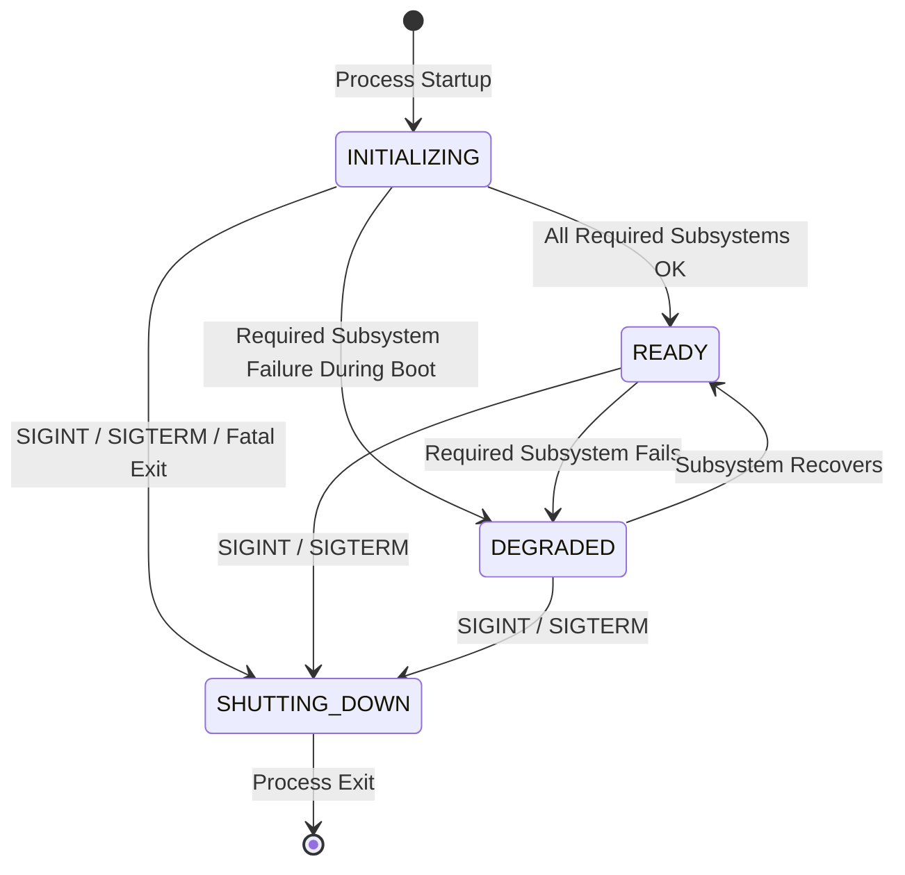

# ADR-0013: Edge Agent Health, Liveness, and Readiness Model

**Status**: Accepted (Phase 6.11)  
**Date**: 2026-10-07  
**Deciders**: AegisEdge Core Engineering Team  
**Supersedes**: None  
**Relates to**: ADR-0004 (Edge-Local Persistence), ADR-0009 (Edge Anomaly Detection), ADR-0010 (Local Incident Engine), ADR-0012 (Autonomous Incident Response Architecture)

---

## 1. Context & Problem Statement

As AegisEdge matures into an edge-resident autonomous system spanning local telemetry acquisition, threshold/ML anomaly detection, incident correlation, simulated mitigation execution, verification, escalation, and audit trail journaling, operational orchestrators and local supervisors require deterministic signals regarding edge agent health.

Prior to Phase 6.11, the edge agent exposed a minimal stub `/healthz` endpoint on its metrics server that returned `200 OK` ("ok") whenever the HTTP server was running. This introduced several limitations:
1. **Liveness vs. Readiness Conflation**: An edge agent in the middle of local SQLite WAL recovery or schema migration was probed as live, leading external supervision to treat it as ready to process workloads before internal subsystems were initialized.
2. **Lack of Subsystem Visibility**: If local SQLite storage failed or disk exhaustion occurred, supervision had no standardized mechanism to differentiate between a dead process and a degraded process.
3. **Risk of Health Misuse**: Without architectural boundaries, health checks risk becoming heavyweight, performing live disk transactions or pinging remote control planes on every probe, which degrades performance and fails during offline edge operation.
4. **Information Disclosure Risk**: Returning unformatted error strings from internal drivers can inadvertently leak local filesystem paths, database connection strings, or internal tokens.

Phase 6.11 establishes a formal, bounded **Edge Agent Health and Readiness Model**.

> [!IMPORTANT]
> **EDGE HEALTH IS NOT DISTRIBUTED HEALTH.**  
> The edge agent health model strictly reports the local operational capability of the edge process. It makes no claims that the distributed mesh, remote control plane, or upstream cloud are healthy or reachable.

---

## 2. Decision & Architecture

### 2.1 Bounded Service Lifecycle States

The edge agent lifecycle is modeled as four bounded, deterministic states:

1. **`INITIALIZING`**: The agent process is loading configuration, initializing SQLite WAL storage, recovering existing incidents, and setting up detectors. Process is *live* but *not ready*.
2. **`READY`**: All required subsystems have completed initialization successfully and report `OK`. The agent is *live* and *ready* to ingest telemetry and correlate incidents.
3. **`DEGRADED`**: One or more required local subsystems have encountered a non-fatal failure (e.g. SQLite storage I/O degradation). The process is *live* but *not ready*. If subsystems recover, the state automatically transitions back to `READY`.
4. **`SHUTTING_DOWN`**: Terminal state entered upon receipt of OS termination signals (`SIGINT`, `SIGTERM`) or graceful exit. The agent is *not live* and *not ready*. Transitions out of `SHUTTING_DOWN` are prohibited fail-closed.

---

### 2.2 Subsystem Check Allowlist & Requirements

Health checks are restricted to a fixed allowlist of subsystem identifiers. Arbitrary check names are rejected:

| Check Name | Target Subsystem | Default Requirement | Description |
|---|---|---|---|
| `config` | Environment & CLI configuration | Required | Valid configuration loaded |
| `storage` | Local SQLite WAL database | Required | Store opened, migrations verified, schema ready |
| `telemetry` | Telemetry generator & detector | Required | Generator initialized, detector rules configured |
| `incident_engine` | Incident correlation engine | Required | Engine active, persisted incidents recovered |
| `response_engine` | Response policy & simulated actuator | Optional | Dormant/available for simulation |
| `metrics` | Prometheus exposition server | Optional | Local metrics HTTP listener active |

#### Optional vs. Required Dependencies
- **Required Subsystems** (`config`, `storage`, `telemetry`, `incident_engine`): If any required subsystem has a status other than `OK`, agent readiness evaluates to `false` (HTTP 503).
- **Optional Subsystems** (`response_engine`, `metrics`): When metrics exposition is disabled via `METRICS_ENABLED=false`, the `metrics` check is registered as optional and marked `OK` ("disabled"). A disabled or degraded optional subsystem does not block overall agent readiness.

---

### 2.3 Check Status Values

Each registered check maintains one of four bounded statuses:
- **`OK`**: Subsystem operational.
- **`DEGRADED`**: Subsystem operational with reduced capacity or transient warnings.
- **`FAILED`**: Subsystem encountered an unrecoverable failure.
- **`UNKNOWN`**: Subsystem state not yet determined.

---

### 2.4 Separation of Liveness and Readiness

| Probe Endpoint | Purpose | Success Condition | HTTP Success | HTTP Failure |
|---|---|---|---|---|
| `GET /healthz` | **Liveness Probe** (Should supervisor kill/restart process?) | `State != SHUTTING_DOWN` | `200 OK` | `503 Service Unavailable` |
| `GET /readyz` | **Readiness Probe** (Should traffic/workload be routed to node?) | `State == READY` AND all required checks == `OK` | `200 OK` | `503 Service Unavailable` |

- **HTTP 503 vs 500**: Unreadiness is an expected operational state during boot or temporary degradation, not an internal server crash. Probes return HTTP 503 Service Unavailable when not ready, never HTTP 500.
- **Read-Only HTTP Methods**: Probes only accept `GET` and `HEAD`. Any mutation method (`POST`, `PUT`, `DELETE`, `PATCH`) returns `405 Method Not Allowed` with `Allow: GET, HEAD`.

---

### 2.5 Information Disclosure Prevention

To ensure security on untrusted edge hardware and local networks:
1. HTTP responses never include raw error strings, Go stack traces, database filepaths (e.g. `C:\...` or `/var/...`), SQL queries, or credentials.
2. Diagnostic messages are filtered through `SanitizeMessage()`, rejecting any strings containing path separators, SQL keywords, or authentication terms. Allowed diagnostics are bounded strings such as `initialized`, `available`, `listening`, `running`, `disabled`, `degraded`, `failed`.
3. Diagnostic string lengths are capped at 32 characters.

---

### 2.6 Concurrency & In-Memory Performance Model

To prevent health checks from starving operational telemetry pipelines:
1. `Tracker` maintains all check states and service lifecycle states in memory guarded by `sync.RWMutex`.
2. Probes read atomic, in-memory `Snapshot` structs without executing live I/O queries or disk access on incoming HTTP requests.
3. Check status transitions are recorded asynchronously by subsystem lifecycle boundaries.

---

## 3. Consequences

### Positive
- Strict separation of process liveness (`/healthz`) and subsystem readiness (`/readyz`).
- Probe handlers do not perform application-level disk or network I/O during execution.
- Fail-closed security with sanitization preventing accidental error disclosure or domain ID leaks.
- Clean integration with existing local HTTP server and Prometheus metrics exposition.

### Negative / Limitations
- Subsystem checks reflect process-local health only; they do not diagnose upstream network partition status or distributed system reachability.
- Subsystem checks primarily represent initialization-time and lifecycle boundary states. Post-startup transient errors in background collection loops (such as temporary SQLite I/O errors during batch persistence) are logged and recorded via metrics, but do not actively trigger background health tracker polling loops to degrade state after boot.
- External orchestrators must respect HTTP 503 as normal initialization/degradation rather than immediate process death.
