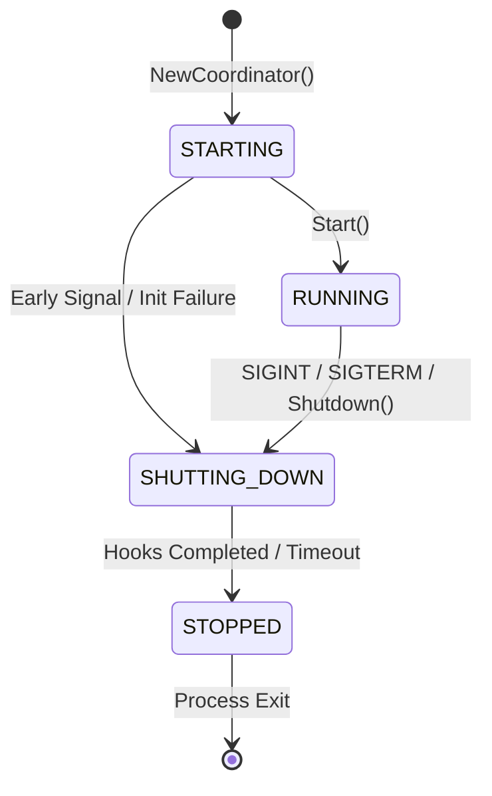
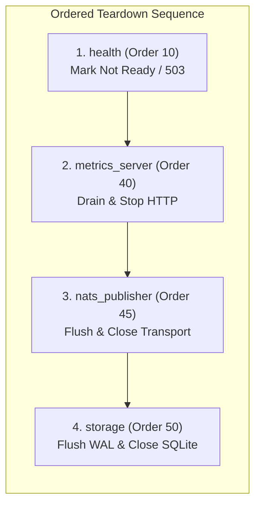

# ADR-0014: Controlled Graceful Shutdown & Runtime Lifecycle Coordinator

**Status**: Accepted (Phase 6.12)  
**Date**: 2026-10-07  
**Deciders**: AegisEdge Core Engineering Team  
**Supersedes**: None  
**Relates to**: ADR-0004 (Edge-Local Persistence), ADR-0006 (NATS Event-Driven Messaging), ADR-0012 (Autonomous Incident Response Architecture), ADR-0013 (Edge Agent Health and Readiness Model)

---

## 1. Context & Problem Statement

Prior to Phase 6.12, the AegisEdge edge agent handled operating system termination signals (`SIGINT`, `SIGTERM`) through a basic select loop in `main.go` that invoked `healthTracker.Shutdown()` and relied on deferred function closures. While sufficient for initial prototyping, this approach introduced significant operational risks for autonomous edge nodes:

1. **Unordered Component Teardown**: Go deferred functions execute in LIFO (last-in, first-out) order relative to when they were declared. This caused storage handles to be closed while background HTTP requests or sync loops were still actively writing, leading to panic-on-closed-database or corrupted in-flight transactions.
2. **Readiness Window Vulnerability**: In-flight HTTP probes or scrapers were not informed immediately that shutdown had begun before internal services started disappearing, leading to connection resets rather than clean HTTP 503 Service Unavailable responses.
3. **Unbounded Teardown Latency**: Deferred closures lacked bounded timeout enforcement. If a component blocked during cleanup (e.g. attempting to flush a network connection over an offline or saturated edge link), the process could hang indefinitely until forcefully killed with `SIGKILL`.
4. **Lack of Lifecycle Observability**: Operators and supervisors had no operational metrics measuring whether edge shutdowns were completing cleanly, encountering errors, or timing out.
5. **Conflation with Health Tracking**: While Phase 6.11 introduced `health.Tracker` for reporting liveness and readiness to external HTTP probes, it was not intended to manage the runtime process lifecycle, signal interception, or teardown sequence orchestration.

Phase 6.12 establishes a formal, bounded **Runtime Lifecycle Coordinator** and **Graceful Shutdown Protocol** for the edge agent.

> [!IMPORTANT]
> **EDGE SHUTDOWN IS LOCAL AND BOUNDED.**  
> Graceful shutdown is process-local. It ensures that local components terminate cleanly in deterministic sequence within a bounded time budget (`DefaultShutdownTimeout = 10s`). It does not coordinate distributed cluster shutdown, invoke shell commands, or make unachievable promises of zero data loss under abrupt power termination or `SIGKILL`.

---

## 2. Decision & Architecture

### 2.1 Bounded Runtime Lifecycle States

The agent's runtime lifecycle is governed by a finite state machine with four bounded states:

1. **`STARTING`**: Initial state during process bootstrap while configuration, logging, database handles, and detectors are being wired.
2. **`RUNNING`**: The coordinator has transitioned into active service (`Start()`). The agent runs autonomous telemetry acquisition, anomaly detection, incident response, and synchronization.
3. **`SHUTTING_DOWN`**: The coordinator has received a shutdown signal or explicit call. The root runtime context (`Context()`) is immediately canceled to halt background work, and registered shutdown hooks begin sequential execution.
4. **`STOPPED`**: Terminal state entered after all hooks complete or the shutdown context deadline expires. All concurrent or subsequent `Shutdown()` calls return the final cached error outcome.

#### Strict State Transition Rules
State transitions are strictly validated by `IsValidTransition`:
- `STARTING` $\rightarrow$ `RUNNING` or `SHUTTING_DOWN`
- `RUNNING` $\rightarrow$ `SHUTTING_DOWN`
- `SHUTTING_DOWN` $\rightarrow$ `STOPPED`
- Self-transitions and reverse transitions are rejected fail-closed with `ErrInvalidTransition`.

---

### 2.2 Separation of Concerns

Phase 6.12 strictly separates runtime lifecycle coordination from health probing:

| Concern | Responsible Subsystem | Primary Role |
| :--- | :--- | :--- |
| **Readiness & Probing** | `edge/agent/health.Tracker` | Serves `/healthz` and `/readyz` probes, aggregates subsystem health checks, reports `INITIALIZING`, `READY`, `DEGRADED`, `SHUTTING_DOWN`. |
| **Runtime Lifecycle** | `edge/agent/lifecycle.Coordinator` | Owns process state transitions (`STARTING` $\rightarrow$ `RUNNING` $\rightarrow$ `SHUTTING_DOWN` $\rightarrow$ `STOPPED`), intercepts OS signals, cancels root context, runs ordered shutdown hooks. |

`health.Tracker` does not execute component shutdown hooks. Instead, `healthTracker.Shutdown()` is registered as an early shutdown hook with the lifecycle coordinator.

---

### 2.3 Deterministic Hook Ordering

Shutdown hooks execute in ascending order based on their numerical `Order` priority. When orders are identical, alphabetical tie-breaking on `Name` ensures deterministic sequence:

1. **Order 10 (`health`)**: Invokes `healthTracker.Shutdown()`. Immediately sets readiness to false and state to `SHUTTING_DOWN`. Because the HTTP server is still running, inbound probes immediately receive `HTTP 503 Service Unavailable` rather than abrupt TCP connection drops.
2. **Order 40 (`metrics_server`)**: Invokes `metricsServer.Stop(ctx)`. Ceases accepting new HTTP requests and cleanly completes in-flight scraper requests.
3. **Order 45 (`nats_publisher`)**: Invokes `publisher.Close()` (if NATS transport is enabled). Flushes buffered messages and closes connections.
4. **Order 50 (`storage`)**: Invokes `store.Close()`. Closes the local SQLite database handle, committing WAL checkpoints safely and preventing any subsequent database access on a closed connection.

---

### 2.4 Concurrency & Lock-Free Hook Execution

To prevent deadlocks and lock inversion, the coordinator adheres to the following concurrency invariants:

1. **Cloned Hook Execution**: Under `c.mu.Lock()`, the state is checked and changed to `StateShuttingDown`, the root context is canceled, and a shallow copy of the registered hooks slice is made. The mutex is **released** prior to sorting and executing hooks.
2. **Safe Re-Entrancy**: Because the mutex is not held during hook execution, any hook function that queries `coord.State()` can safely obtain an `RLock()` without deadlock.
3. **Idempotent Awaiters**: Concurrent callers attempting to invoke `Shutdown()` while an existing shutdown is executing do not execute duplicate hooks. Instead, they block on `<-c.shutdownDone` and receive the exact same error outcome.
4. **Registration Guard**: Hook registration (`RegisterHook`) is strictly disallowed once shutdown has commenced (`ErrAlreadyShuttingDown`).

---

### 2.5 Bounded Timeout & Error Resilience

Graceful shutdown is bounded by a strict duration:
- Default timeout: `10 * time.Second` (`DefaultShutdownTimeout`).
- Configurable via environment variable `AEGISEDGE_SHUTDOWN_TIMEOUT` or CLI flag `-shutdown-timeout`.
- If the shutdown context expires before all hooks complete, remaining hooks are aborted, `ErrShutdownTimeout` is returned, and the timeout metric is incremented.
- If an individual hook fails, subsequent hooks continue to execute (best-effort completion), and the first observed error is returned upon completion.

---

### 2.6 Operational Observability

Phase 6.12 introduces Prometheus-compatible operational metrics for shutdown monitoring:

| Metric Family | Type | Labels | Description |
| :--- | :--- | :--- | :--- |
| `aegisedge_shutdowns_total` | Counter | `status="completed\|timed_out\|failed\|unknown"` | Total shutdown sequences executed |
| `aegisedge_shutdown_duration_seconds` | Histogram | None | Latency of the shutdown sequence |
| `aegisedge_shutdown_timeouts_total` | Counter | None | Total shutdown sequences exceeding timeout |

---

## 3. Security, Actuation, and Operational Guardrails

1. **No External Actuation**: The lifecycle coordinator does not invoke `os/exec`, run shell commands, terminate sibling OS processes, or interface with Docker/systemd.
2. **No Remote Shutdown Endpoint**: The HTTP server provides read-only `/healthz`, `/readyz`, and `/metrics`. No HTTP endpoint exists to trigger remote process termination.
3. **Bounded Memory & Goroutines**: Signal handling uses a buffered channel of size 2 and cleans up signal listeners on loop exit (`signal.Stop`).
4. **Offline Resilience**: The coordinator relies exclusively on local synchronizers and does not make network calls to external control planes during teardown.
