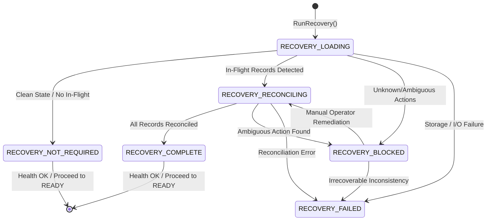

# ADR-0015: Persistent Runtime State & Safe Restart Recovery

**Status**: Accepted (Phase 6.13)  
**Date**: 2026-10-08  
**Deciders**: AegisEdge Core Engineering Team  
**Supersedes**: None  
**Relates to**: ADR-0004 (Edge-Local Persistence), ADR-0012 (Autonomous Incident Response Architecture), ADR-0013 (Edge Agent Health and Readiness Model), ADR-0014 (Controlled Graceful Shutdown & Runtime Lifecycle Coordinator)

---

## 1. Context & Problem Statement

In autonomous edge environments, power loss, kernel panics, OOM kills, and physical restarts are inevitable operational occurrences. Prior to Phase 6.13, while previous phases established offline-first SQLite WAL persistence (ADR-0004), incident state machines (ADR-0012), health/readiness probing (ADR-0013), and controlled graceful shutdown (ADR-0014), the edge agent lacked a structured, fail-closed restart recovery coordinator.

Without a formal recovery model, edge restarts pose severe safety hazards:
1. **Ambiguous In-Flight Mitigations**: If an agent crashed while a mitigation action was in `EXECUTING` status, restarting blindly could lead the agent to re-trigger the action (causing double-remediation, flapping, or cascading network failures) or mistakenly assume it completed successfully.
2. **Unmanaged Pending Actions**: Mitigations left in `PENDING` prior to restart could be picked up and executed in an altered operational context where the original incident dynamics no longer apply.
3. **Dangling Verifications**: Verification loops left `IN_PROGRESS` or `PENDING` across restarts could remain unresolved indefinitely.
4. **Premature Readiness**: External supervisors (Kubernetes kubelet, systemd, load balancers) probing `/readyz` could consider the agent healthy before interrupted state has been safely reconciled.

Phase 6.13 introduces a persistent runtime recovery model governed by the core safety invariant:

> [!IMPORTANT]
> **RESTART MUST NEVER BY ITSELF AUTHORIZE ACTION EXECUTION.**  
> The system MUST NOT interpret a restart as permission to automatically re-execute an incomplete or unknown mitigation. An interrupted operation must be reconciled safely before the agent becomes `READY`. If recovery cannot safely establish state, recovery fails closed into `RECOVERY_BLOCKED` or `RECOVERY_FAILED`, and readiness remains false.

---

## 2. Decision & Architecture

### 2.1 Bounded Recovery State Machine

Recovery lifecycle transitions are governed by a bounded, deterministic state model:



The six bounded recovery states:
1. **`RECOVERY_NOT_REQUIRED`**: Clean startup. No prior in-flight, pending, or ambiguous mitigations/verifications exist. Checkpoint written; health check OK.
2. **`RECOVERY_LOADING`**: Initial state upon calling `RunRecovery`. Persisted checkpoints and incident tables are queried.
3. **`RECOVERY_RECONCILING`**: Active reconciliation of interrupted entities (pending actions skipped, expired verifications timed out).
4. **`RECOVERY_BLOCKED`**: Ambiguous, unconfirmed mitigations detected (`UNKNOWN_RECONCILIATION_REQUIRED`). Action execution is blocked; readiness is held false (`503`); manual operator intervention is required.
5. **`RECOVERY_COMPLETE`**: All recoverable in-flight operations were successfully and safely reconciled. Checkpoint written; health check OK.
6. **`RECOVERY_FAILED`**: Storage I/O corruption, deserialization error, or database failure prevented recovery execution. Health check set to `FAILED`; readiness remains false.

---

### 2.2 Storage Schema (Migration v9)

Phase 6.13 introduces SQLite Migration v9 adding the `runtime_checkpoints` table with WAL durability:

```sql
CREATE TABLE IF NOT EXISTS runtime_checkpoints (
    checkpoint_id            TEXT PRIMARY KEY,
    node_id                  TEXT NOT NULL,
    state                    TEXT NOT NULL,
    started_at               DATETIME NOT NULL,
    completed_at             DATETIME,
    recovery_reason          TEXT NOT NULL,
    last_reconciled_attempt  INTEGER NOT NULL DEFAULT 0,
    schema_version           INTEGER NOT NULL DEFAULT 9,
    created_at               DATETIME NOT NULL DEFAULT CURRENT_TIMESTAMP,
    updated_at               DATETIME NOT NULL DEFAULT CURRENT_TIMESTAMP
);

CREATE INDEX IF NOT EXISTS idx_runtime_checkpoints_node 
    ON runtime_checkpoints(node_id, created_at DESC);
CREATE INDEX IF NOT EXISTS idx_runtime_checkpoints_created 
    ON runtime_checkpoints(created_at DESC);
```

Security guards enforce strict payload constraints:
- Node ID and Checkpoint ID bounded to 256 characters.
- Recovery reason bounded to 1,024 characters.
- Prohibited patterns (private keys, bearer tokens, passwords, shell command syntax `exec`, `bash`, `sh`, `rm -rf`) are rejected fail-closed with `storage.ErrInvalidCheckpoint`.

---

### 2.3 Reconciliation Policy & Invariant Enforcement

When `RunRecovery(ctx)` executes during agent startup, it enforces strict reconciliation rules:

| Prior Runtime Condition | Post-Restart State | Action Taken | Rationale |
| :--- | :--- | :--- | :--- |
| **Mitigation `EXECUTING`** | `UNKNOWN_RECONCILIATION_REQUIRED` | Recovery enters `RECOVERY_BLOCKED`. Health degraded. Readiness false. | The host effect of an in-flight command cannot be safely inferred. Automatic re-execution could cause severe harm. Requires human operator inspection. |
| **Mitigation `PENDING`** | `SKIPPED` | Reconciled to `SKIPPED` with `error_code="RESTART_ABORTED"` and explanation `"interrupted by agent restart prior to execution"`. | An unstarted action must not run in a rebooted context without fresh detection and policy validation. |
| **Verification past deadline** | `TIMED_OUT` | Reconciled to `TIMED_OUT`. | Stale verification windows cannot attest to post-reboot health. |
| **Prior `EXECUTED` / `FAILED` / `SKIPPED`** | Unchanged | Preserved immutably in SQLite WAL. | Terminal mitigation states are authoritative and idempotent. |

---

### 2.4 Integration with Edge Health and Readiness

Phase 6.13 registers a new required check with `health.Tracker`:
- `health.CheckRecovery` (`"recovery"`)

| Recovery State | Health Check Status | Readiness Impact (`/readyz`) |
| :--- | :--- | :--- |
| `RECOVERY_NOT_REQUIRED` | `StatusOk` | Allowed to become Ready |
| `RECOVERY_COMPLETE` | `StatusOk` | Allowed to become Ready |
| `RECOVERY_BLOCKED` | `StatusDegraded` | **Blocked (503 Service Unavailable)** |
| `RECOVERY_FAILED` | `StatusFailed` | **Blocked (503 Service Unavailable)** |

Because `CheckRecovery` is a required check, `healthTracker.IsReady()` evaluates to `false` whenever recovery is blocked or failed. Upstream orchestrators, load balancers, and supervisors are immediately informed that the edge agent cannot accept traffic or execute automated decisions.

---

### 2.5 Audit Trail & Explainability

Recovery operations generate structured, deterministic audit events recorded in local SQLite storage:
- `RECOVERY_STARTED`: Initial startup signal.
- `RECOVERY_STATE_LOADED`: Details of loaded prior checkpoint.
- `RECOVERY_RECONCILIATION_REQUIRED`: Emitted when ambiguous actions are detected.
- `RECOVERY_RECONCILIATION_COMPLETED`: Emitted when pending/stale items are reconciled.
- `RECOVERY_BLOCKED`: Emitted with `ResultBlocked` when manual intervention is needed.
- `RECOVERY_FAILED`: Emitted when recovery fails due to errors.
- `RECOVERY_COMPLETED`: Emitted upon clean or reconciled recovery completion.

---

### 2.6 Operational Metrics

A Prometheus-compatible metric family monitors recovery behavior without external dependencies:

| Metric Name | Type | Description / Labels |
| :--- | :--- | :--- |
| `aegisedge_recovery_total` | Counter | Total recovery attempts partitioned by bounded label `status` (`not_required`, `completed`, `blocked`, `failed`, `unknown`). |
| `aegisedge_recovery_duration_seconds` | Histogram | Recovery execution latency in seconds. |
| `aegisedge_recovery_reconciliation_required_total` | Counter | Total occurrences of mitigations requiring manual reconciliation. |
| `aegisedge_recovery_blocked_total` | Counter | Total times recovery entered `RECOVERY_BLOCKED`. |
| `aegisedge_recovery_failed_total` | Counter | Total times recovery encountered an unrecoverable failure. |

---

## 3. Safety & Security Invariants

1. **No Automatic Re-Execution**: A reboot never triggers automated command execution.
2. **No Approval Bypass**: Restarting the agent cannot bypass operator approval or human-in-the-loop requirements.
3. **No Shell Execution**: Checkpoint reconciliation operates entirely through Go domain logic; `os/exec` and shell invocation are strictly prohibited.
4. **Sanitized State**: Checkpoints and audit reasons reject credentials, private keys, tokens, and shell commands.
5. **Local Authority**: Recovery decisions are evaluated against local SQLite WAL persistence. The edge node never relies on external cloud connectivity to determine its recovery state.

---

## 4. Operational Limitations & Future Scope

1. **Local-Process Scope**: Recovery reconciles the local node's state. It does not provide distributed consensus across multiple edge agents.
2. **Human Operator Remediation**: When in `RECOVERY_BLOCKED`, an operator must inspect host conditions, resolve the ambiguous mitigation state via database update or administrative CLI, and restart or signal the agent. Automated guessing is intentionally prohibited.
3. **Simulated Actuation**: In accordance with project phases, mitigations remain simulated. Host mutations (Docker, systemd, iptables) are deferred to subsequent phases.
