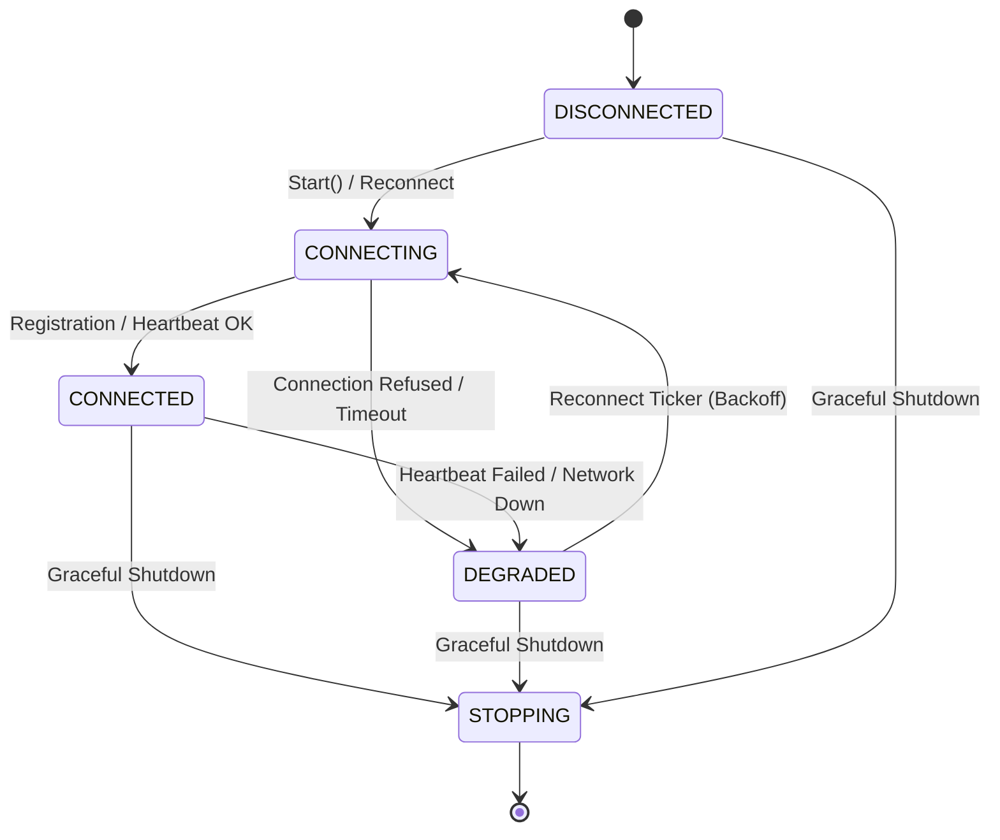

# ADR-0016: Edge ↔ Control-Plane Coordination Layer

**Status**: Accepted (Phase 6.14)  
**Date**: 2026-10-08  
**Deciders**: AegisEdge Core Engineering Team  
**Supersedes**: None  
**Relates to**: ADR-0002 (Edge-to-Control-Plane Communication), ADR-0004 (Edge-Local Persistence), ADR-0005 (HTTP Synchronization), ADR-0012 (Autonomous Incident Response Architecture), ADR-0013 (Edge Agent Health and Readiness Model), ADR-0014 (Graceful Shutdown & Runtime Lifecycle), ADR-0015 (Persistent Runtime State & Recovery)

---

## 1. Context & Problem Statement

AegisEdge is built upon a fundamental architectural guarantee: the edge node operates autonomously and safely regardless of upstream network availability. Previous phases established offline-first SQLite WAL persistence (ADR-0004), local anomaly detection (ADR-0009), autonomous incident state machines (ADR-0010, ADR-0012), health/readiness probing (ADR-0013), graceful shutdown (ADR-0014), and persistent restart recovery (ADR-0015).

However, in production deployments, edge nodes must coordinate with a centralized Control Plane when network connectivity is available:
1. **Dynamic Node Enrollment**: The Control Plane must track edge inventory, node hardware architectures, OS environments, versions, and capabilities.
2. **Liveness & Sequencing Heartbeats**: Edge nodes must periodically transmit lightweight liveness pings with monotonic sequence numbers and health summaries.
3. **Persistent Identity Stability**: Nodes must maintain an immutable, durable identity across reboots and network reconnects, preventing identity collisions or node drift.
4. **Offline Autonomy Preservation**: The Control Plane **must never become a hard dependency** for edge operations. A network partition or control plane outage must not block telemetry generation, anomaly detection, incident response, or agent readiness (`/readyz`).

Phase 6.14 introduces a bounded, resilient Edge ↔ Control-Plane coordination layer that satisfies these requirements without violating the offline-first guarantee.

---

## 2. Core Invariant

```
   EDGE OPERATES AUTONOMOUSLY OFFLINE
                   ↓
        CONTROL PLANE AVAILABLE
                   ↓
        EDGE REGISTERS / HEARTBEATS
                   ↓
       COORDINATION WHEN AVAILABLE
                   ↓
EDGE REMAINS SAFE AND AUTONOMOUS IF LOST
```

> [!IMPORTANT]
> **OFFLINE AUTONOMY GUARANTEE:**  
> The Control Plane is strictly an observability, inventory, and coordination peer. It **MUST NOT** be a runtime dependency for:
> - Local telemetry collection and SQLite WAL persistence
> - Statistical or machine learning anomaly detection
> - Incident state machine progression
> - Response policy evaluation, safety validation, or operator approval checks
> - Simulated mitigation execution and recovery verification
> - Edge agent health readiness (`GET /readyz`)

---

## 3. Decision & Architecture

### 3.1 Persistent Node Identity Model

To prevent identity fragmentation across reboots, Phase 6.14 introduces Migration v10 in SQLite WAL storage:

```sql
CREATE TABLE IF NOT EXISTS node_identity (
    node_id TEXT PRIMARY KEY,
    created_at TEXT NOT NULL,
    updated_at TEXT NOT NULL
);
```

- **Identity Resolution**: `coordination.ResolveNodeIdentity(ctx, store, configuredID)` implements a strict priority:
  1. If an identity exists in the database, it is retrieved and preserved.
  2. If the database is empty and a configured ID is provided, the configured ID is validated and persisted.
  3. If no ID is provided, a cryptographically secure random ID (`node-<16-hex-characters>`) is generated and durably stored.
- **Security Bounds**: Node IDs must adhere strictly to `^[a-zA-Z0-9_-]{3,128}$` and are rejected if containing credential keywords (`secret`, `password`, `token`, `bearer`).

### 3.2 Bounded Connection State Machine

Edge connection state with the Control Plane is tracked by a thread-safe state machine:



- **`DISCONNECTED` (0)**: Initialized state prior to connection attempts.
- **`CONNECTING` (1)**: Actively performing HTTP handshake or registration.
- **`CONNECTED` (2)**: Successfully registered and heartbeating regularly.
- **`DEGRADED` (3)**: Upstream unreachable, partitioned, or timing out. Edge continues full local operation.
- **`STOPPING` (4)**: Coordination manager shutting down during agent teardown.

### 3.3 Control-Plane Endpoints

The Control Plane exposes synchronous HTTP endpoints under `/api/v1/nodes`:
- `POST /api/v1/nodes/register`: Validates `shared/types.NodeRegistration`. Enrolls the node. Returns `201 Created` or `200 OK` (`already_registered`) idempotently.
- `POST /api/v1/nodes/heartbeat`: Validates `shared/types.Heartbeat`. Enforces registered node status; returns `404 Not Found` if the node is unknown (triggering automatic edge re-registration). Returns `200 OK` on success.
- `GET /api/v1/nodes`: Enumerates active registered nodes for control plane operators.
- `GET /api/v1/nodes/{id}`: Retrieves single node registration record.

### 3.4 Non-Critical Health Check Integration

In the health model (`edge/agent/health`):
- `CheckControlPlane` is registered with **`required = false`**.
- When the control plane is offline, check status is updated to `StatusDegraded`.
- Because `required = false`, `healthTracker.IsReady()` evaluates to **`true`** (`200 OK`), ensuring container orchestrators do not restart or evict healthy offline edge agents.

### 3.5 Reconnection & Exponential Backoff

When heartbeats or registration fail:
- The coordinator triggers an exponential backoff schedule:
  $$\text{Interval}_{k+1} = \min\left(\text{Interval}_k \times 2.0, \; 30\text{s}\right)$$
  starting from $1\text{s}$.
- The reconnect event is recorded in metrics (`aegisedge_control_plane_reconnects_total`) and audit trail (`CONTROL_PLANE_RECONNECT_SCHEDULED`).
- Upon connection restoration, the backoff automatically resets to $1\text{s}$.

### 3.6 Explainable Audit Trail Events

Phase 6.14 adds 8 dedicated domain audit events:
- `CONTROL_PLANE_REGISTRATION_STARTED`
- `CONTROL_PLANE_REGISTRATION_SUCCEEDED`
- `CONTROL_PLANE_REGISTRATION_FAILED`
- `CONTROL_PLANE_CONNECTED`
- `CONTROL_PLANE_DISCONNECTED`
- `CONTROL_PLANE_HEARTBEAT_SUCCEEDED`
- `CONTROL_PLANE_HEARTBEAT_FAILED`
- `CONTROL_PLANE_RECONNECT_SCHEDULED`

All events are durably persisted in SQLite WAL storage under incident ID `system-coordination`.

### 3.7 Prometheus Metrics Exposition

Six bounded metric families are exposed at `GET /metrics`:
- `aegisedge_control_plane_connections_total{status}` (Counter: connected, disconnected, failed)
- `aegisedge_control_plane_heartbeats_total{status}` (Counter: success, failed)
- `aegisedge_control_plane_registration_total{status}` (Counter: success, already_registered, failed)
- `aegisedge_control_plane_reconnects_total` (Counter)
- `aegisedge_control_plane_connection_state` (Gauge: 0=DISCONNECTED, 1=CONNECTING, 2=CONNECTED, 3=DEGRADED, 4=STOPPING)
- `aegisedge_control_plane_heartbeat_duration_seconds` (Histogram with standard bounded latency buckets)

---

## 4. Consequences & Trade-offs

### Positive
- Edge nodes automatically register capabilities and broadcast liveness to the control plane.
- Offline-first execution remains completely intact and unaffected by control plane downtime.
- In-memory Control Plane restarts are cleanly recovered via automatic edge re-registration on 404 heartbeat responses.
- Node identity remains durable, bounded, and deterministic across reboots.

### Explicit Limitations & Non-Goals
- **No Remote Actuation / Command Execution**: The Control Plane cannot send arbitrary shell commands or remote execution payloads to edge agents.
- **No Distributed Consensus**: Edge nodes operate independently without Raft/Paxos clusters between edge nodes.
- **In-Memory Control Plane Records**: Control Plane stores node registrations in-memory in this phase; database persistence on the control plane side is deferred to subsequent enterprise backend phases.
